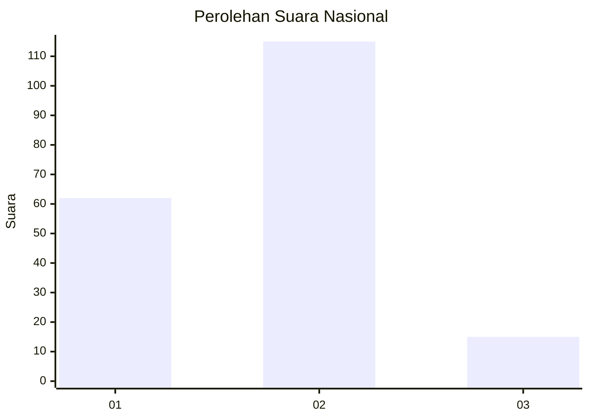
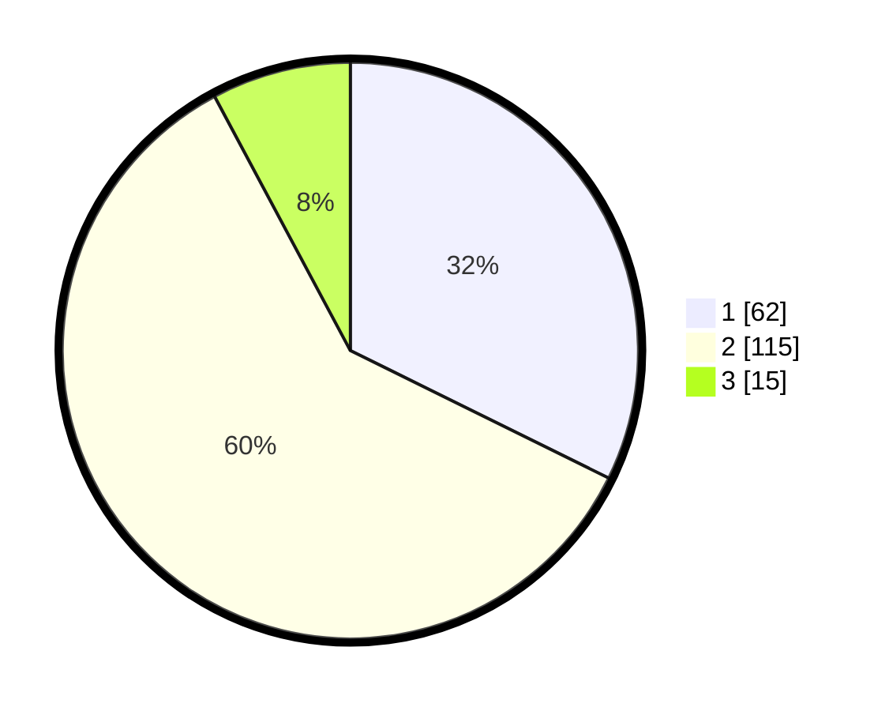

# Hasil

## Grafik

## Tabel

| No. | Nama Paslon    | Suara | Suara (raw) | Persentase |
|:--- |:-------------- | -----:| -----------:| ----------:|
| 1   | ANIES MUHAIMIN | 62    | [62][p-1]   | 32,29      |
| 2   | PRABOWO GIBRAN | 115   | [115][p-2]  | 59,90      |
| 3   | GANJAR MAHFUD  | 15    | [15][p-3]   | 7,81       |

[p-1]: https://github.com/gigit-pemilu/pemilu-2024/blob/main/pilpres/hitung-suara/sub/14-riau/sub/08-siak/sub/07-kerinci-kanan/sub/2002-kerinci-kiri/sub/001-tps/sub/paslon-1.txt
[p-2]: https://github.com/gigit-pemilu/pemilu-2024/blob/main/pilpres/hitung-suara/sub/14-riau/sub/08-siak/sub/07-kerinci-kanan/sub/2002-kerinci-kiri/sub/001-tps/sub/paslon-2.txt
[p-3]: https://github.com/gigit-pemilu/pemilu-2024/blob/main/pilpres/hitung-suara/sub/14-riau/sub/08-siak/sub/07-kerinci-kanan/sub/2002-kerinci-kiri/sub/001-tps/sub/paslon-3.txt

## Foto C Plano

https://sirekap-obj-formc.kpu.go.id/21b9/pemilu/ppwp/14/08/07/20/02/1408072002001-20240215-022305--c67e7f81-4b0f-430a-8446-4420cb372111.jpg

https://sirekap-obj-formc.kpu.go.id/21b9/pemilu/ppwp/14/08/07/20/02/1408072002001-20240215-023555--9372b89a-6827-4800-9e74-73220e158bda.jpg

https://sirekap-obj-formc.kpu.go.id/21b9/pemilu/ppwp/14/08/07/20/02/1408072002001-20240215-051019--8afa2b11-554a-45ff-86f1-37ba19a0bc43.jpg

## Metadata

| Key        | Value               |
| ---------- | ------------------- |
| Time Stamp | 2024-02-24 22:31:28 |

