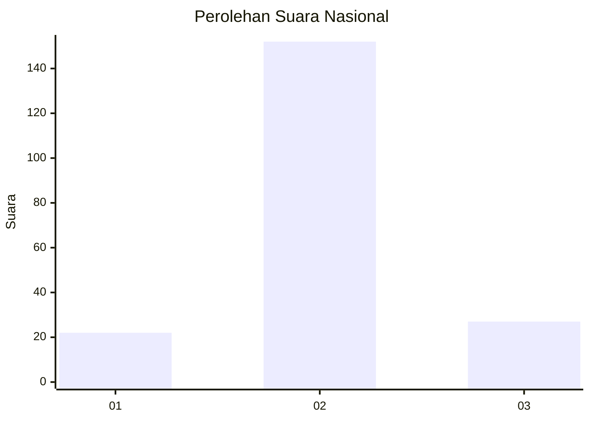
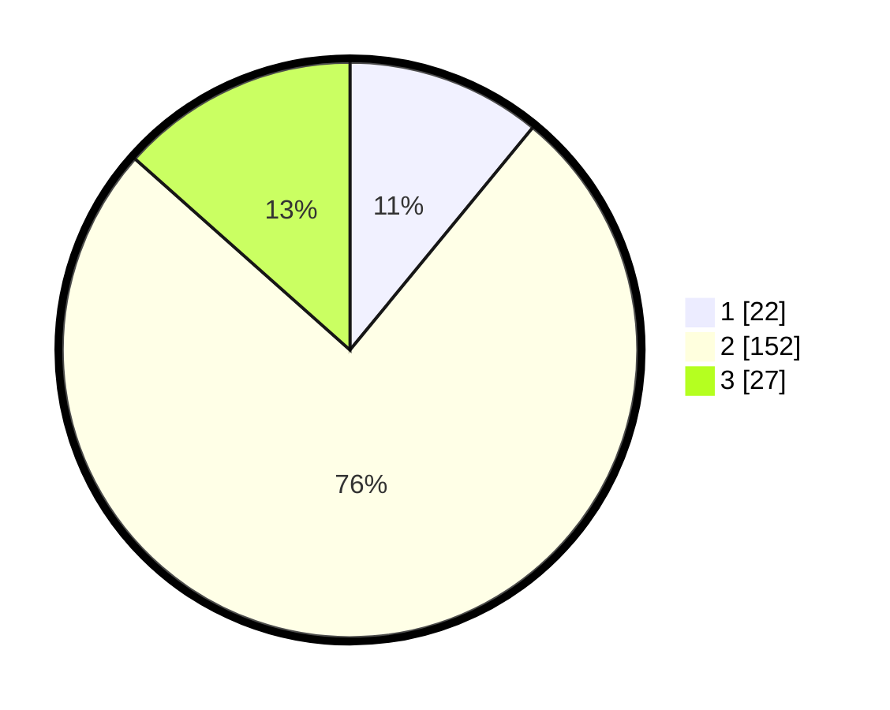

# Hasil

## Grafik

## Tabel

| No. | Nama Paslon    | Suara | Suara (raw) | Persentase |
|:--- |:-------------- | -----:| -----------:| ----------:|
| 1   | ANIES MUHAIMIN | 22    | [22][p-1]   | 10,95      |
| 2   | PRABOWO GIBRAN | 152   | [152][p-2]  | 75,62      |
| 3   | GANJAR MAHFUD  | 27    | [27][p-3]   | 13,43      |

[p-1]: https://github.com/gigit-pemilu/pemilu-2024/blob/main/pilpres/hitung-suara/sub/14-riau/sub/08-siak/sub/08-bunga-raya/sub/2011-kemuning-muda/sub/006-tps/sub/paslon-1.txt
[p-2]: https://github.com/gigit-pemilu/pemilu-2024/blob/main/pilpres/hitung-suara/sub/14-riau/sub/08-siak/sub/08-bunga-raya/sub/2011-kemuning-muda/sub/006-tps/sub/paslon-2.txt
[p-3]: https://github.com/gigit-pemilu/pemilu-2024/blob/main/pilpres/hitung-suara/sub/14-riau/sub/08-siak/sub/08-bunga-raya/sub/2011-kemuning-muda/sub/006-tps/sub/paslon-3.txt

## Foto C Plano

https://sirekap-obj-formc.kpu.go.id/f770/pemilu/ppwp/14/08/08/20/11/1408082011006-20240214-155513--f9757025-37b8-4cb9-a844-dc13426ec3f9.jpg

https://sirekap-obj-formc.kpu.go.id/f770/pemilu/ppwp/14/08/08/20/11/1408082011006-20240214-155821--9728ae60-98f8-4fcf-ad05-d4ececb02bcd.jpg

https://sirekap-obj-formc.kpu.go.id/f770/pemilu/ppwp/14/08/08/20/11/1408082011006-20240214-160121--de6ad4ab-eed9-4642-85d1-8a2b777cfe7f.jpg

## Metadata

| Key        | Value               |
| ---------- | ------------------- |
| Time Stamp | 2024-02-16 14:00:34 |

