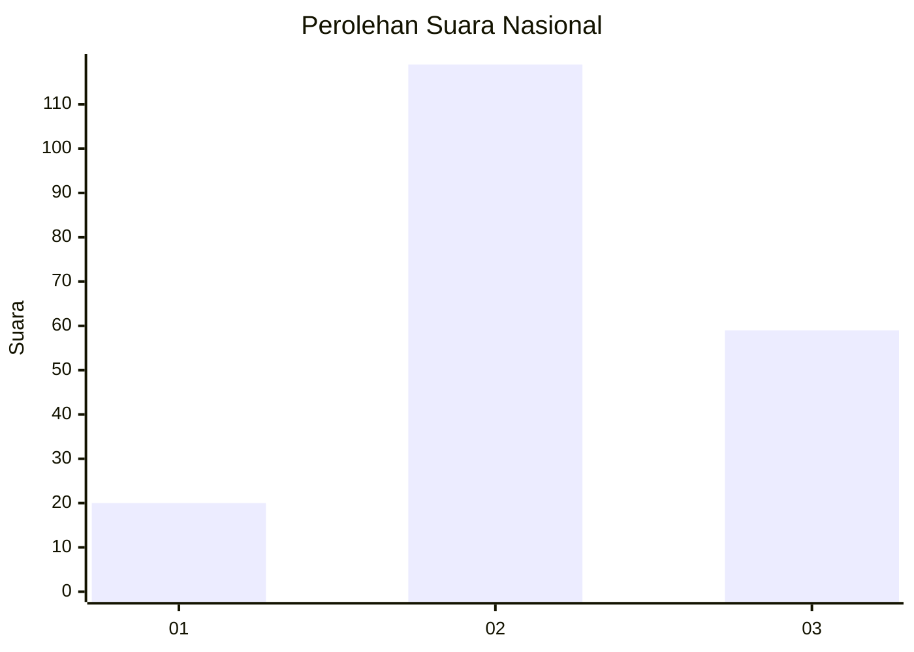
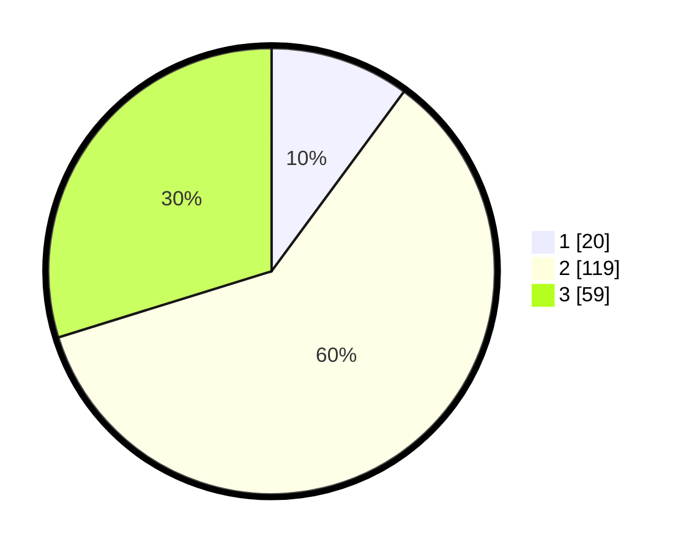

# Hasil

## Grafik

## Tabel

| No. | Nama Paslon    | Suara | Suara (raw) | Persentase |
|:--- |:-------------- | -----:| -----------:| ----------:|
| 1   | ANIES MUHAIMIN | 20    | [20][p-1]   | 10,10      |
| 2   | PRABOWO GIBRAN | 119   | [119][p-2]  | 60,10      |
| 3   | GANJAR MAHFUD  | 59    | [59][p-3]   | 29,80      |

[p-1]: https://github.com/gigit-pemilu/pemilu-2024/blob/main/pilpres/hitung-suara/sub/14-riau/sub/08-siak/sub/08-bunga-raya/sub/2014-langsat-permai/sub/001-tps/sub/paslon-1.txt
[p-2]: https://github.com/gigit-pemilu/pemilu-2024/blob/main/pilpres/hitung-suara/sub/14-riau/sub/08-siak/sub/08-bunga-raya/sub/2014-langsat-permai/sub/001-tps/sub/paslon-2.txt
[p-3]: https://github.com/gigit-pemilu/pemilu-2024/blob/main/pilpres/hitung-suara/sub/14-riau/sub/08-siak/sub/08-bunga-raya/sub/2014-langsat-permai/sub/001-tps/sub/paslon-3.txt

## Foto C Plano

https://sirekap-obj-formc.kpu.go.id/9bc7/pemilu/ppwp/14/08/08/20/14/1408082014001-20240227-154031--db534cf5-dd36-4452-b22e-a5db91fd5249.jpg

https://sirekap-obj-formc.kpu.go.id/9bc7/pemilu/ppwp/14/08/08/20/14/1408082014001-20240227-154229--9860dd72-f329-457c-80ae-8e7c7636131b.jpg

https://sirekap-obj-formc.kpu.go.id/9bc7/pemilu/ppwp/14/08/08/20/14/1408082014001-20240227-154343--fa312a2e-f96a-4953-b4d6-8ac3512e9b2e.jpg

## Metadata

| Key        | Value               |
| ---------- | ------------------- |
| Time Stamp | 2024-02-28 19:00:00 |

