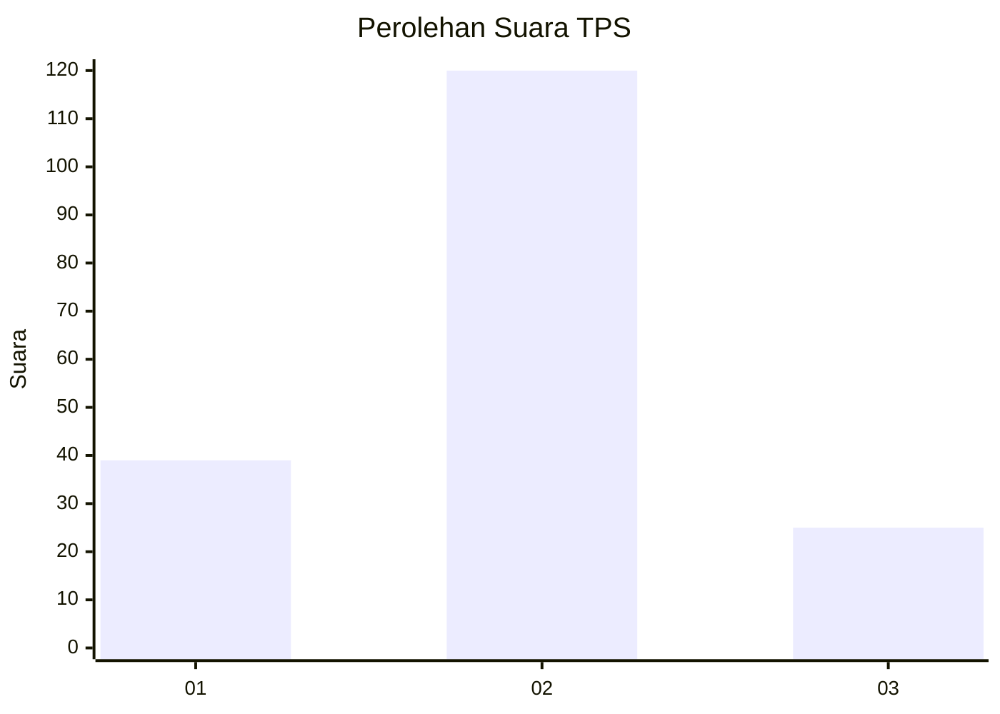
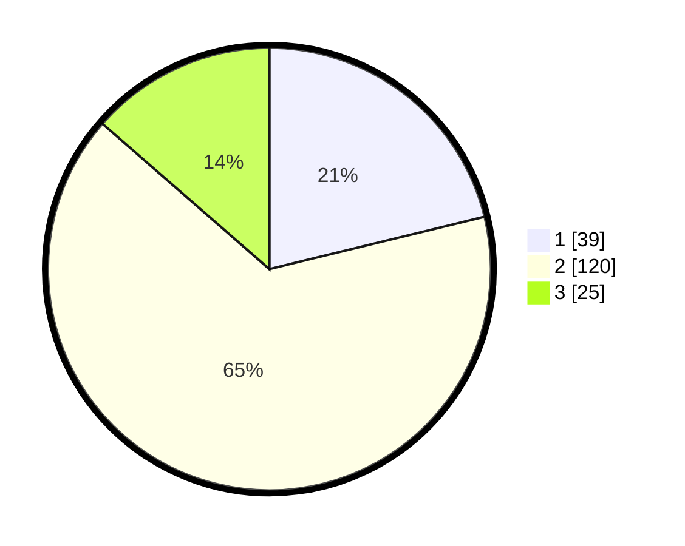

# Hasil

## Grafik

## Tabel

| No. | Nama Paslon    | Suara | Suara (raw) | Persentase |
|:--- |:-------------- | -----:| -----------:| ----------:|
| 1   | ANIES MUHAIMIN | 39    | [39][p-1]   | 21,20      |
| 2   | PRABOWO GIBRAN | 120   | [120][p-2]  | 65,22      |
| 3   | GANJAR MAHFUD  | 25    | [25][p-3]   | 13,59      |

[p-1]: https://github.com/gigit-pemilu/pemilu-2024-14-riau/blob/main/pilpres/hitung-suara/sub/14-riau/sub/08-siak/sub/08-bunga-raya/sub/2017-suak-merambai/sub/002-tps/sub/paslon-1.txt
[p-2]: https://github.com/gigit-pemilu/pemilu-2024-14-riau/blob/main/pilpres/hitung-suara/sub/14-riau/sub/08-siak/sub/08-bunga-raya/sub/2017-suak-merambai/sub/002-tps/sub/paslon-2.txt
[p-3]: https://github.com/gigit-pemilu/pemilu-2024-14-riau/blob/main/pilpres/hitung-suara/sub/14-riau/sub/08-siak/sub/08-bunga-raya/sub/2017-suak-merambai/sub/002-tps/sub/paslon-3.txt

## Foto C Plano

https://sirekap-obj-formc.kpu.go.id/d631/pemilu/ppwp/14/08/08/20/17/1408082017002-20240214-155402--2f88c890-96ec-4814-93b9-ec37b4b7964a.jpg

https://sirekap-obj-formc.kpu.go.id/d631/pemilu/ppwp/14/08/08/20/17/1408082017002-20240214-155535--7ae12dbe-9ade-4728-a42d-6587ba7e923b.jpg

https://sirekap-obj-formc.kpu.go.id/d631/pemilu/ppwp/14/08/08/20/17/1408082017002-20240214-155639--4c9ffbd1-47ed-4ac3-85f7-751a26d0200c.jpg

## Metadata

| Key        | Value               |
| ---------- | ------------------- |
| Time Stamp | 2024-02-16 14:00:34 |

