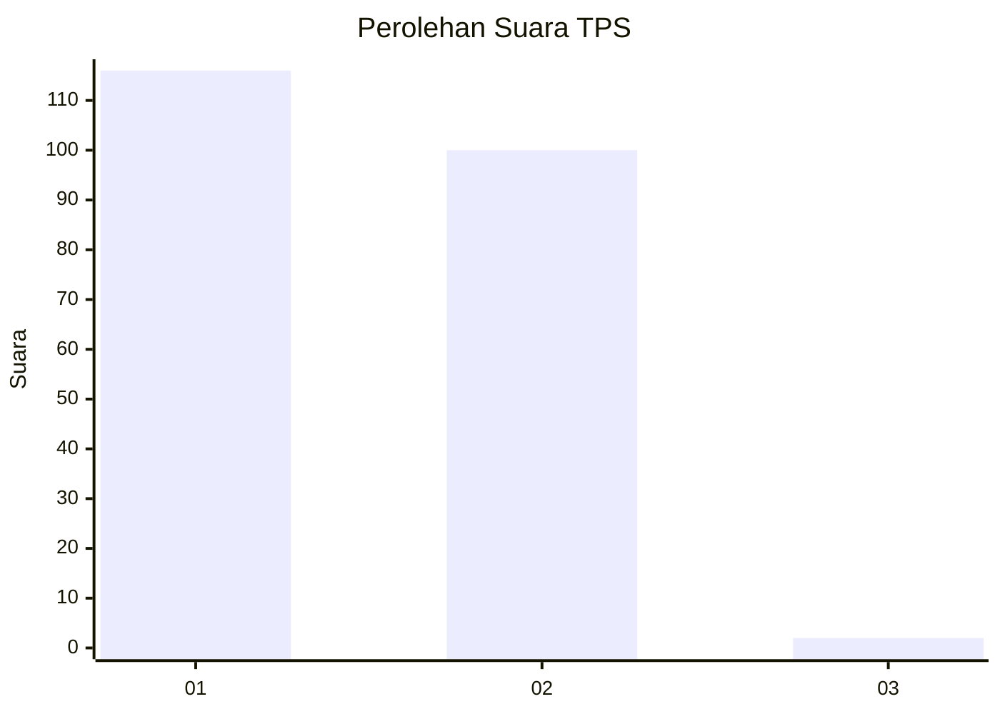
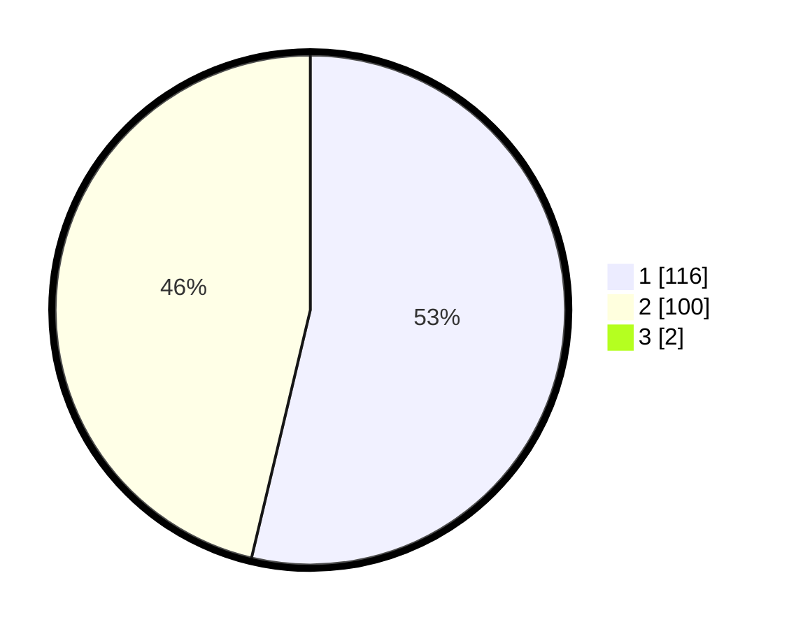

# Hasil

## Grafik

## Tabel

| No. | Nama Paslon    | Suara | Suara (raw) | Persentase |
|:--- |:-------------- | -----:| -----------:| ----------:|
| 1   | ANIES MUHAIMIN | 116   | [116][p-1]  | 53,21      |
| 2   | PRABOWO GIBRAN | 100   | [100][p-2]  | 45,87      |
| 3   | GANJAR MAHFUD  | 2     | [2][p-3]    | 0,92       |

[p-1]: https://github.com/gigit-pemilu/pemilu-2024-14-riau/blob/main/pilpres/hitung-suara/sub/14-riau/sub/08-siak/sub/09-koto-gasib/sub/2002-kuala-gasib/sub/002-tps/sub/paslon-1.txt
[p-2]: https://github.com/gigit-pemilu/pemilu-2024-14-riau/blob/main/pilpres/hitung-suara/sub/14-riau/sub/08-siak/sub/09-koto-gasib/sub/2002-kuala-gasib/sub/002-tps/sub/paslon-2.txt
[p-3]: https://github.com/gigit-pemilu/pemilu-2024-14-riau/blob/main/pilpres/hitung-suara/sub/14-riau/sub/08-siak/sub/09-koto-gasib/sub/2002-kuala-gasib/sub/002-tps/sub/paslon-3.txt

## Foto C Plano

https://sirekap-obj-formc.kpu.go.id/e9df/pemilu/ppwp/14/08/09/20/02/1408092002002-20240214-221517--9b3192e6-68ef-4a65-9249-6e9811d0bacf.jpg

https://sirekap-obj-formc.kpu.go.id/e9df/pemilu/ppwp/14/08/09/20/02/1408092002002-20240214-221550--3547a606-3501-4603-9031-63c1962d3261.jpg

https://sirekap-obj-formc.kpu.go.id/e9df/pemilu/ppwp/14/08/09/20/02/1408092002002-20240214-221627--bd9d6dad-99bc-4fef-bd7a-100045aca1c1.jpg

## Metadata

| Key        | Value               |
| ---------- | ------------------- |
| Time Stamp | 2024-02-24 22:31:28 |

