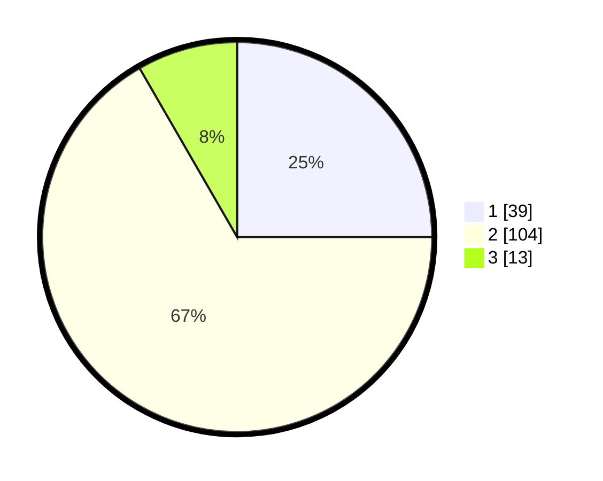

# Hasil

## Grafik

## Tabel

| No. | Nama Paslon    | Suara | Suara (raw) | Persentase |
|:--- |:-------------- | -----:| -----------:| ----------:|
| 1   | ANIES MUHAIMIN | 39    | [39][p-1]   | 25,00      |
| 2   | PRABOWO GIBRAN | 104   | [104][p-2]  | 66,67      |
| 3   | GANJAR MAHFUD  | 13    | [13][p-3]   | 8,33       |

[p-1]: https://github.com/gigit-pemilu/pemilu-2024-14-riau/blob/main/pilpres/hitung-suara/sub/14-riau/sub/08-siak/sub/09-koto-gasib/sub/2002-kuala-gasib/sub/004-tps/sub/paslon-1.txt
[p-2]: https://github.com/gigit-pemilu/pemilu-2024-14-riau/blob/main/pilpres/hitung-suara/sub/14-riau/sub/08-siak/sub/09-koto-gasib/sub/2002-kuala-gasib/sub/004-tps/sub/paslon-2.txt
[p-3]: https://github.com/gigit-pemilu/pemilu-2024-14-riau/blob/main/pilpres/hitung-suara/sub/14-riau/sub/08-siak/sub/09-koto-gasib/sub/2002-kuala-gasib/sub/004-tps/sub/paslon-3.txt

## Foto C Plano

https://sirekap-obj-formc.kpu.go.id/de2b/pemilu/ppwp/14/08/09/20/02/1408092002004-20240215-000811--6d6f2847-dd31-4b50-a9a7-7aba974864d1.jpg

https://sirekap-obj-formc.kpu.go.id/de2b/pemilu/ppwp/14/08/09/20/02/1408092002004-20240215-001100--af9ab24d-032d-47c1-9ad6-8d54f8533342.jpg

https://sirekap-obj-formc.kpu.go.id/de2b/pemilu/ppwp/14/08/09/20/02/1408092002004-20240215-001222--5b72e9e7-7566-47fb-8656-c962f4f9b7d0.jpg

## Metadata

| Key        | Value               |
| ---------- | ------------------- |
| Time Stamp | 2024-02-24 22:31:28 |

