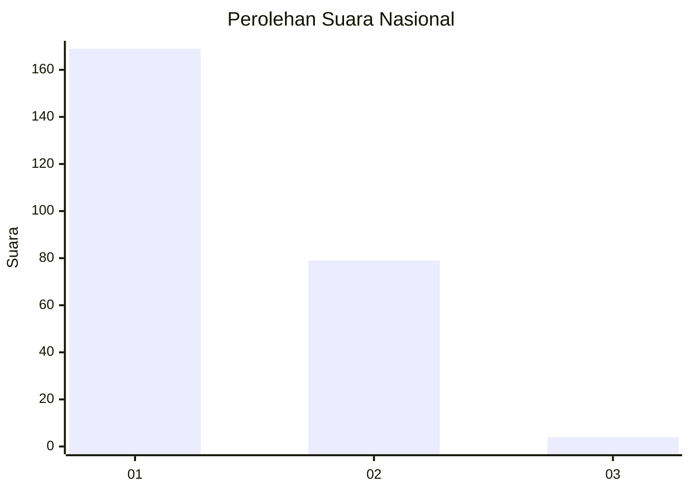
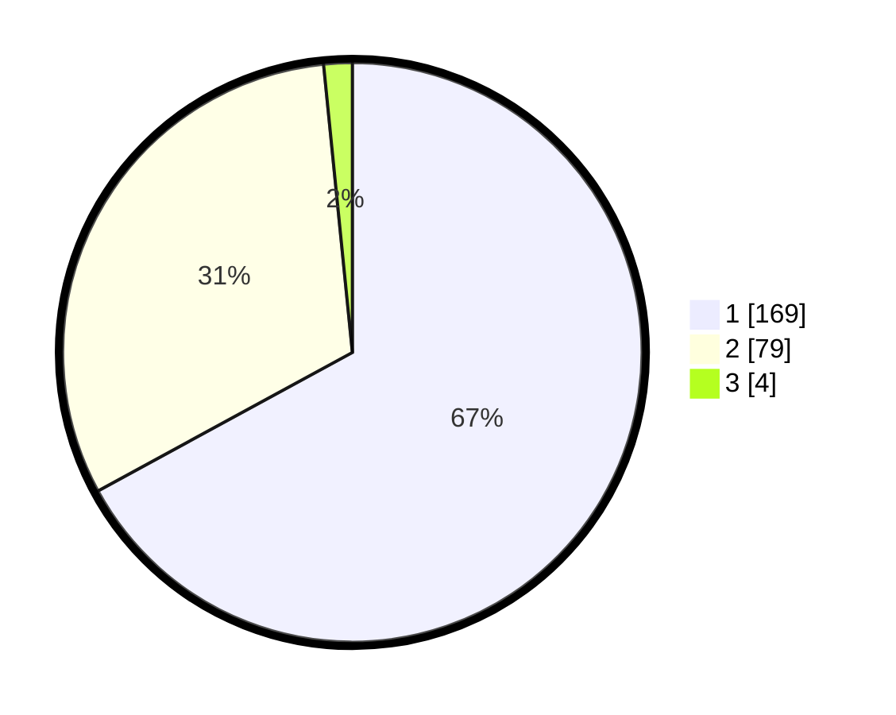

# Hasil

## Grafik

## Tabel

| No. | Nama Paslon    | Suara | Suara (raw) | Persentase |
|:--- |:-------------- | -----:| -----------:| ----------:|
| 1   | ANIES MUHAIMIN | 169   | [169][p-1]  | 67,06      |
| 2   | PRABOWO GIBRAN | 79    | [79][p-2]   | 31,35      |
| 3   | GANJAR MAHFUD  | 4     | [4][p-3]    | 1,59       |

[p-1]: https://github.com/gigit-pemilu/pemilu-2024/blob/main/pilpres/hitung-suara/sub/14-riau/sub/08-siak/sub/09-koto-gasib/sub/2005-buatan-ii/sub/005-tps/sub/paslon-1.txt
[p-2]: https://github.com/gigit-pemilu/pemilu-2024/blob/main/pilpres/hitung-suara/sub/14-riau/sub/08-siak/sub/09-koto-gasib/sub/2005-buatan-ii/sub/005-tps/sub/paslon-2.txt
[p-3]: https://github.com/gigit-pemilu/pemilu-2024/blob/main/pilpres/hitung-suara/sub/14-riau/sub/08-siak/sub/09-koto-gasib/sub/2005-buatan-ii/sub/005-tps/sub/paslon-3.txt

## Foto C Plano

https://sirekap-obj-formc.kpu.go.id/0ae2/pemilu/ppwp/14/08/09/20/05/1408092005005-20240214-200306--7f49b4ed-91c3-4a13-acec-e27a92939a77.jpg

https://sirekap-obj-formc.kpu.go.id/0ae2/pemilu/ppwp/14/08/09/20/05/1408092005005-20240214-200447--56e1974b-d6c3-45db-9651-d94a00351d4c.jpg

https://sirekap-obj-formc.kpu.go.id/0ae2/pemilu/ppwp/14/08/09/20/05/1408092005005-20240214-200550--37330f95-b356-4bdb-bb0c-86381600c054.jpg

## Metadata

| Key        | Value               |
| ---------- | ------------------- |
| Time Stamp | 2024-02-24 22:31:28 |

