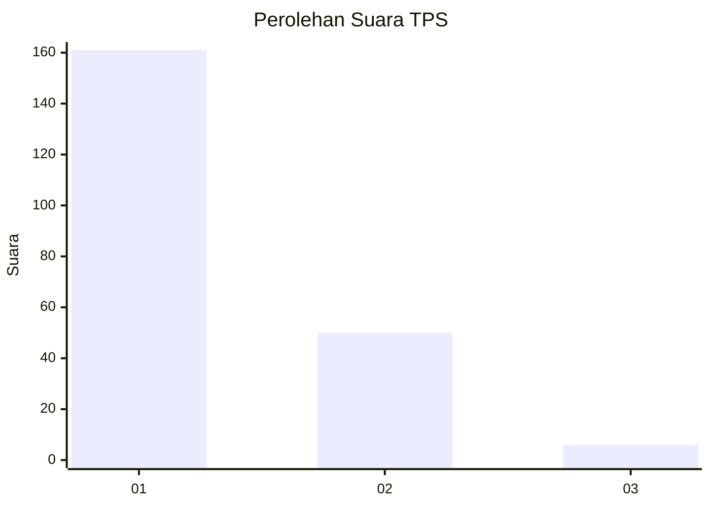
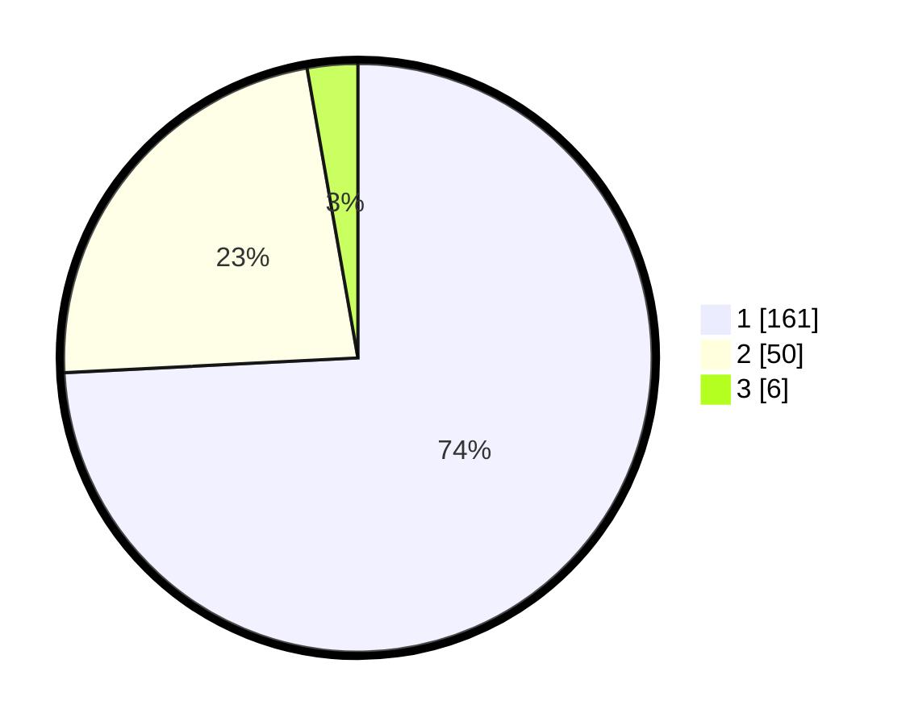

# Hasil

## Grafik

## Tabel

| No. | Nama Paslon    | Suara | Suara (raw) | Persentase |
|:--- |:-------------- | -----:| -----------:| ----------:|
| 1   | ANIES MUHAIMIN | 161   | [161][p-1]  | 74,19      |
| 2   | PRABOWO GIBRAN | 50    | [50][p-2]   | 23,04      |
| 3   | GANJAR MAHFUD  | 6     | [6][p-3]    | 2,76       |

[p-1]: https://github.com/gigit-pemilu/pemilu-2024-14-riau/blob/main/pilpres/hitung-suara/sub/14-riau/sub/08-siak/sub/09-koto-gasib/sub/2005-buatan-ii/sub/008-tps/sub/paslon-1.txt
[p-2]: https://github.com/gigit-pemilu/pemilu-2024-14-riau/blob/main/pilpres/hitung-suara/sub/14-riau/sub/08-siak/sub/09-koto-gasib/sub/2005-buatan-ii/sub/008-tps/sub/paslon-2.txt
[p-3]: https://github.com/gigit-pemilu/pemilu-2024-14-riau/blob/main/pilpres/hitung-suara/sub/14-riau/sub/08-siak/sub/09-koto-gasib/sub/2005-buatan-ii/sub/008-tps/sub/paslon-3.txt

## Foto C Plano

https://sirekap-obj-formc.kpu.go.id/6aea/pemilu/ppwp/14/08/09/20/05/1408092005008-20240214-233954--cc63e5d9-cd30-49e8-b783-55f0da061bac.jpg

https://sirekap-obj-formc.kpu.go.id/6aea/pemilu/ppwp/14/08/09/20/05/1408092005008-20240214-224052--a3681670-83fd-40d7-aa1b-1c7245afb736.jpg

https://sirekap-obj-formc.kpu.go.id/6aea/pemilu/ppwp/14/08/09/20/05/1408092005008-20240214-223113--3c7a3a71-2906-4174-abc0-58c2324f71d4.jpg

## Metadata

| Key        | Value               |
| ---------- | ------------------- |
| Time Stamp | 2024-02-24 22:31:28 |

