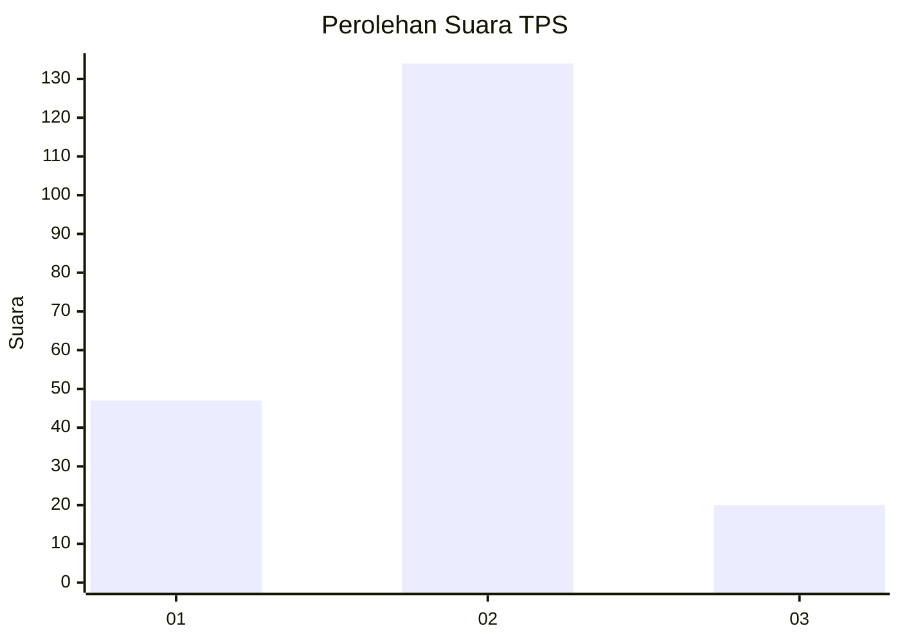

# Hasil

## Grafik

## Tabel

| No. | Nama Paslon    | Suara | Suara (raw) | Persentase |
|:--- |:-------------- | -----:| -----------:| ----------:|
| 1   | ANIES MUHAIMIN | 47    | [47][p-1]   | 23,38      |
| 2   | PRABOWO GIBRAN | 134   | [134][p-2]  | 66,67      |
| 3   | GANJAR MAHFUD  | 20    | [20][p-3]   | 9,95       |

[p-1]: https://github.com/gigit-pemilu/pemilu-2024-14-riau/blob/main/pilpres/hitung-suara/sub/14-riau/sub/08-siak/sub/11-lubuk-dalam/sub/2001-lubuk-dalam/sub/002-tps/sub/paslon-1.txt
[p-2]: https://github.com/gigit-pemilu/pemilu-2024-14-riau/blob/main/pilpres/hitung-suara/sub/14-riau/sub/08-siak/sub/11-lubuk-dalam/sub/2001-lubuk-dalam/sub/002-tps/sub/paslon-2.txt
[p-3]: https://github.com/gigit-pemilu/pemilu-2024-14-riau/blob/main/pilpres/hitung-suara/sub/14-riau/sub/08-siak/sub/11-lubuk-dalam/sub/2001-lubuk-dalam/sub/002-tps/sub/paslon-3.txt

## Foto C Plano

https://sirekap-obj-formc.kpu.go.id/0519/pemilu/ppwp/14/08/11/20/01/1408112001002-20240215-024642--98d9d0b7-5276-46a2-8685-b25bbb5f215f.jpg

https://sirekap-obj-formc.kpu.go.id/0519/pemilu/ppwp/14/08/11/20/01/1408112001002-20240215-024820--7a943eec-efa9-4821-96e7-b08d3b086506.jpg

https://sirekap-obj-formc.kpu.go.id/0519/pemilu/ppwp/14/08/11/20/01/1408112001002-20240215-024904--aa965ae1-039a-4bda-a7ff-c6e7091471db.jpg

## Metadata

| Key        | Value               |
| ---------- | ------------------- |
| Time Stamp | 2024-02-24 22:31:28 |

