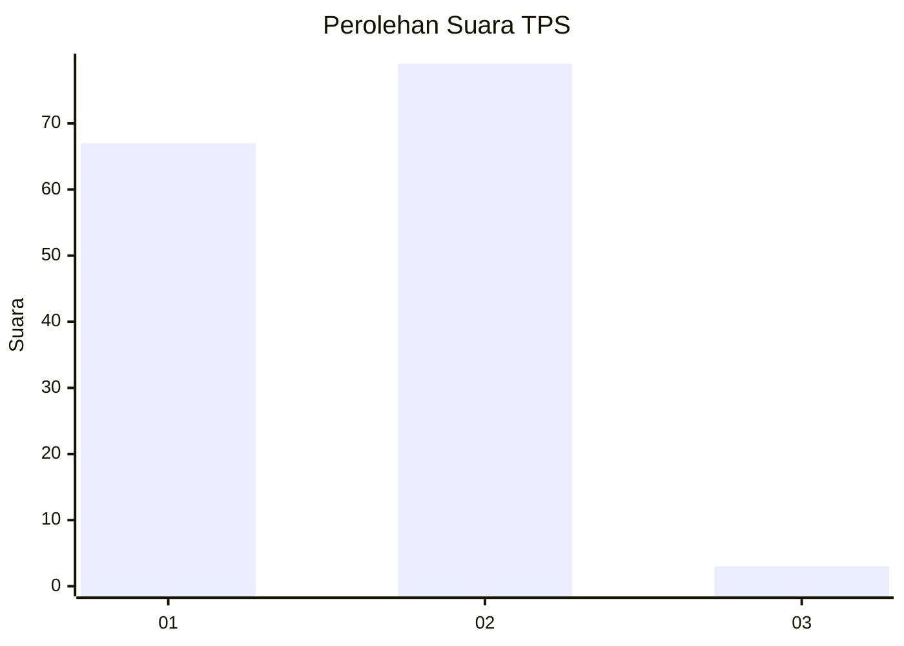
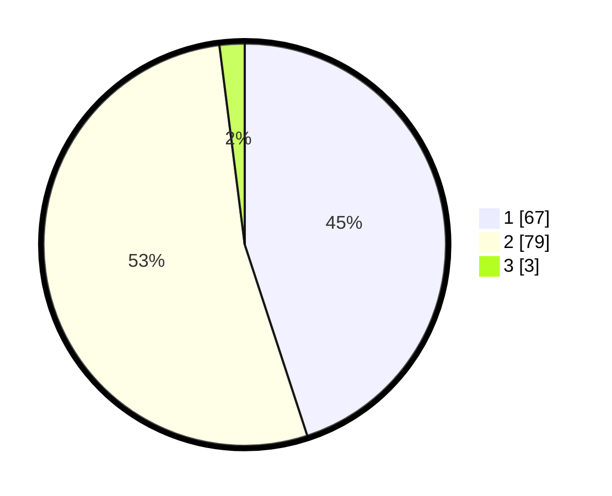

# Hasil

## Grafik

## Tabel

| No. | Nama Paslon    | Suara | Suara (raw) | Persentase |
|:--- |:-------------- | -----:| -----------:| ----------:|
| 1   | ANIES MUHAIMIN | 67    | [67][p-1]   | 44,97      |
| 2   | PRABOWO GIBRAN | 79    | [79][p-2]   | 53,02      |
| 3   | GANJAR MAHFUD  | 3     | [3][p-3]    | 2,01       |

[p-1]: https://github.com/gigit-pemilu/pemilu-2024-14-riau/blob/main/pilpres/hitung-suara/sub/14-riau/sub/08-siak/sub/11-lubuk-dalam/sub/2001-lubuk-dalam/sub/003-tps/sub/paslon-1.txt
[p-2]: https://github.com/gigit-pemilu/pemilu-2024-14-riau/blob/main/pilpres/hitung-suara/sub/14-riau/sub/08-siak/sub/11-lubuk-dalam/sub/2001-lubuk-dalam/sub/003-tps/sub/paslon-2.txt
[p-3]: https://github.com/gigit-pemilu/pemilu-2024-14-riau/blob/main/pilpres/hitung-suara/sub/14-riau/sub/08-siak/sub/11-lubuk-dalam/sub/2001-lubuk-dalam/sub/003-tps/sub/paslon-3.txt

## Foto C Plano

https://sirekap-obj-formc.kpu.go.id/3eb1/pemilu/ppwp/14/08/11/20/01/1408112001003-20240229-112734--63a10faf-0a86-4202-b3a9-865f967276e6.jpg

https://sirekap-obj-formc.kpu.go.id/3eb1/pemilu/ppwp/14/08/11/20/01/1408112001003-20240226-162731--e24e448c-f653-4fbd-a18b-f4f6f40f417d.jpg

https://sirekap-obj-formc.kpu.go.id/3eb1/pemilu/ppwp/14/08/11/20/01/1408112001003-20240226-163101--f7e44d64-0329-4675-a11a-643f5d65ac0b.jpg

## Metadata

| Key        | Value               |
| ---------- | ------------------- |
| Time Stamp | 2024-03-01 22:00:00 |

