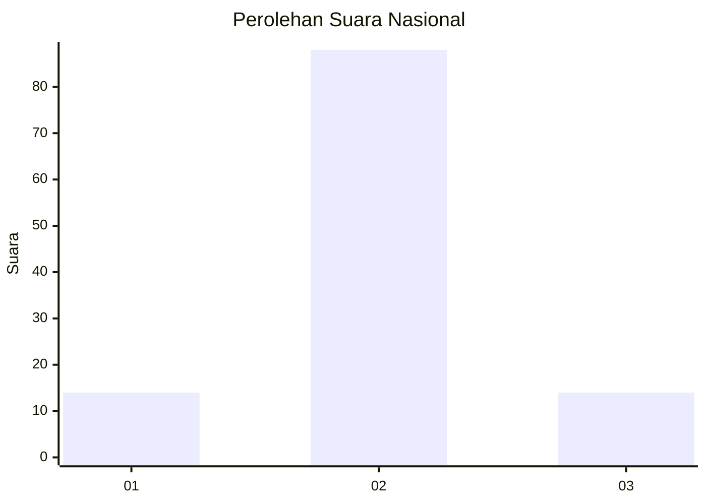
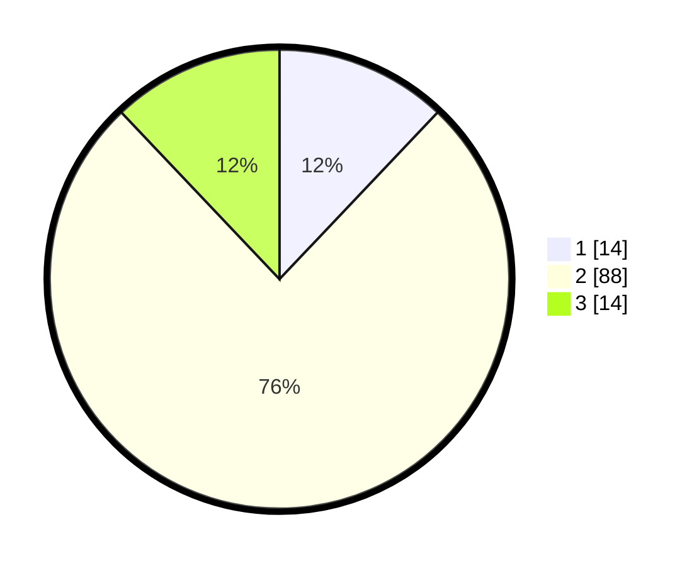

# Hasil

## Grafik

## Tabel

| No. | Nama Paslon    | Suara | Suara (raw) | Persentase |
|:--- |:-------------- | -----:| -----------:| ----------:|
| 1   | ANIES MUHAIMIN | 14    | [14][p-1]   | 12,07      |
| 2   | PRABOWO GIBRAN | 88    | [88][p-2]   | 75,86      |
| 3   | GANJAR MAHFUD  | 14    | [14][p-3]   | 12,07      |

[p-1]: https://github.com/gigit-pemilu/pemilu-2024/blob/main/pilpres/hitung-suara/sub/14-riau/sub/08-siak/sub/11-lubuk-dalam/sub/2001-lubuk-dalam/sub/019-tps/sub/paslon-1.txt
[p-2]: https://github.com/gigit-pemilu/pemilu-2024/blob/main/pilpres/hitung-suara/sub/14-riau/sub/08-siak/sub/11-lubuk-dalam/sub/2001-lubuk-dalam/sub/019-tps/sub/paslon-2.txt
[p-3]: https://github.com/gigit-pemilu/pemilu-2024/blob/main/pilpres/hitung-suara/sub/14-riau/sub/08-siak/sub/11-lubuk-dalam/sub/2001-lubuk-dalam/sub/019-tps/sub/paslon-3.txt

## Foto C Plano

https://sirekap-obj-formc.kpu.go.id/82f2/pemilu/ppwp/14/08/11/20/01/1408112001019-20240215-045406--e461e931-6373-475e-b85b-9cbfab960079.jpg

https://sirekap-obj-formc.kpu.go.id/82f2/pemilu/ppwp/14/08/11/20/01/1408112001019-20240214-233656--8ec87b54-129d-482b-9c10-98d2fcd665a3.jpg

https://sirekap-obj-formc.kpu.go.id/82f2/pemilu/ppwp/14/08/11/20/01/1408112001019-20240214-233736--0e0ec20b-2539-44a9-9c90-c164ca1e2520.jpg

## Metadata

| Key        | Value               |
| ---------- | ------------------- |
| Time Stamp | 2024-02-25 02:00:00 |

