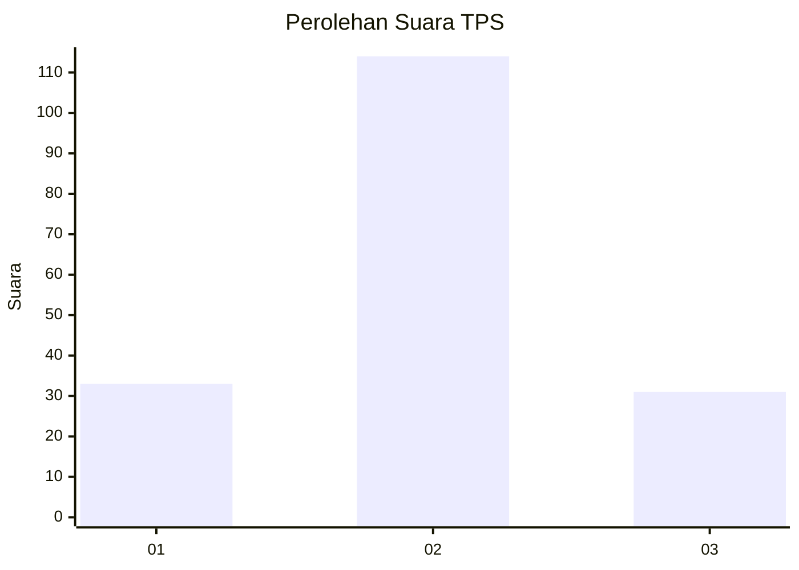
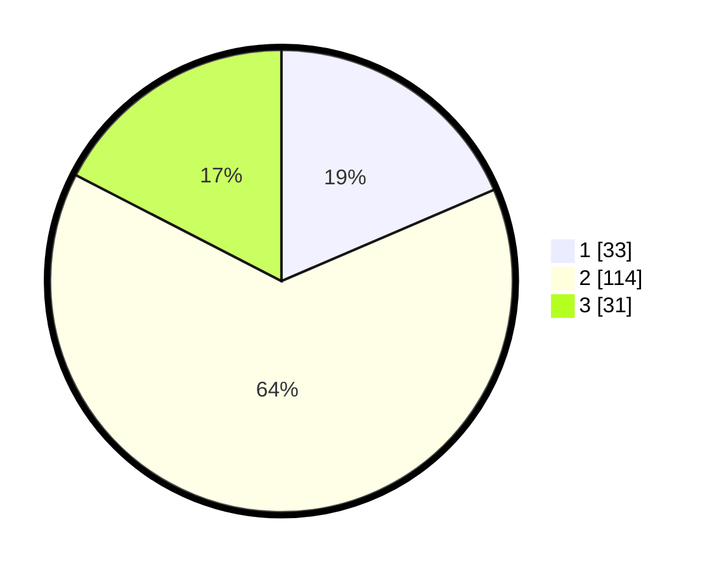

# Hasil

## Grafik

## Tabel

| No. | Nama Paslon    | Suara | Suara (raw) | Persentase |
|:--- |:-------------- | -----:| -----------:| ----------:|
| 1   | ANIES MUHAIMIN | 33    | [33][p-1]   | 18,54      |
| 2   | PRABOWO GIBRAN | 114   | [114][p-2]  | 64,04      |
| 3   | GANJAR MAHFUD  | 31    | [31][p-3]   | 17,42      |

[p-1]: https://github.com/gigit-pemilu/pemilu-2024-14-riau/blob/main/pilpres/hitung-suara/sub/14-riau/sub/08-siak/sub/11-lubuk-dalam/sub/2005-sialang-palas/sub/002-tps/sub/paslon-1.txt
[p-2]: https://github.com/gigit-pemilu/pemilu-2024-14-riau/blob/main/pilpres/hitung-suara/sub/14-riau/sub/08-siak/sub/11-lubuk-dalam/sub/2005-sialang-palas/sub/002-tps/sub/paslon-2.txt
[p-3]: https://github.com/gigit-pemilu/pemilu-2024-14-riau/blob/main/pilpres/hitung-suara/sub/14-riau/sub/08-siak/sub/11-lubuk-dalam/sub/2005-sialang-palas/sub/002-tps/sub/paslon-3.txt

## Foto C Plano

https://sirekap-obj-formc.kpu.go.id/5b09/pemilu/ppwp/14/08/11/20/05/1408112005002-20240214-234934--a1a39b16-f0a2-4a33-a6d3-9095dfca4fb1.jpg

https://sirekap-obj-formc.kpu.go.id/5b09/pemilu/ppwp/14/08/11/20/05/1408112005002-20240214-235614--7dccb5fc-1264-408f-8059-a90135bf0c5d.jpg

https://sirekap-obj-formc.kpu.go.id/5b09/pemilu/ppwp/14/08/11/20/05/1408112005002-20240215-032204--e78d8399-d77b-4cbf-86a0-66af3f4288f4.jpg

## Metadata

| Key        | Value               |
| ---------- | ------------------- |
| Time Stamp | 2024-02-24 22:31:28 |

