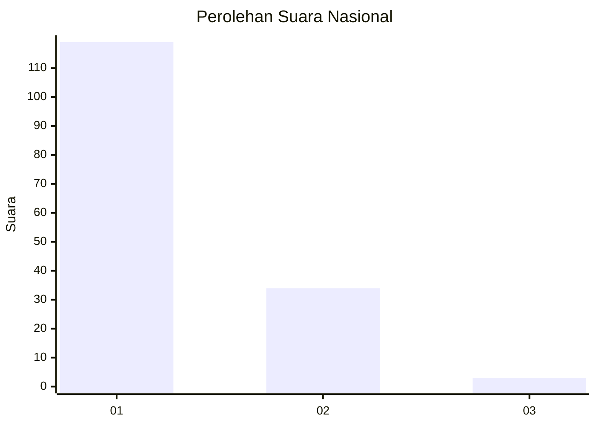
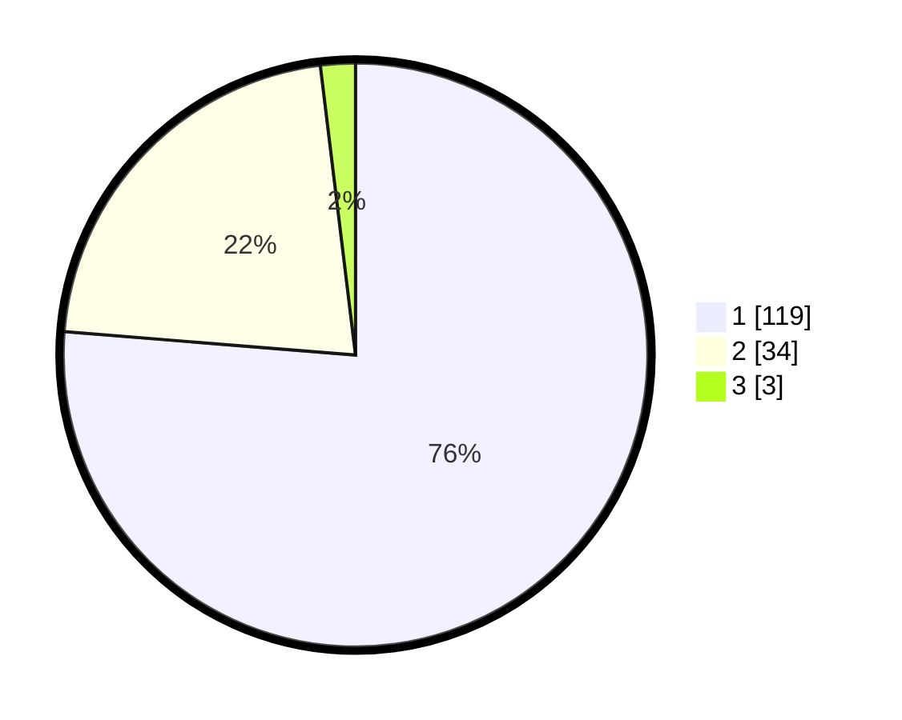

# Hasil

## Grafik

## Tabel

| No. | Nama Paslon    | Suara | Suara (raw) | Persentase |
|:--- |:-------------- | -----:| -----------:| ----------:|
| 1   | ANIES MUHAIMIN | 119   | [119][p-1]  | 76,28      |
| 2   | PRABOWO GIBRAN | 34    | [34][p-2]   | 21,79      |
| 3   | GANJAR MAHFUD  | 3     | [3][p-3]    | 1,92       |

[p-1]: https://github.com/gigit-pemilu/pemilu-2024/blob/main/pilpres/hitung-suara/sub/14-riau/sub/08-siak/sub/12-sabak-auh/sub/2002-rempak/sub/001-tps/sub/paslon-1.txt
[p-2]: https://github.com/gigit-pemilu/pemilu-2024/blob/main/pilpres/hitung-suara/sub/14-riau/sub/08-siak/sub/12-sabak-auh/sub/2002-rempak/sub/001-tps/sub/paslon-2.txt
[p-3]: https://github.com/gigit-pemilu/pemilu-2024/blob/main/pilpres/hitung-suara/sub/14-riau/sub/08-siak/sub/12-sabak-auh/sub/2002-rempak/sub/001-tps/sub/paslon-3.txt

## Foto C Plano

https://sirekap-obj-formc.kpu.go.id/311f/pemilu/ppwp/14/08/12/20/02/1408122002001-20240214-202025--7258cf46-b527-4f2e-a909-2cfe95f2406a.jpg

https://sirekap-obj-formc.kpu.go.id/311f/pemilu/ppwp/14/08/12/20/02/1408122002001-20240214-202034--ee2b86c9-6e83-4022-bf16-84d470b06974.jpg

https://sirekap-obj-formc.kpu.go.id/311f/pemilu/ppwp/14/08/12/20/02/1408122002001-20240214-202041--382c981a-7774-4a83-8420-efa14ffb0b26.jpg

## Metadata

| Key        | Value               |
| ---------- | ------------------- |
| Time Stamp | 2024-02-15 16:00:26 |

