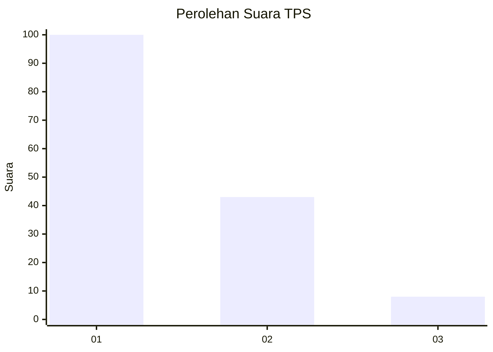
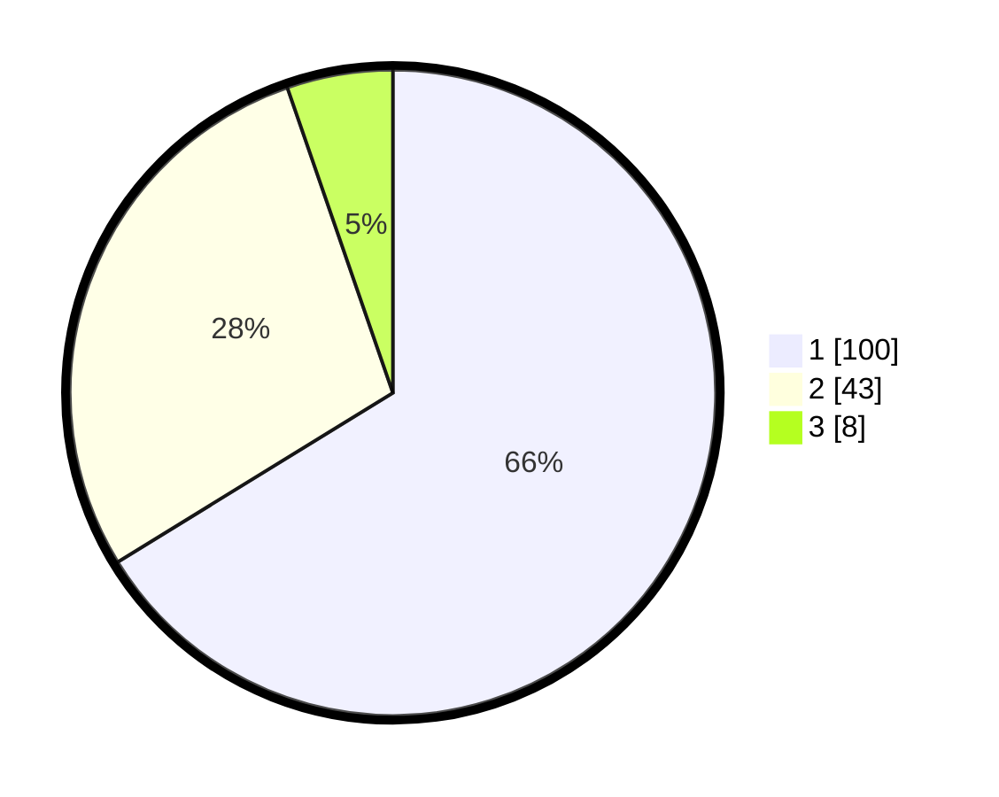

# Hasil

## Grafik

## Tabel

| No. | Nama Paslon    | Suara | Suara (raw) | Persentase |
|:--- |:-------------- | -----:| -----------:| ----------:|
| 1   | ANIES MUHAIMIN | 100   | [100][p-1]  | 66,23      |
| 2   | PRABOWO GIBRAN | 43    | [43][p-2]   | 28,48      |
| 3   | GANJAR MAHFUD  | 8     | [8][p-3]    | 5,30       |

[p-1]: https://github.com/gigit-pemilu/pemilu-2024-14-riau/blob/main/pilpres/hitung-suara/sub/14-riau/sub/08-siak/sub/12-sabak-auh/sub/2002-rempak/sub/003-tps/sub/paslon-1.txt
[p-2]: https://github.com/gigit-pemilu/pemilu-2024-14-riau/blob/main/pilpres/hitung-suara/sub/14-riau/sub/08-siak/sub/12-sabak-auh/sub/2002-rempak/sub/003-tps/sub/paslon-2.txt
[p-3]: https://github.com/gigit-pemilu/pemilu-2024-14-riau/blob/main/pilpres/hitung-suara/sub/14-riau/sub/08-siak/sub/12-sabak-auh/sub/2002-rempak/sub/003-tps/sub/paslon-3.txt

## Foto C Plano

https://sirekap-obj-formc.kpu.go.id/82b3/pemilu/ppwp/14/08/12/20/02/1408122002003-20240214-212502--43d6ef59-54e4-4b08-ae51-ba837a287d56.jpg

https://sirekap-obj-formc.kpu.go.id/82b3/pemilu/ppwp/14/08/12/20/02/1408122002003-20240214-212609--96a0d20d-4d73-411d-99bf-7348a6d3b64e.jpg

https://sirekap-obj-formc.kpu.go.id/82b3/pemilu/ppwp/14/08/12/20/02/1408122002003-20240214-212824--f4b5dff1-d491-4632-8981-45f0213b6a41.jpg

## Metadata

| Key        | Value               |
| ---------- | ------------------- |
| Time Stamp | 2024-02-15 16:00:26 |

