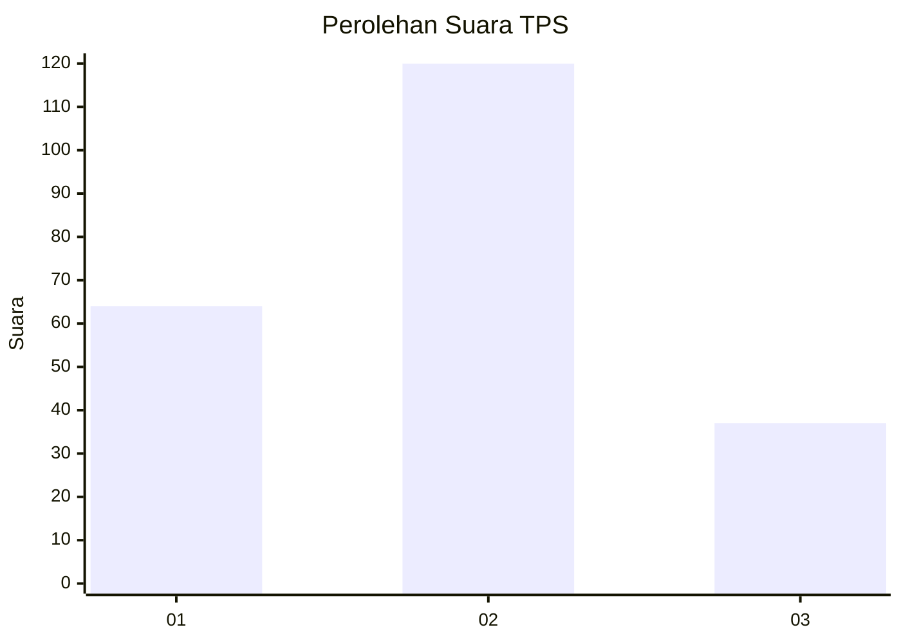
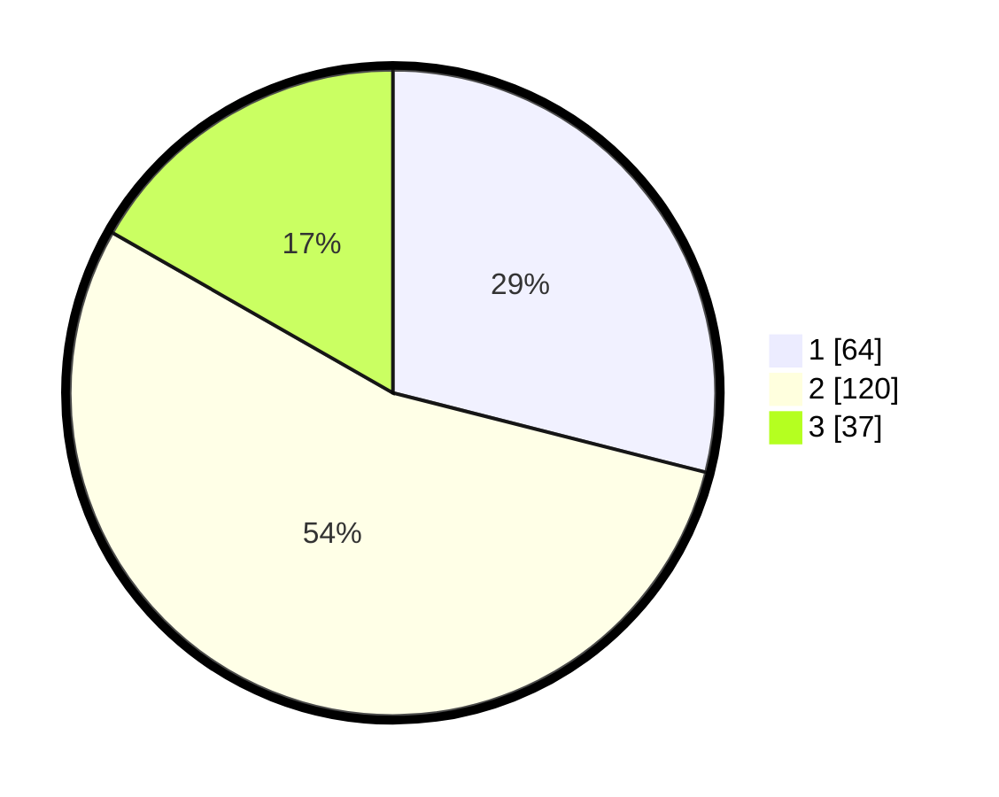

# Hasil

## Grafik

## Tabel

| No. | Nama Paslon    | Suara | Suara (raw) | Persentase |
|:--- |:-------------- | -----:| -----------:| ----------:|
| 1   | ANIES MUHAIMIN | 64    | [64][p-1]   | 28,96      |
| 2   | PRABOWO GIBRAN | 120   | [120][p-2]  | 54,30      |
| 3   | GANJAR MAHFUD  | 37    | [37][p-3]   | 16,74      |

[p-1]: https://github.com/gigit-pemilu/pemilu-2024-14-riau/blob/main/pilpres/hitung-suara/sub/14-riau/sub/08-siak/sub/13-mempura/sub/1006-sungaimempura/sub/005-tps/sub/paslon-1.txt
[p-2]: https://github.com/gigit-pemilu/pemilu-2024-14-riau/blob/main/pilpres/hitung-suara/sub/14-riau/sub/08-siak/sub/13-mempura/sub/1006-sungaimempura/sub/005-tps/sub/paslon-2.txt
[p-3]: https://github.com/gigit-pemilu/pemilu-2024-14-riau/blob/main/pilpres/hitung-suara/sub/14-riau/sub/08-siak/sub/13-mempura/sub/1006-sungaimempura/sub/005-tps/sub/paslon-3.txt

## Foto C Plano

https://sirekap-obj-formc.kpu.go.id/d118/pemilu/ppwp/14/08/13/10/06/1408131006005-20240214-215856--c3552562-4784-4e59-ac8a-150d71dad487.jpg

https://sirekap-obj-formc.kpu.go.id/d118/pemilu/ppwp/14/08/13/10/06/1408131006005-20240214-220136--93a51994-f727-44cd-a758-57a50a03e3cc.jpg

https://sirekap-obj-formc.kpu.go.id/d118/pemilu/ppwp/14/08/13/10/06/1408131006005-20240214-220422--1be3d079-d3e7-4c6f-9ec6-42044caea7fe.jpg

## Metadata

| Key        | Value               |
| ---------- | ------------------- |
| Time Stamp | 2024-02-15 19:30:26 |

