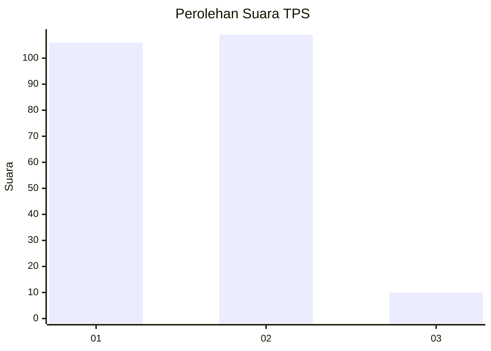
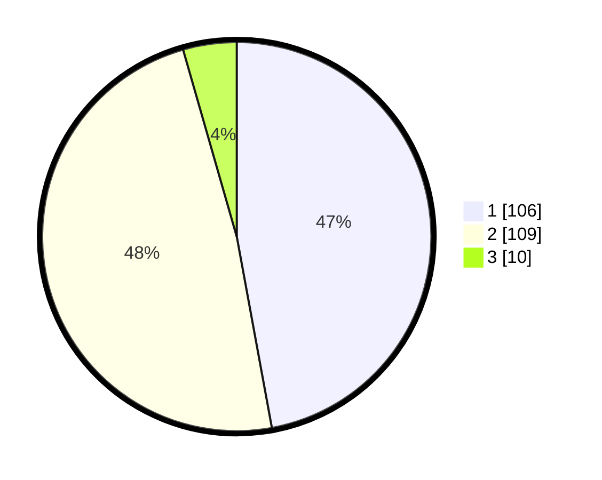

# Hasil

## Grafik

## Tabel

| No. | Nama Paslon    | Suara | Suara (raw) | Persentase |
|:--- |:-------------- | -----:| -----------:| ----------:|
| 1   | ANIES MUHAIMIN | 106   | [106][p-1]  | 47,11      |
| 2   | PRABOWO GIBRAN | 109   | [109][p-2]  | 48,44      |
| 3   | GANJAR MAHFUD  | 10    | [10][p-3]   | 4,44       |

[p-1]: https://github.com/gigit-pemilu/pemilu-2024-14-riau/blob/main/pilpres/hitung-suara/sub/14-riau/sub/08-siak/sub/13-mempura/sub/1006-sungaimempura/sub/006-tps/sub/paslon-1.txt
[p-2]: https://github.com/gigit-pemilu/pemilu-2024-14-riau/blob/main/pilpres/hitung-suara/sub/14-riau/sub/08-siak/sub/13-mempura/sub/1006-sungaimempura/sub/006-tps/sub/paslon-2.txt
[p-3]: https://github.com/gigit-pemilu/pemilu-2024-14-riau/blob/main/pilpres/hitung-suara/sub/14-riau/sub/08-siak/sub/13-mempura/sub/1006-sungaimempura/sub/006-tps/sub/paslon-3.txt

## Foto C Plano

https://sirekap-obj-formc.kpu.go.id/7032/pemilu/ppwp/14/08/13/10/06/1408131006006-20240215-033159--14fa2256-b4bb-4c80-b90c-99ba871379ad.jpg

https://sirekap-obj-formc.kpu.go.id/7032/pemilu/ppwp/14/08/13/10/06/1408131006006-20240215-033355--d79adb68-3313-48e7-a233-63cfb27527fc.jpg

https://sirekap-obj-formc.kpu.go.id/7032/pemilu/ppwp/14/08/13/10/06/1408131006006-20240215-033502--56b79025-6137-435f-9f4f-52b9316585ac.jpg

## Metadata

| Key        | Value               |
| ---------- | ------------------- |
| Time Stamp | 2024-02-24 22:31:28 |

