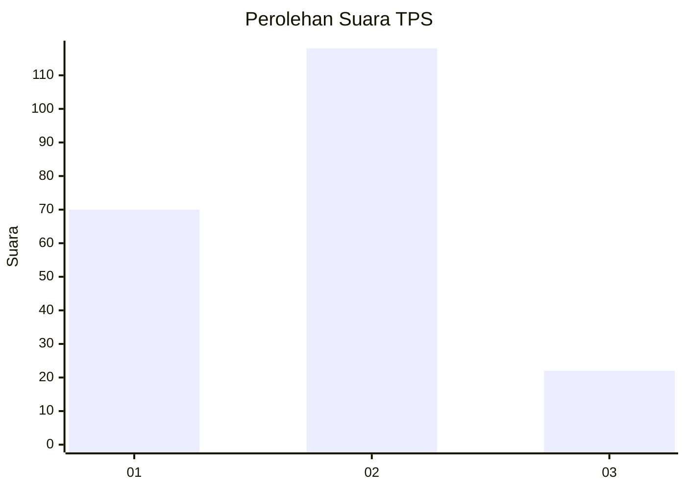
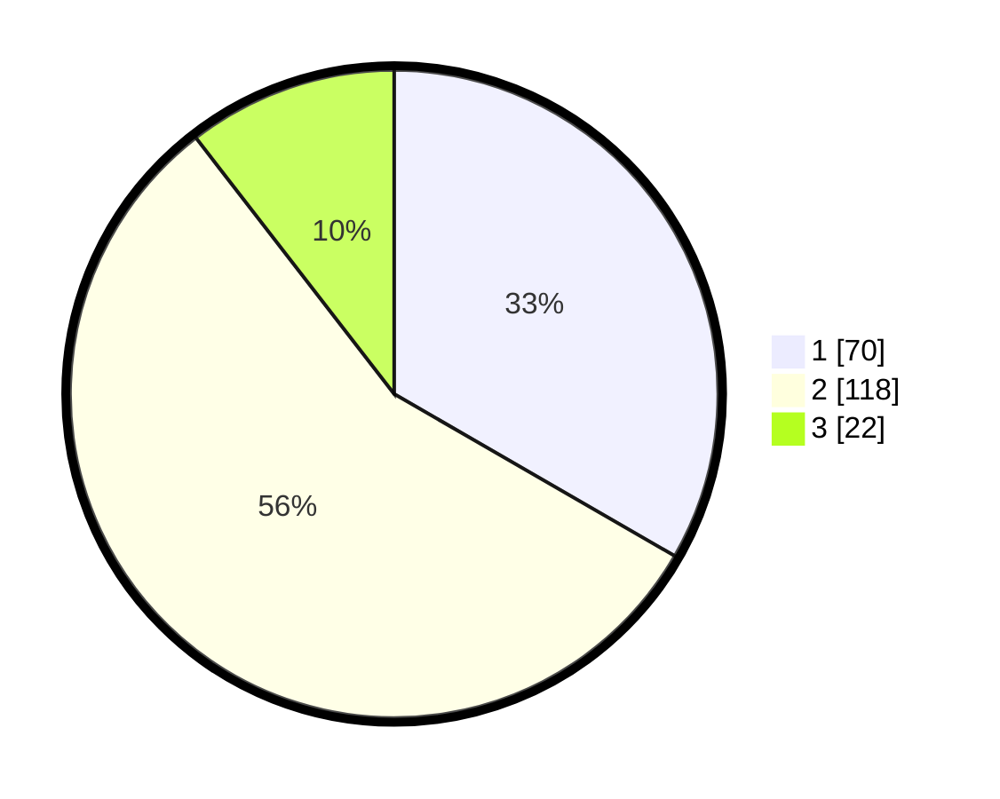

# Hasil

## Grafik

## Tabel

| No. | Nama Paslon    | Suara | Suara (raw) | Persentase |
|:--- |:-------------- | -----:| -----------:| ----------:|
| 1   | ANIES MUHAIMIN | 70    | [70][p-1]   | 33,33      |
| 2   | PRABOWO GIBRAN | 118   | [118][p-2]  | 56,19      |
| 3   | GANJAR MAHFUD  | 22    | [22][p-3]   | 10,48      |

[p-1]: https://github.com/gigit-pemilu/pemilu-2024-14-riau/blob/main/pilpres/hitung-suara/sub/14-riau/sub/08-siak/sub/13-mempura/sub/2001-kota-ringin/sub/004-tps/sub/paslon-1.txt
[p-2]: https://github.com/gigit-pemilu/pemilu-2024-14-riau/blob/main/pilpres/hitung-suara/sub/14-riau/sub/08-siak/sub/13-mempura/sub/2001-kota-ringin/sub/004-tps/sub/paslon-2.txt
[p-3]: https://github.com/gigit-pemilu/pemilu-2024-14-riau/blob/main/pilpres/hitung-suara/sub/14-riau/sub/08-siak/sub/13-mempura/sub/2001-kota-ringin/sub/004-tps/sub/paslon-3.txt

## Foto C Plano

https://sirekap-obj-formc.kpu.go.id/dfa3/pemilu/ppwp/14/08/13/20/01/1408132001004-20240215-043316--fa281e7f-6461-42f1-993d-bec12e644eec.jpg

https://sirekap-obj-formc.kpu.go.id/dfa3/pemilu/ppwp/14/08/13/20/01/1408132001004-20240215-043525--48329a0b-69c3-4baa-acaf-b696b1684f79.jpg

https://sirekap-obj-formc.kpu.go.id/dfa3/pemilu/ppwp/14/08/13/20/01/1408132001004-20240215-043653--0a96a81b-cc43-4c06-8dcf-29d2d95988b2.jpg

## Metadata

| Key        | Value               |
| ---------- | ------------------- |
| Time Stamp | 2024-02-24 22:31:28 |

