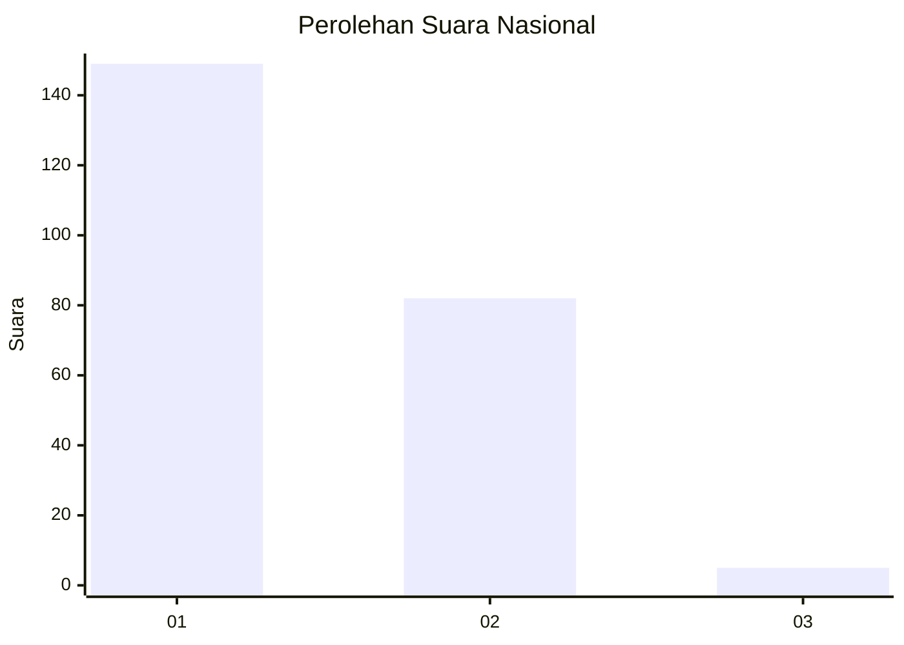
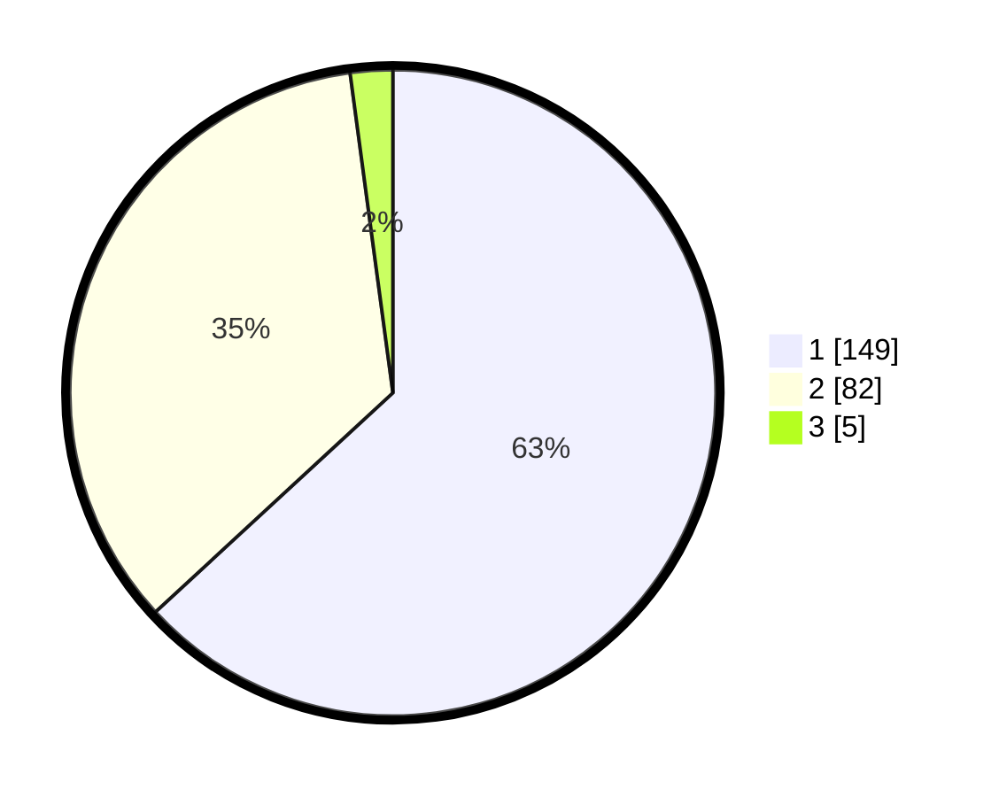

# Hasil

## Grafik

## Tabel

| No. | Nama Paslon    | Suara | Suara (raw) | Persentase |
|:--- |:-------------- | -----:| -----------:| ----------:|
| 1   | ANIES MUHAIMIN | 149   | [149][p-1]  | 63,14      |
| 2   | PRABOWO GIBRAN | 82    | [82][p-2]   | 34,75      |
| 3   | GANJAR MAHFUD  | 5     | [5][p-3]    | 2,12       |

[p-1]: https://github.com/gigit-pemilu/pemilu-2024/blob/main/pilpres/hitung-suara/sub/14-riau/sub/08-siak/sub/13-mempura/sub/2003-benteng-hilir/sub/003-tps/sub/paslon-1.txt
[p-2]: https://github.com/gigit-pemilu/pemilu-2024/blob/main/pilpres/hitung-suara/sub/14-riau/sub/08-siak/sub/13-mempura/sub/2003-benteng-hilir/sub/003-tps/sub/paslon-2.txt
[p-3]: https://github.com/gigit-pemilu/pemilu-2024/blob/main/pilpres/hitung-suara/sub/14-riau/sub/08-siak/sub/13-mempura/sub/2003-benteng-hilir/sub/003-tps/sub/paslon-3.txt

## Foto C Plano

https://sirekap-obj-formc.kpu.go.id/dab0/pemilu/ppwp/14/08/13/20/03/1408132003003-20240215-024249--68047240-7ccb-4b4e-aab0-662872fb884a.jpg

https://sirekap-obj-formc.kpu.go.id/dab0/pemilu/ppwp/14/08/13/20/03/1408132003003-20240215-024640--7213e808-c8a8-47ab-9200-1a403817a636.jpg

https://sirekap-obj-formc.kpu.go.id/dab0/pemilu/ppwp/14/08/13/20/03/1408132003003-20240215-025140--bef4fb35-d381-4c92-ba9f-96a56179d424.jpg

## Metadata

| Key        | Value               |
| ---------- | ------------------- |
| Time Stamp | 2024-02-24 22:31:28 |

