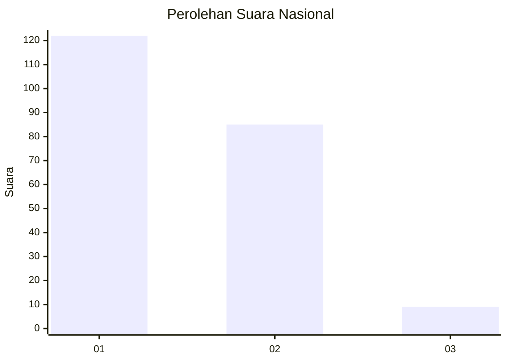
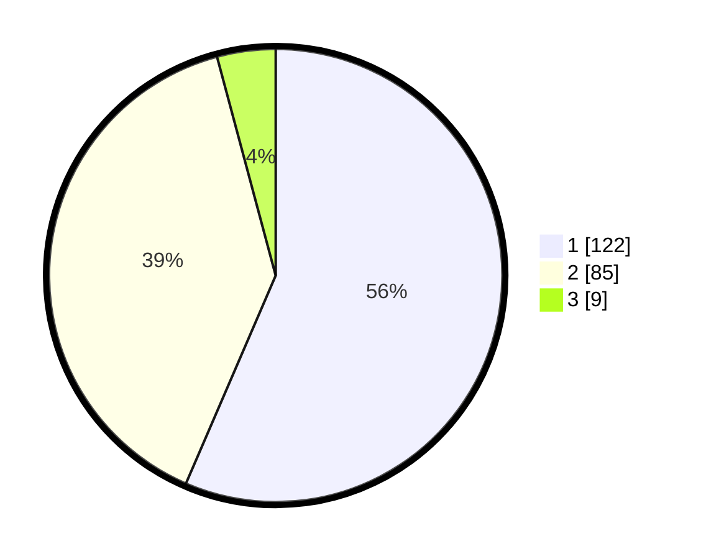

# Hasil

## Grafik

## Tabel

| No. | Nama Paslon    | Suara | Suara (raw) | Persentase |
|:--- |:-------------- | -----:| -----------:| ----------:|
| 1   | ANIES MUHAIMIN | 122   | [122][p-1]  | 56,48      |
| 2   | PRABOWO GIBRAN | 85    | [85][p-2]   | 39,35      |
| 3   | GANJAR MAHFUD  | 9     | [9][p-3]    | 4,17       |

[p-1]: https://github.com/gigit-pemilu/pemilu-2024/blob/main/pilpres/hitung-suara/sub/14-riau/sub/08-siak/sub/13-mempura/sub/2004-benteng-hulu/sub/004-tps/sub/paslon-1.txt
[p-2]: https://github.com/gigit-pemilu/pemilu-2024/blob/main/pilpres/hitung-suara/sub/14-riau/sub/08-siak/sub/13-mempura/sub/2004-benteng-hulu/sub/004-tps/sub/paslon-2.txt
[p-3]: https://github.com/gigit-pemilu/pemilu-2024/blob/main/pilpres/hitung-suara/sub/14-riau/sub/08-siak/sub/13-mempura/sub/2004-benteng-hulu/sub/004-tps/sub/paslon-3.txt

## Foto C Plano

https://sirekap-obj-formc.kpu.go.id/6bbc/pemilu/ppwp/14/08/13/20/04/1408132004004-20240215-001048--817dcd47-659a-48f6-a89b-e77b38ae5727.jpg

https://sirekap-obj-formc.kpu.go.id/6bbc/pemilu/ppwp/14/08/13/20/04/1408132004004-20240215-001316--1fa6381d-3548-4039-8390-fdc3157bd9db.jpg

https://sirekap-obj-formc.kpu.go.id/6bbc/pemilu/ppwp/14/08/13/20/04/1408132004004-20240215-001426--c3899aa2-75a9-4c55-bb38-a225210d543b.jpg

## Metadata

| Key        | Value               |
| ---------- | ------------------- |
| Time Stamp | 2024-02-24 22:31:28 |

