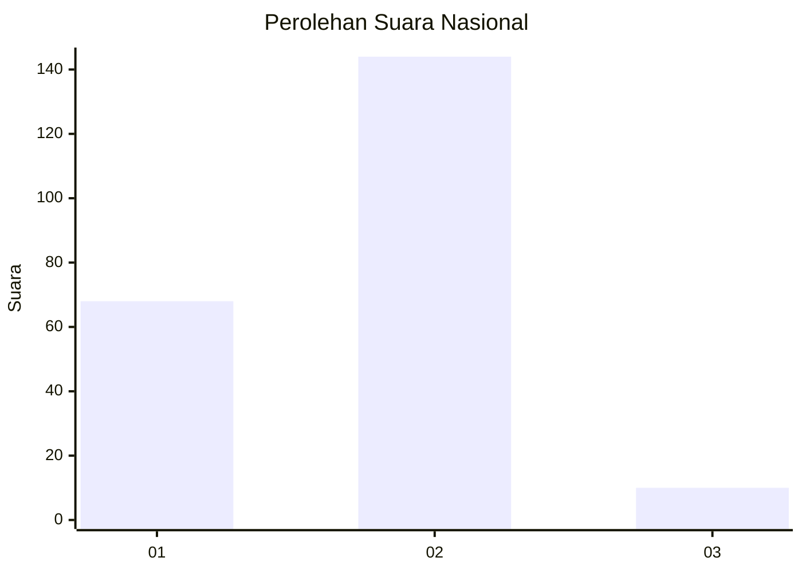
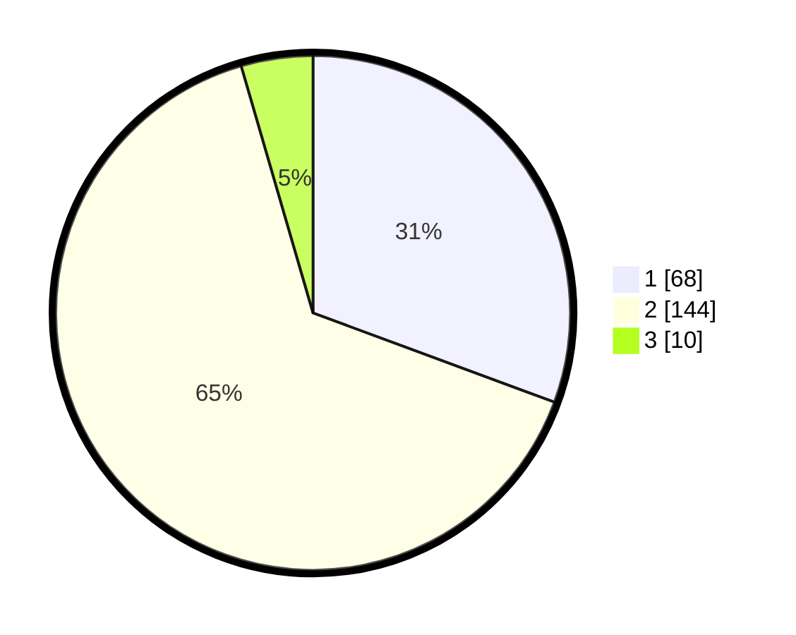

# Hasil

## Grafik

## Tabel

| No. | Nama Paslon    | Suara | Suara (raw) | Persentase |
|:--- |:-------------- | -----:| -----------:| ----------:|
| 1   | ANIES MUHAIMIN | 68    | [68][p-1]   | 30,63      |
| 2   | PRABOWO GIBRAN | 144   | [144][p-2]  | 64,86      |
| 3   | GANJAR MAHFUD  | 10    | [10][p-3]   | 4,50       |

[p-1]: https://github.com/gigit-pemilu/pemilu-2024/blob/main/pilpres/hitung-suara/sub/14-riau/sub/08-siak/sub/13-mempura/sub/2008-telukmerempan/sub/001-tps/sub/paslon-1.txt
[p-2]: https://github.com/gigit-pemilu/pemilu-2024/blob/main/pilpres/hitung-suara/sub/14-riau/sub/08-siak/sub/13-mempura/sub/2008-telukmerempan/sub/001-tps/sub/paslon-2.txt
[p-3]: https://github.com/gigit-pemilu/pemilu-2024/blob/main/pilpres/hitung-suara/sub/14-riau/sub/08-siak/sub/13-mempura/sub/2008-telukmerempan/sub/001-tps/sub/paslon-3.txt

## Foto C Plano

https://sirekap-obj-formc.kpu.go.id/f481/pemilu/ppwp/14/08/13/20/08/1408132008001-20240308-212540--9a89771e-e2c1-4d0f-83c9-7d79151c59b6.jpg

https://sirekap-obj-formc.kpu.go.id/f481/pemilu/ppwp/14/08/13/20/08/1408132008001-20240226-225056--410ab4ac-548b-41b3-889e-5aa4da23daf0.jpg

https://sirekap-obj-formc.kpu.go.id/f481/pemilu/ppwp/14/08/13/20/08/1408132008001-20240226-225314--3210ca8d-b4a4-4206-8306-837a2b9f779e.jpg

## Metadata

| Key        | Value               |
| ---------- | ------------------- |
| Time Stamp | 2024-03-08 22:00:00 |

