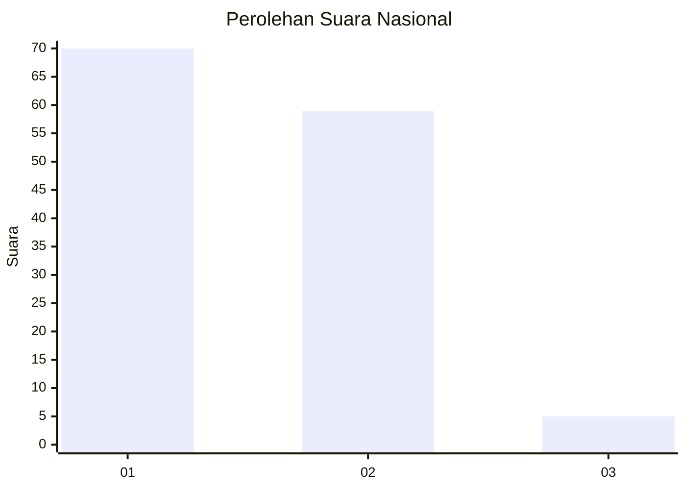
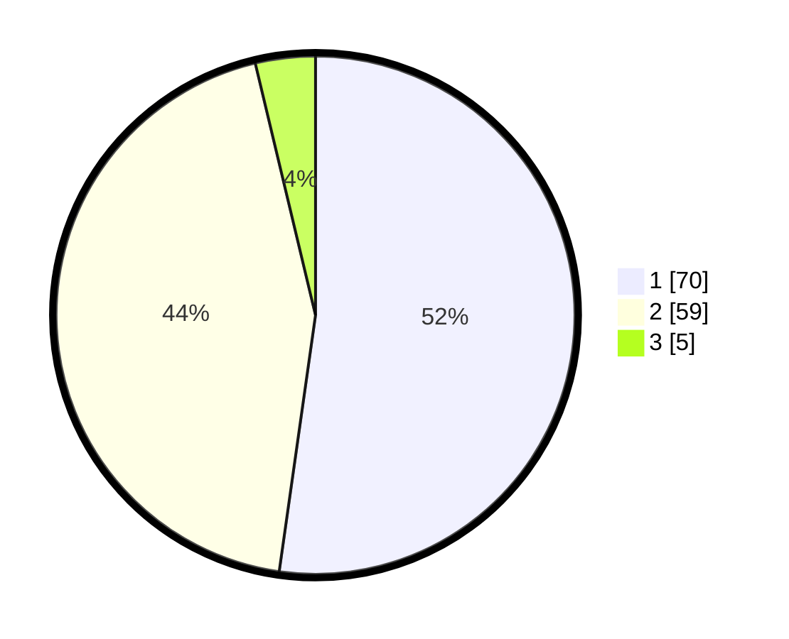

# Hasil

## Grafik

## Tabel

| No. | Nama Paslon    | Suara | Suara (raw) | Persentase |
|:--- |:-------------- | -----:| -----------:| ----------:|
| 1   | ANIES MUHAIMIN | 70    | [70][p-1]   | 52,24      |
| 2   | PRABOWO GIBRAN | 59    | [59][p-2]   | 44,03      |
| 3   | GANJAR MAHFUD  | 5     | [5][p-3]    | 3,73       |

[p-1]: https://github.com/gigit-pemilu/pemilu-2024/blob/main/pilpres/hitung-suara/sub/14-riau/sub/08-siak/sub/13-mempura/sub/2008-telukmerempan/sub/002-tps/sub/paslon-1.txt
[p-2]: https://github.com/gigit-pemilu/pemilu-2024/blob/main/pilpres/hitung-suara/sub/14-riau/sub/08-siak/sub/13-mempura/sub/2008-telukmerempan/sub/002-tps/sub/paslon-2.txt
[p-3]: https://github.com/gigit-pemilu/pemilu-2024/blob/main/pilpres/hitung-suara/sub/14-riau/sub/08-siak/sub/13-mempura/sub/2008-telukmerempan/sub/002-tps/sub/paslon-3.txt

## Foto C Plano

https://sirekap-obj-formc.kpu.go.id/70f9/pemilu/ppwp/14/08/13/20/08/1408132008002-20240308-212800--dca7a017-6edc-4f9b-8247-58f6e614cc47.jpg

https://sirekap-obj-formc.kpu.go.id/70f9/pemilu/ppwp/14/08/13/20/08/1408132008002-20240226-223959--d8b12691-cc11-4574-8212-b24c1f14dc59.jpg

https://sirekap-obj-formc.kpu.go.id/70f9/pemilu/ppwp/14/08/13/20/08/1408132008002-20240226-224110--bf1ac1d3-5889-438d-953d-359144fc808e.jpg

## Metadata

| Key        | Value               |
| ---------- | ------------------- |
| Time Stamp | 2024-03-08 22:00:00 |

