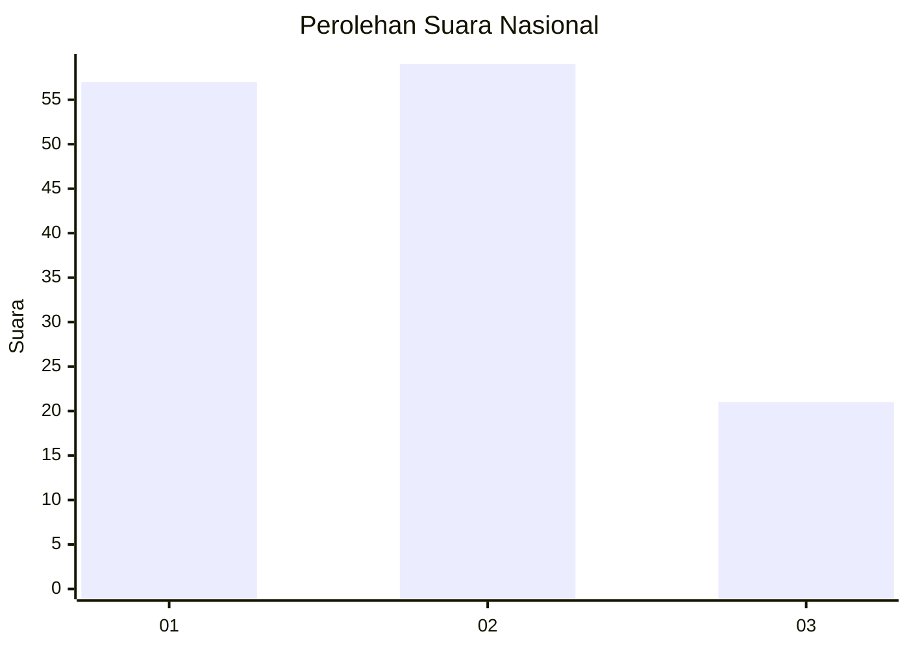
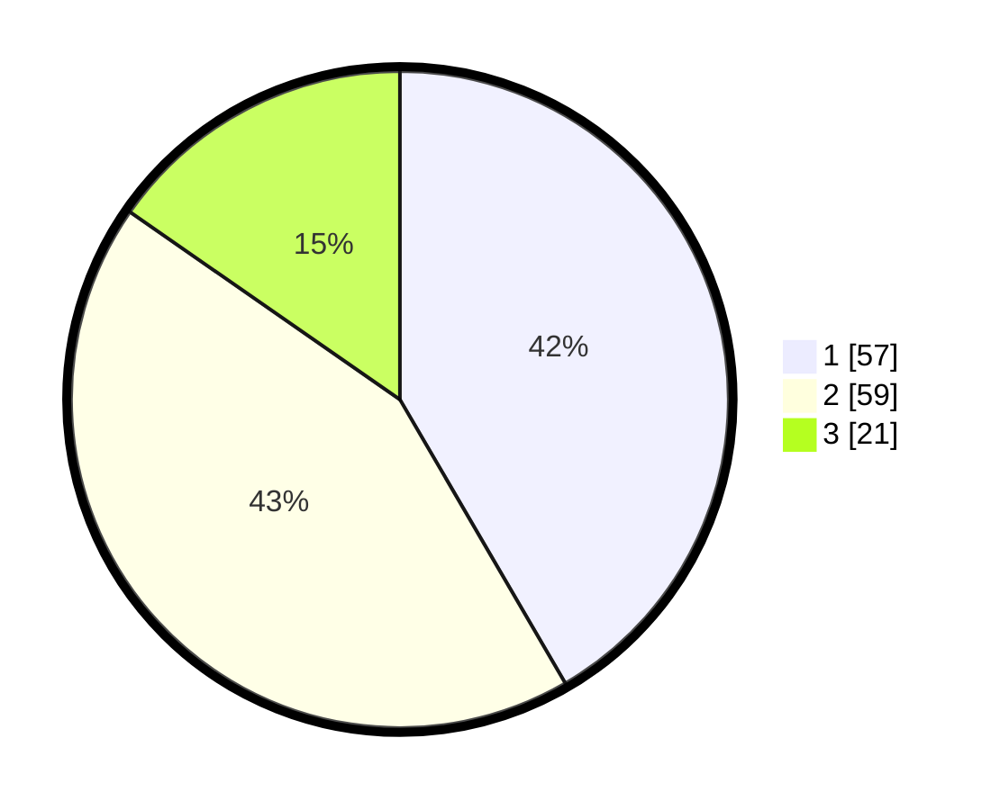

# Hasil

## Grafik

## Tabel

| No. | Nama Paslon    | Suara | Suara (raw) | Persentase |
|:--- |:-------------- | -----:| -----------:| ----------:|
| 1   | ANIES MUHAIMIN | 57    | [57][p-1]   | 41,61      |
| 2   | PRABOWO GIBRAN | 59    | [59][p-2]   | 43,07      |
| 3   | GANJAR MAHFUD  | 21    | [21][p-3]   | 15,33      |

[p-1]: https://github.com/gigit-pemilu/pemilu-2024/blob/main/pilpres/hitung-suara/sub/14-riau/sub/08-siak/sub/13-mempura/sub/2008-telukmerempan/sub/003-tps/sub/paslon-1.txt
[p-2]: https://github.com/gigit-pemilu/pemilu-2024/blob/main/pilpres/hitung-suara/sub/14-riau/sub/08-siak/sub/13-mempura/sub/2008-telukmerempan/sub/003-tps/sub/paslon-2.txt
[p-3]: https://github.com/gigit-pemilu/pemilu-2024/blob/main/pilpres/hitung-suara/sub/14-riau/sub/08-siak/sub/13-mempura/sub/2008-telukmerempan/sub/003-tps/sub/paslon-3.txt

## Foto C Plano

https://sirekap-obj-formc.kpu.go.id/cf40/pemilu/ppwp/14/08/13/20/08/1408132008003-20240308-213009--f2cee2f4-5f90-4c0c-9e15-a49f0fce834e.jpg

https://sirekap-obj-formc.kpu.go.id/cf40/pemilu/ppwp/14/08/13/20/08/1408132008003-20240226-233526--0d733d26-6d78-4703-8957-c037bf79d2d0.jpg

https://sirekap-obj-formc.kpu.go.id/cf40/pemilu/ppwp/14/08/13/20/08/1408132008003-20240226-223057--9da442a1-a7bf-4af2-af8a-6aac827537e2.jpg

## Metadata

| Key        | Value               |
| ---------- | ------------------- |
| Time Stamp | 2024-03-08 22:00:00 |

