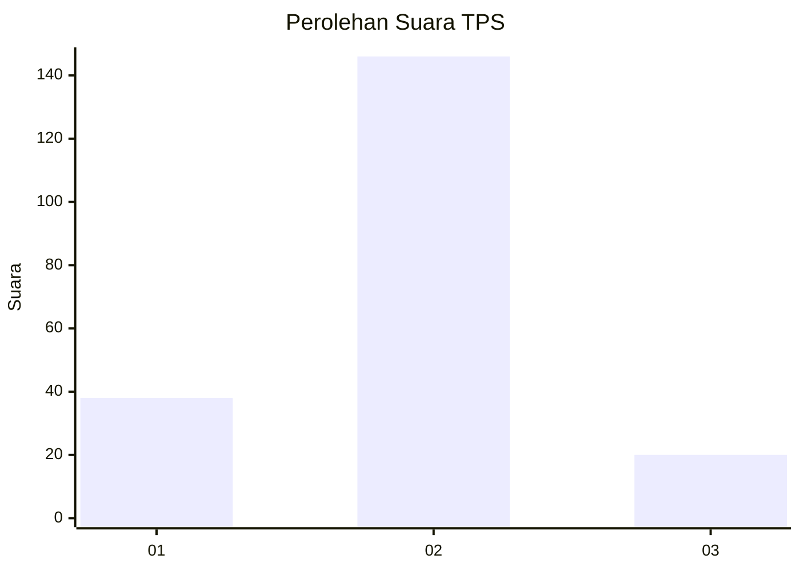
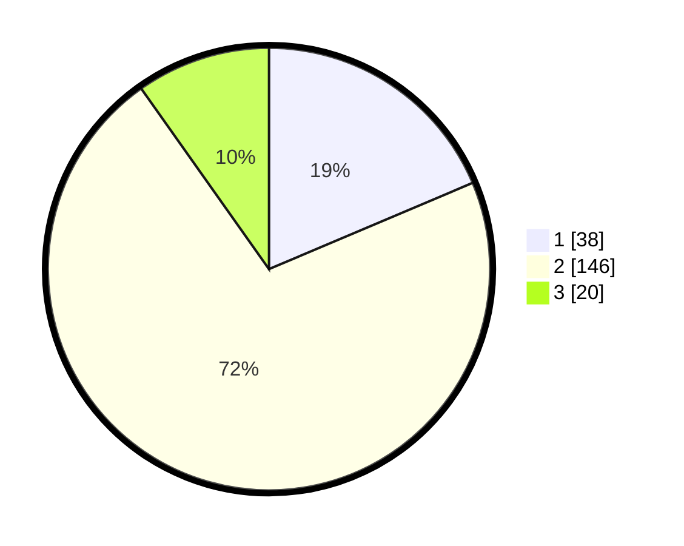

# Hasil

## Grafik

## Tabel

| No. | Nama Paslon    | Suara | Suara (raw) | Persentase |
|:--- |:-------------- | -----:| -----------:| ----------:|
| 1   | ANIES MUHAIMIN | 38    | [38][p-1]   | 18,63      |
| 2   | PRABOWO GIBRAN | 146   | [146][p-2]  | 71,57      |
| 3   | GANJAR MAHFUD  | 20    | [20][p-3]   | 9,80       |

[p-1]: https://github.com/gigit-pemilu/pemilu-2024-14-riau/blob/main/pilpres/hitung-suara/sub/14-riau/sub/08-siak/sub/14-pusako/sub/2001-sungai-berbari/sub/001-tps/sub/paslon-1.txt
[p-2]: https://github.com/gigit-pemilu/pemilu-2024-14-riau/blob/main/pilpres/hitung-suara/sub/14-riau/sub/08-siak/sub/14-pusako/sub/2001-sungai-berbari/sub/001-tps/sub/paslon-2.txt
[p-3]: https://github.com/gigit-pemilu/pemilu-2024-14-riau/blob/main/pilpres/hitung-suara/sub/14-riau/sub/08-siak/sub/14-pusako/sub/2001-sungai-berbari/sub/001-tps/sub/paslon-3.txt

## Foto C Plano

https://sirekap-obj-formc.kpu.go.id/8acc/pemilu/ppwp/14/08/14/20/01/1408142001001-20240225-173955--71982d7c-905d-418d-b9ae-a0e732db62f0.jpg

https://sirekap-obj-formc.kpu.go.id/8acc/pemilu/ppwp/14/08/14/20/01/1408142001001-20240225-174218--bee4ac4c-a1a1-4fcc-8013-8deb19c3bdf0.jpg

https://sirekap-obj-formc.kpu.go.id/8acc/pemilu/ppwp/14/08/14/20/01/1408142001001-20240226-150008--c1d3c594-6be0-47a3-9b2b-f57959b0a942.jpg

## Metadata

| Key        | Value               |
| ---------- | ------------------- |
| Time Stamp | 2024-02-29 12:00:00 |

