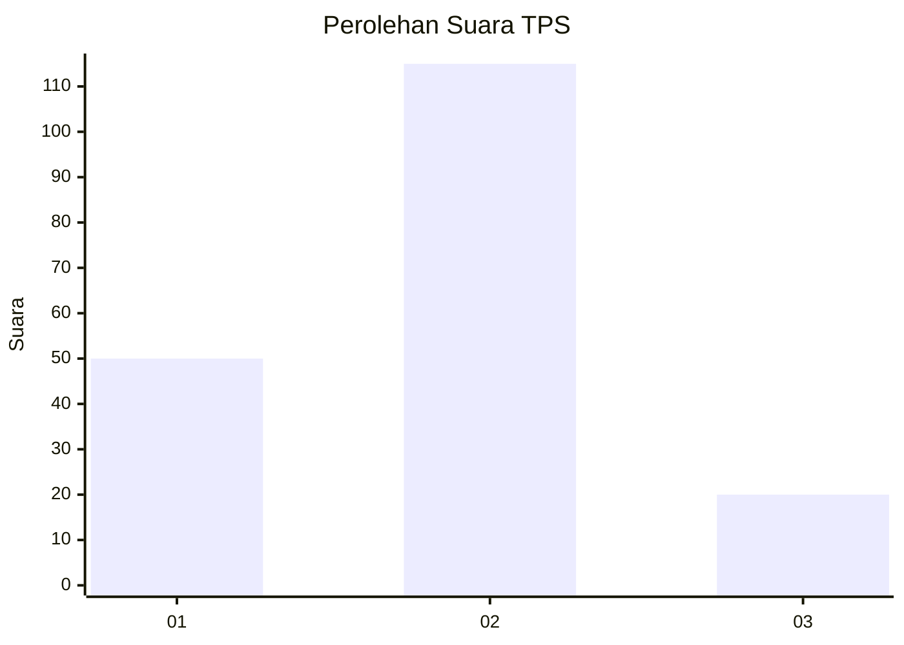
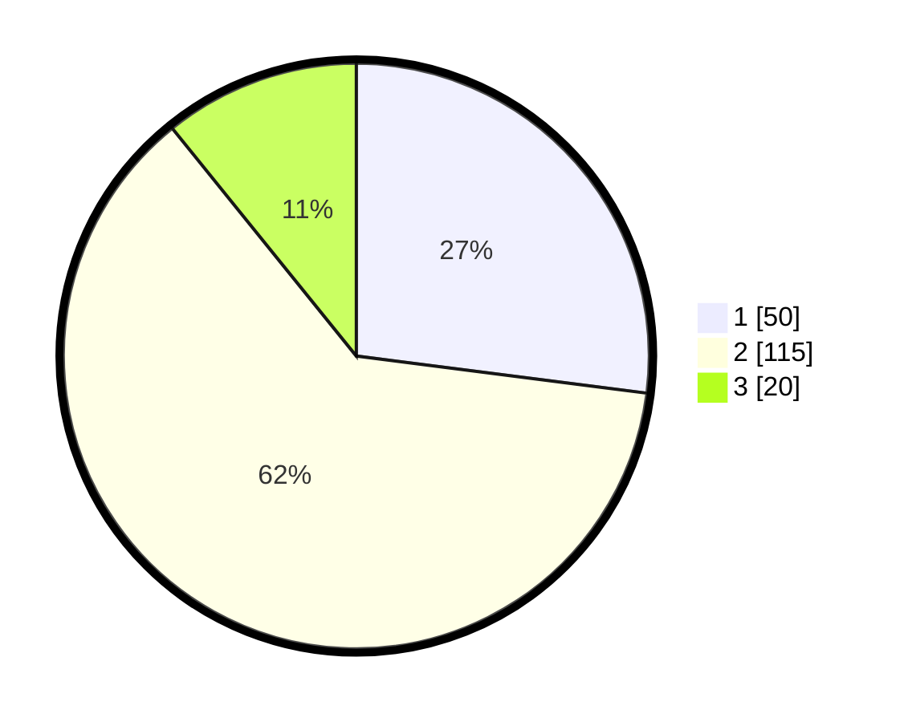

# Hasil

## Grafik

## Tabel

| No. | Nama Paslon    | Suara | Suara (raw) | Persentase |
|:--- |:-------------- | -----:| -----------:| ----------:|
| 1   | ANIES MUHAIMIN | 50    | [50][p-1]   | 27,03      |
| 2   | PRABOWO GIBRAN | 115   | [115][p-2]  | 62,16      |
| 3   | GANJAR MAHFUD  | 20    | [20][p-3]   | 10,81      |

[p-1]: https://github.com/gigit-pemilu/pemilu-2024-14-riau/blob/main/pilpres/hitung-suara/sub/14-riau/sub/08-siak/sub/14-pusako/sub/2001-sungai-berbari/sub/002-tps/sub/paslon-1.txt
[p-2]: https://github.com/gigit-pemilu/pemilu-2024-14-riau/blob/main/pilpres/hitung-suara/sub/14-riau/sub/08-siak/sub/14-pusako/sub/2001-sungai-berbari/sub/002-tps/sub/paslon-2.txt
[p-3]: https://github.com/gigit-pemilu/pemilu-2024-14-riau/blob/main/pilpres/hitung-suara/sub/14-riau/sub/08-siak/sub/14-pusako/sub/2001-sungai-berbari/sub/002-tps/sub/paslon-3.txt

## Foto C Plano

https://sirekap-obj-formc.kpu.go.id/d847/pemilu/ppwp/14/08/14/20/01/1408142001002-20240226-150623--06677a4a-ca6c-4bed-85cf-3b5315a35472.jpg

https://sirekap-obj-formc.kpu.go.id/d847/pemilu/ppwp/14/08/14/20/01/1408142001002-20240226-150736--f7f82595-fdd2-4522-a7e4-691c1085534e.jpg

https://sirekap-obj-formc.kpu.go.id/d847/pemilu/ppwp/14/08/14/20/01/1408142001002-20240226-150912--ad951eba-ec66-491f-a396-afa6fbc55b15.jpg

## Metadata

| Key        | Value               |
| ---------- | ------------------- |
| Time Stamp | 2024-02-29 12:00:00 |

