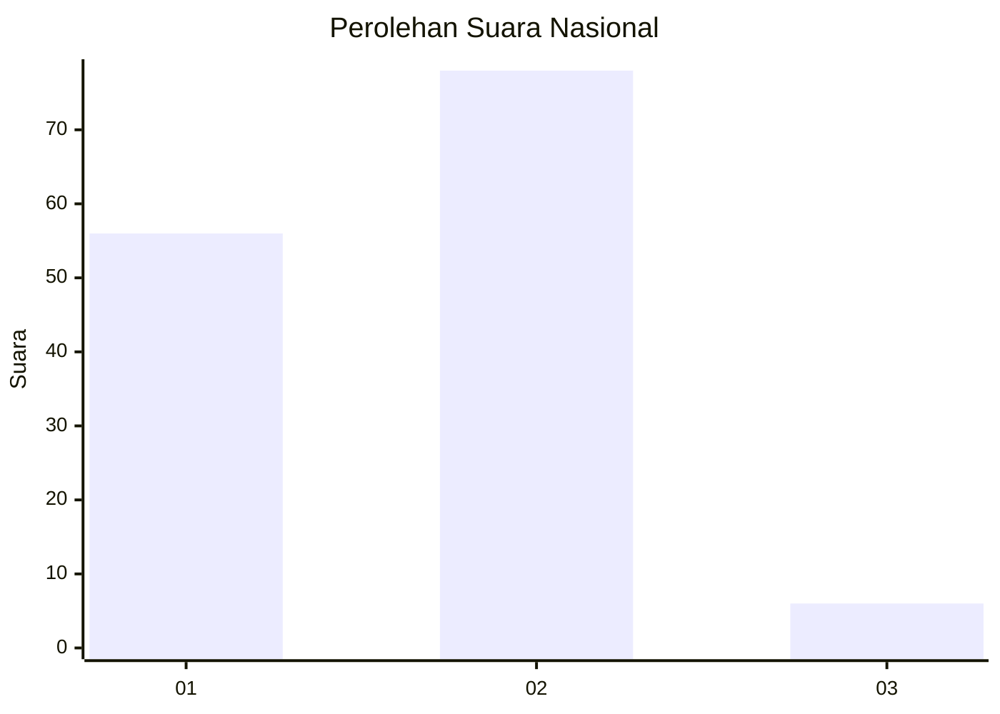
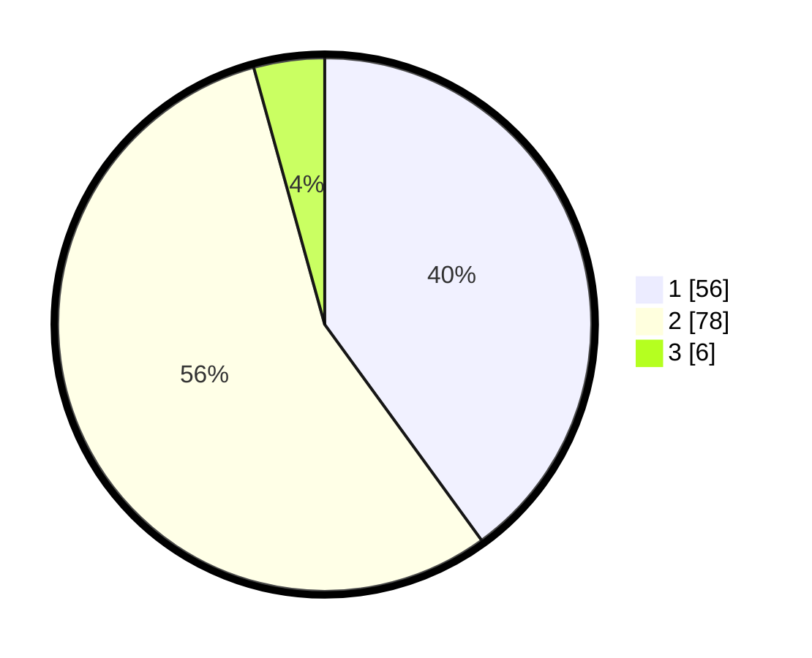

# Hasil

## Grafik

## Tabel

| No. | Nama Paslon    | Suara | Suara (raw) | Persentase |
|:--- |:-------------- | -----:| -----------:| ----------:|
| 1   | ANIES MUHAIMIN | 56    | [56][p-1]   | 40,00      |
| 2   | PRABOWO GIBRAN | 78    | [78][p-2]   | 55,71      |
| 3   | GANJAR MAHFUD  | 6     | [6][p-3]    | 4,29       |

[p-1]: https://github.com/gigit-pemilu/pemilu-2024/blob/main/pilpres/hitung-suara/sub/14-riau/sub/08-siak/sub/14-pusako/sub/2002-sungai-limau/sub/002-tps/sub/paslon-1.txt
[p-2]: https://github.com/gigit-pemilu/pemilu-2024/blob/main/pilpres/hitung-suara/sub/14-riau/sub/08-siak/sub/14-pusako/sub/2002-sungai-limau/sub/002-tps/sub/paslon-2.txt
[p-3]: https://github.com/gigit-pemilu/pemilu-2024/blob/main/pilpres/hitung-suara/sub/14-riau/sub/08-siak/sub/14-pusako/sub/2002-sungai-limau/sub/002-tps/sub/paslon-3.txt

## Foto C Plano

https://sirekap-obj-formc.kpu.go.id/34f7/pemilu/ppwp/14/08/14/20/02/1408142002002-20240226-152834--078be629-7cb6-4aac-8a8c-2a574cd09927.jpg

https://sirekap-obj-formc.kpu.go.id/34f7/pemilu/ppwp/14/08/14/20/02/1408142002002-20240226-152947--662fe939-ce0d-46a7-b781-732e6aba8666.jpg

https://sirekap-obj-formc.kpu.go.id/34f7/pemilu/ppwp/14/08/14/20/02/1408142002002-20240226-153055--977aa633-95f4-47a4-b975-5c3a8a5deb68.jpg

## Metadata

| Key        | Value               |
| ---------- | ------------------- |
| Time Stamp | 2024-02-28 19:00:00 |

