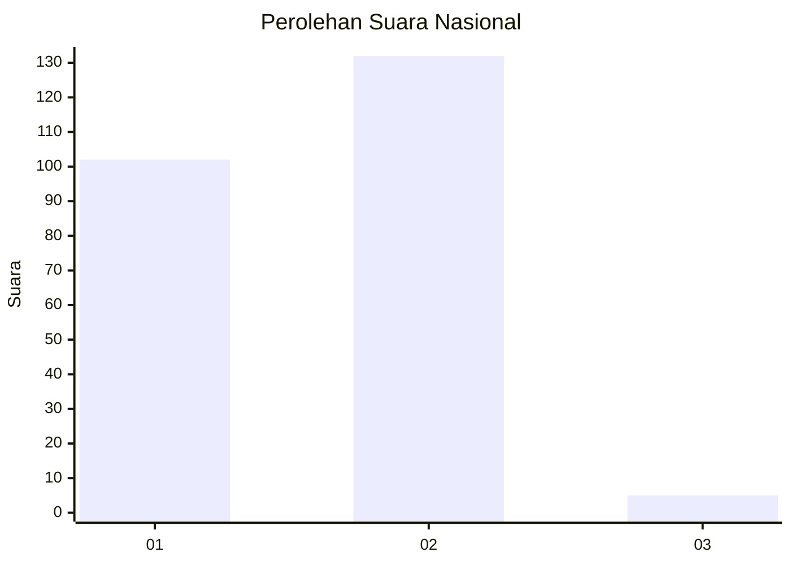
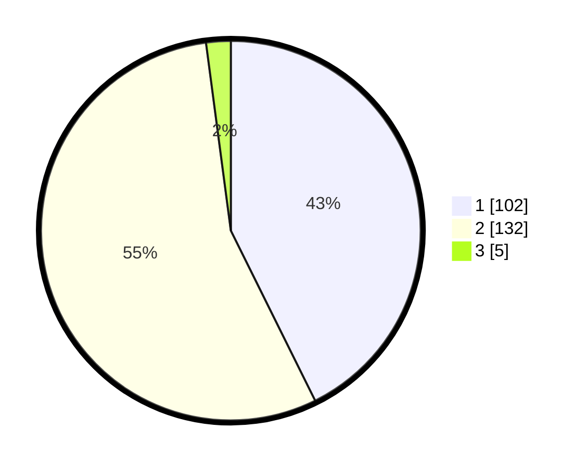

# Hasil

## Grafik

## Tabel

| No. | Nama Paslon    | Suara | Suara (raw) | Persentase |
|:--- |:-------------- | -----:| -----------:| ----------:|
| 1   | ANIES MUHAIMIN | 102   | [102][p-1]  | 42,68      |
| 2   | PRABOWO GIBRAN | 132   | [132][p-2]  | 55,23      |
| 3   | GANJAR MAHFUD  | 5     | [5][p-3]    | 2,09       |

[p-1]: https://github.com/gigit-pemilu/pemilu-2024/blob/main/pilpres/hitung-suara/sub/14-riau/sub/08-siak/sub/14-pusako/sub/2002-sungai-limau/sub/003-tps/sub/paslon-1.txt
[p-2]: https://github.com/gigit-pemilu/pemilu-2024/blob/main/pilpres/hitung-suara/sub/14-riau/sub/08-siak/sub/14-pusako/sub/2002-sungai-limau/sub/003-tps/sub/paslon-2.txt
[p-3]: https://github.com/gigit-pemilu/pemilu-2024/blob/main/pilpres/hitung-suara/sub/14-riau/sub/08-siak/sub/14-pusako/sub/2002-sungai-limau/sub/003-tps/sub/paslon-3.txt

## Foto C Plano

https://sirekap-obj-formc.kpu.go.id/bf19/pemilu/ppwp/14/08/14/20/02/1408142002003-20240226-153320--274475a9-9012-4b4a-a210-72c9daad9196.jpg

https://sirekap-obj-formc.kpu.go.id/bf19/pemilu/ppwp/14/08/14/20/02/1408142002003-20240226-153410--90b2fe8b-9a95-47c1-94f2-9e90293e3e99.jpg

https://sirekap-obj-formc.kpu.go.id/bf19/pemilu/ppwp/14/08/14/20/02/1408142002003-20240226-153508--687f1566-67f2-486f-a4a9-3400ffe68c70.jpg

## Metadata

| Key        | Value               |
| ---------- | ------------------- |
| Time Stamp | 2024-02-28 20:00:00 |

