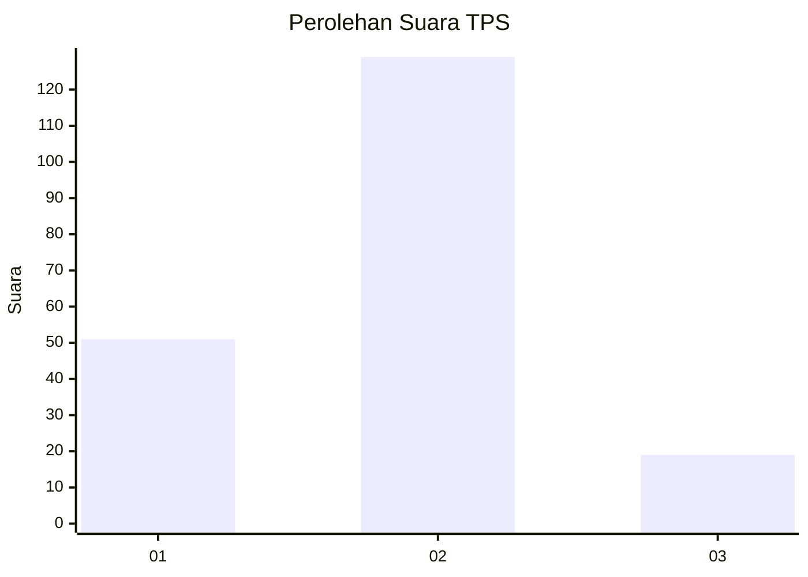
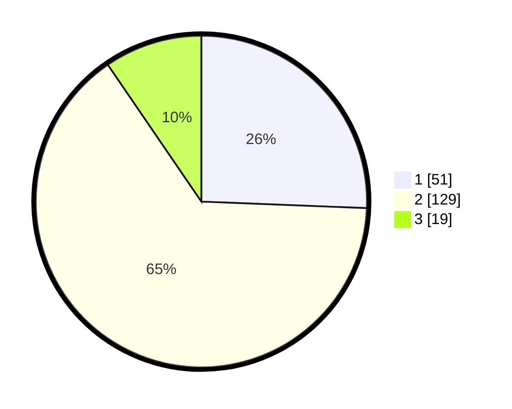

# Hasil

## Grafik

## Tabel

| No. | Nama Paslon    | Suara | Suara (raw) | Persentase |
|:--- |:-------------- | -----:| -----------:| ----------:|
| 1   | ANIES MUHAIMIN | 51    | [51][p-1]   | 25,63      |
| 2   | PRABOWO GIBRAN | 129   | [129][p-2]  | 64,82      |
| 3   | GANJAR MAHFUD  | 19    | [19][p-3]   | 9,55       |

[p-1]: https://github.com/gigit-pemilu/pemilu-2024-14-riau/blob/main/pilpres/hitung-suara/sub/14-riau/sub/08-siak/sub/14-pusako/sub/2002-sungai-limau/sub/004-tps/sub/paslon-1.txt
[p-2]: https://github.com/gigit-pemilu/pemilu-2024-14-riau/blob/main/pilpres/hitung-suara/sub/14-riau/sub/08-siak/sub/14-pusako/sub/2002-sungai-limau/sub/004-tps/sub/paslon-2.txt
[p-3]: https://github.com/gigit-pemilu/pemilu-2024-14-riau/blob/main/pilpres/hitung-suara/sub/14-riau/sub/08-siak/sub/14-pusako/sub/2002-sungai-limau/sub/004-tps/sub/paslon-3.txt

## Foto C Plano

https://sirekap-obj-formc.kpu.go.id/c2db/pemilu/ppwp/14/08/14/20/02/1408142002004-20240226-153704--8bcefee8-033c-40aa-b446-c3a123375591.jpg

https://sirekap-obj-formc.kpu.go.id/c2db/pemilu/ppwp/14/08/14/20/02/1408142002004-20240226-153811--e4f37012-192e-4639-a0dc-93fb39b7fa79.jpg

https://sirekap-obj-formc.kpu.go.id/c2db/pemilu/ppwp/14/08/14/20/02/1408142002004-20240226-153843--24be7fd3-43e6-4b8e-b4f2-23625d07aea3.jpg

## Metadata

| Key        | Value               |
| ---------- | ------------------- |
| Time Stamp | 2024-03-01 11:00:00 |

