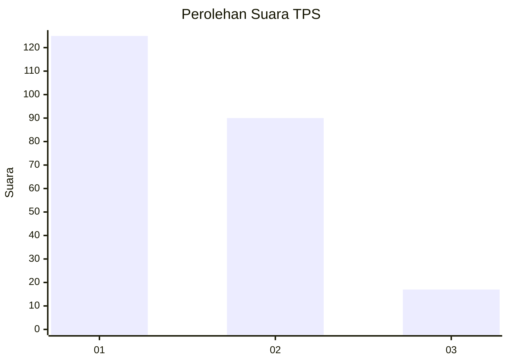
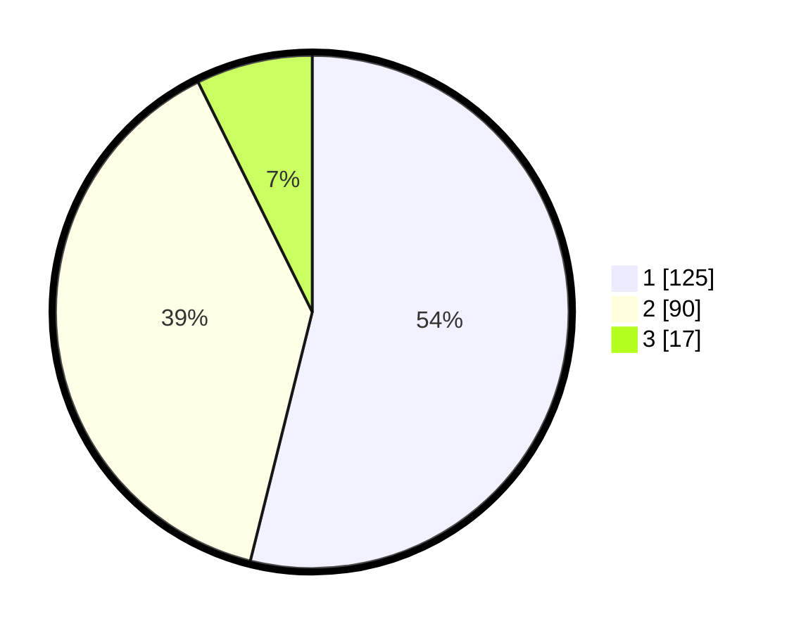

# Hasil

## Grafik

## Tabel

| No. | Nama Paslon    | Suara | Suara (raw) | Persentase |
|:--- |:-------------- | -----:| -----------:| ----------:|
| 1   | ANIES MUHAIMIN | 125   | [125][p-1]  | 53,88      |
| 2   | PRABOWO GIBRAN | 90    | [90][p-2]   | 38,79      |
| 3   | GANJAR MAHFUD  | 17    | [17][p-3]   | 7,33       |

[p-1]: https://github.com/gigit-pemilu/pemilu-2024-14-riau/blob/main/pilpres/hitung-suara/sub/14-riau/sub/08-siak/sub/14-pusako/sub/2004-benayah/sub/002-tps/sub/paslon-1.txt
[p-2]: https://github.com/gigit-pemilu/pemilu-2024-14-riau/blob/main/pilpres/hitung-suara/sub/14-riau/sub/08-siak/sub/14-pusako/sub/2004-benayah/sub/002-tps/sub/paslon-2.txt
[p-3]: https://github.com/gigit-pemilu/pemilu-2024-14-riau/blob/main/pilpres/hitung-suara/sub/14-riau/sub/08-siak/sub/14-pusako/sub/2004-benayah/sub/002-tps/sub/paslon-3.txt

## Foto C Plano

https://sirekap-obj-formc.kpu.go.id/89ea/pemilu/ppwp/14/08/14/20/04/1408142004002-20240226-161011--d83caf14-a697-4aff-b1ad-5425f24e9f73.jpg

https://sirekap-obj-formc.kpu.go.id/89ea/pemilu/ppwp/14/08/14/20/04/1408142004002-20240226-161112--df24c731-e9b0-40e0-b6e2-daf9381d6186.jpg

https://sirekap-obj-formc.kpu.go.id/89ea/pemilu/ppwp/14/08/14/20/04/1408142004002-20240226-161200--96a86c7e-7c98-484b-862a-e2fa8a35ae2d.jpg

## Metadata

| Key        | Value               |
| ---------- | ------------------- |
| Time Stamp | 2024-03-03 11:00:00 |

