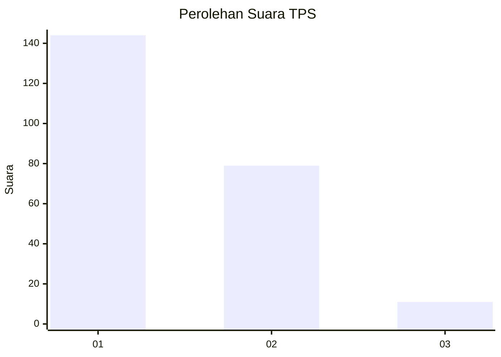
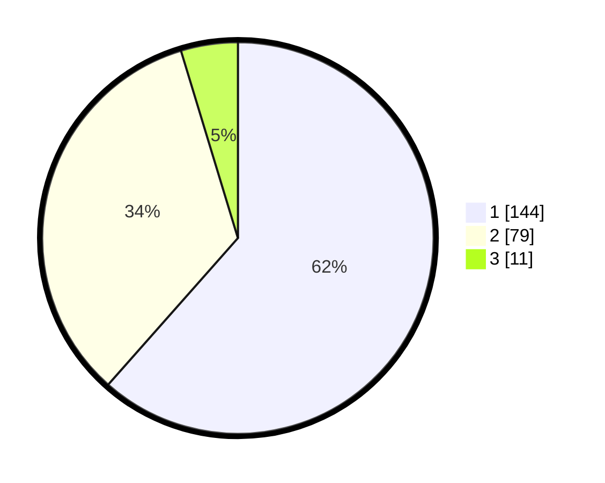

# Hasil

## Grafik

## Tabel

| No. | Nama Paslon    | Suara | Suara (raw) | Persentase |
|:--- |:-------------- | -----:| -----------:| ----------:|
| 1   | ANIES MUHAIMIN | 144   | [144][p-1]  | 61,54      |
| 2   | PRABOWO GIBRAN | 79    | [79][p-2]   | 33,76      |
| 3   | GANJAR MAHFUD  | 11    | [11][p-3]   | 4,70       |

[p-1]: https://github.com/gigit-pemilu/pemilu-2024-14-riau/blob/main/pilpres/hitung-suara/sub/14-riau/sub/08-siak/sub/14-pusako/sub/2004-benayah/sub/004-tps/sub/paslon-1.txt
[p-2]: https://github.com/gigit-pemilu/pemilu-2024-14-riau/blob/main/pilpres/hitung-suara/sub/14-riau/sub/08-siak/sub/14-pusako/sub/2004-benayah/sub/004-tps/sub/paslon-2.txt
[p-3]: https://github.com/gigit-pemilu/pemilu-2024-14-riau/blob/main/pilpres/hitung-suara/sub/14-riau/sub/08-siak/sub/14-pusako/sub/2004-benayah/sub/004-tps/sub/paslon-3.txt

## Foto C Plano

https://sirekap-obj-formc.kpu.go.id/591b/pemilu/ppwp/14/08/14/20/04/1408142004004-20240226-161738--847196cb-c150-49c3-ad8f-a81f4d0cc695.jpg

https://sirekap-obj-formc.kpu.go.id/591b/pemilu/ppwp/14/08/14/20/04/1408142004004-20240226-161842--a162ec18-63e2-4271-8c3c-df9d0451f648.jpg

https://sirekap-obj-formc.kpu.go.id/591b/pemilu/ppwp/14/08/14/20/04/1408142004004-20240226-162108--fde5d54b-6767-4b25-874a-33963a20fcb0.jpg

## Metadata

| Key        | Value               |
| ---------- | ------------------- |
| Time Stamp | 2024-02-28 20:00:00 |

