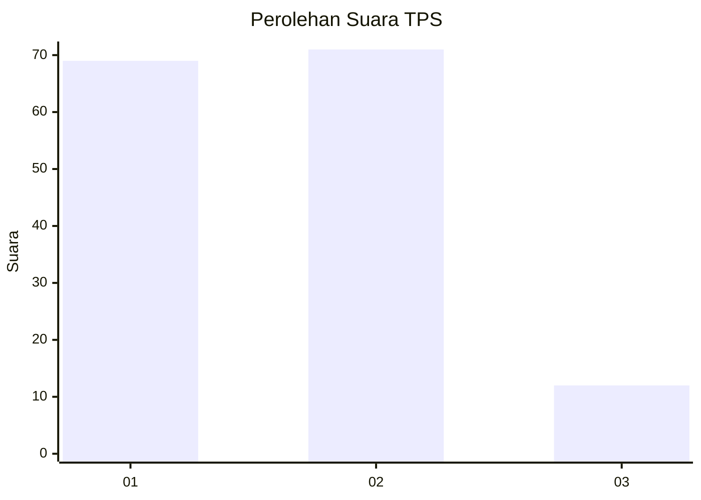
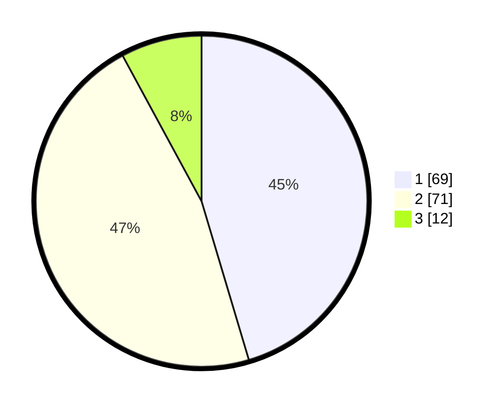

# Hasil

## Grafik

## Tabel

| No. | Nama Paslon    | Suara | Suara (raw) | Persentase |
|:--- |:-------------- | -----:| -----------:| ----------:|
| 1   | ANIES MUHAIMIN | 69    | [69][p-1]   | 45,39      |
| 2   | PRABOWO GIBRAN | 71    | [71][p-2]   | 46,71      |
| 3   | GANJAR MAHFUD  | 12    | [12][p-3]   | 7,89       |

[p-1]: https://github.com/gigit-pemilu/pemilu-2024-14-riau/blob/main/pilpres/hitung-suara/sub/14-riau/sub/08-siak/sub/14-pusako/sub/2005-pebadaran/sub/002-tps/sub/paslon-1.txt
[p-2]: https://github.com/gigit-pemilu/pemilu-2024-14-riau/blob/main/pilpres/hitung-suara/sub/14-riau/sub/08-siak/sub/14-pusako/sub/2005-pebadaran/sub/002-tps/sub/paslon-2.txt
[p-3]: https://github.com/gigit-pemilu/pemilu-2024-14-riau/blob/main/pilpres/hitung-suara/sub/14-riau/sub/08-siak/sub/14-pusako/sub/2005-pebadaran/sub/002-tps/sub/paslon-3.txt

## Foto C Plano

https://sirekap-obj-formc.kpu.go.id/0641/pemilu/ppwp/14/08/14/20/05/1408142005002-20240226-162742--8e72f693-2d3f-48ae-8f5e-2529e4a82c99.jpg

https://sirekap-obj-formc.kpu.go.id/0641/pemilu/ppwp/14/08/14/20/05/1408142005002-20240226-162831--45dfc8ea-20c3-4d7a-80dd-3f842ee282a8.jpg

https://sirekap-obj-formc.kpu.go.id/0641/pemilu/ppwp/14/08/14/20/05/1408142005002-20240226-162911--51cdd0a8-7f03-4d4c-afc2-18a75a3b5730.jpg

## Metadata

| Key        | Value               |
| ---------- | ------------------- |
| Time Stamp | 2024-02-29 11:00:00 |

