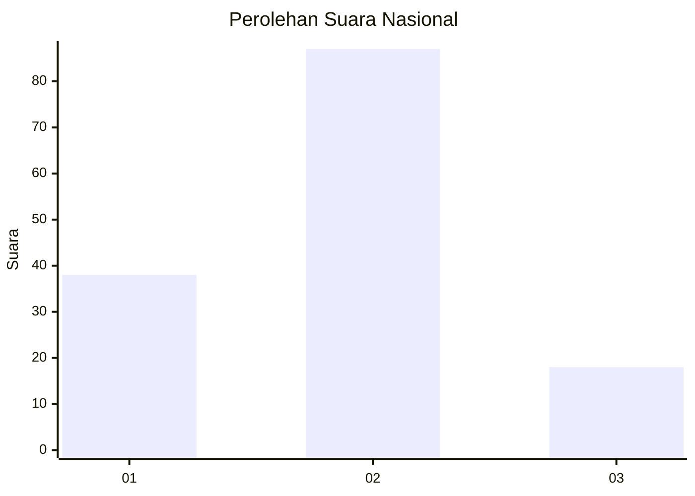
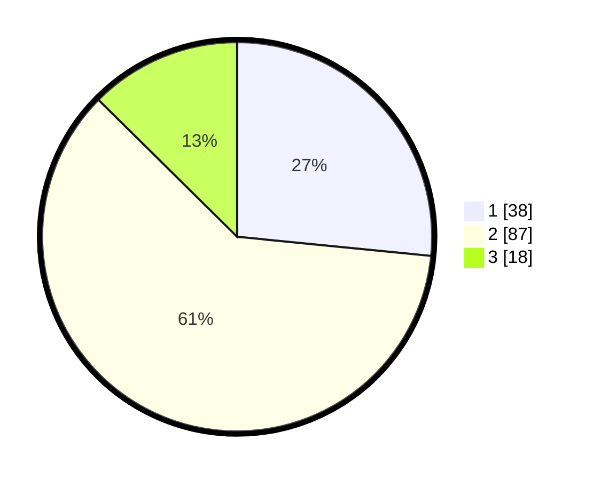

# Hasil

## Grafik

## Tabel

| No. | Nama Paslon    | Suara | Suara (raw) | Persentase |
|:--- |:-------------- | -----:| -----------:| ----------:|
| 1   | ANIES MUHAIMIN | 38    | [38][p-1]   | 26,57      |
| 2   | PRABOWO GIBRAN | 87    | [87][p-2]   | 60,84      |
| 3   | GANJAR MAHFUD  | 18    | [18][p-3]   | 12,59      |

[p-1]: https://github.com/gigit-pemilu/pemilu-2024/blob/main/pilpres/hitung-suara/sub/14-riau/sub/08-siak/sub/14-pusako/sub/2005-pebadaran/sub/003-tps/sub/paslon-1.txt
[p-2]: https://github.com/gigit-pemilu/pemilu-2024/blob/main/pilpres/hitung-suara/sub/14-riau/sub/08-siak/sub/14-pusako/sub/2005-pebadaran/sub/003-tps/sub/paslon-2.txt
[p-3]: https://github.com/gigit-pemilu/pemilu-2024/blob/main/pilpres/hitung-suara/sub/14-riau/sub/08-siak/sub/14-pusako/sub/2005-pebadaran/sub/003-tps/sub/paslon-3.txt

## Foto C Plano

https://sirekap-obj-formc.kpu.go.id/b6c3/pemilu/ppwp/14/08/14/20/05/1408142005003-20240226-163044--e5c508cd-fa6e-4205-922c-ea3546f0da77.jpg

https://sirekap-obj-formc.kpu.go.id/b6c3/pemilu/ppwp/14/08/14/20/05/1408142005003-20240226-163140--54a93478-66c0-491d-8db2-c4868e6b3510.jpg

https://sirekap-obj-formc.kpu.go.id/b6c3/pemilu/ppwp/14/08/14/20/05/1408142005003-20240226-163224--c80a7145-66db-4fd4-a55e-0c4ddb5ff0b0.jpg

## Metadata

| Key        | Value               |
| ---------- | ------------------- |
| Time Stamp | 2024-02-28 19:00:00 |

