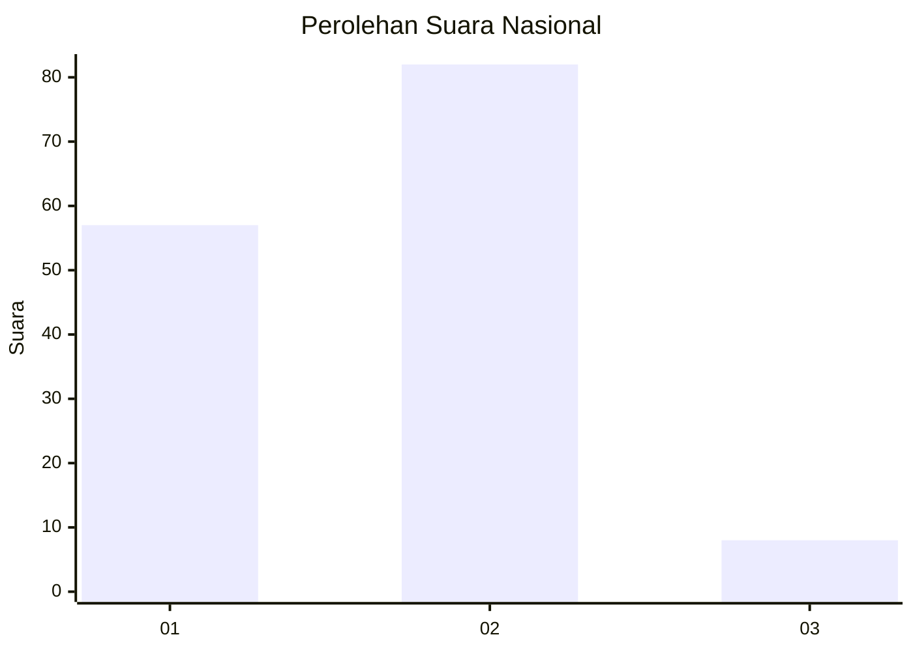
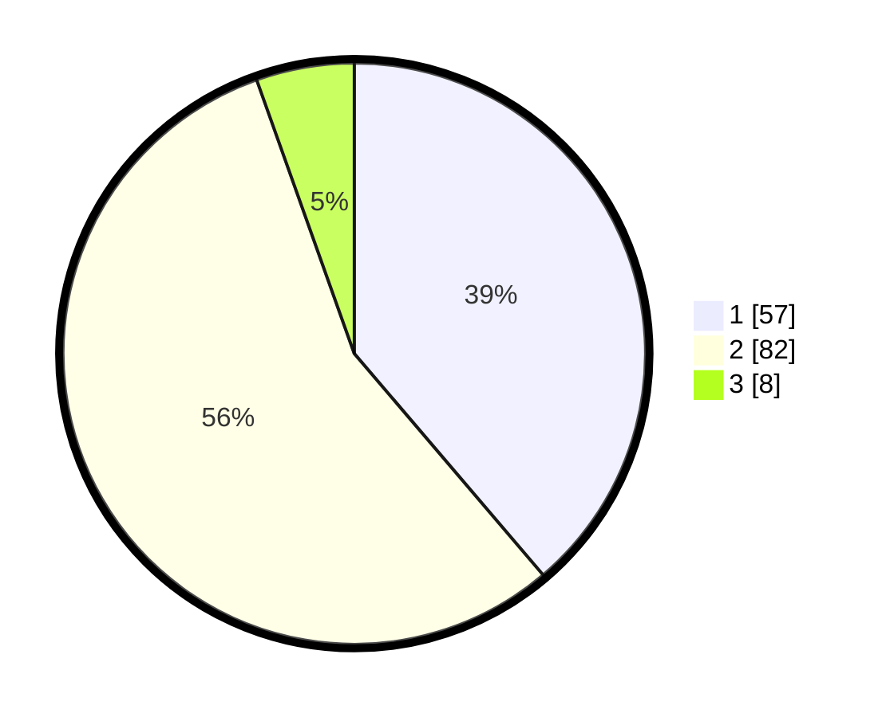

# Hasil

## Grafik

## Tabel

| No. | Nama Paslon    | Suara | Suara (raw) | Persentase |
|:--- |:-------------- | -----:| -----------:| ----------:|
| 1   | ANIES MUHAIMIN | 57    | [57][p-1]   | 38,78      |
| 2   | PRABOWO GIBRAN | 82    | [82][p-2]   | 55,78      |
| 3   | GANJAR MAHFUD  | 8     | [8][p-3]    | 5,44       |

[p-1]: https://github.com/gigit-pemilu/pemilu-2024/blob/main/pilpres/hitung-suara/sub/14-riau/sub/08-siak/sub/14-pusako/sub/2006-dusun-pusaka/sub/001-tps/sub/paslon-1.txt
[p-2]: https://github.com/gigit-pemilu/pemilu-2024/blob/main/pilpres/hitung-suara/sub/14-riau/sub/08-siak/sub/14-pusako/sub/2006-dusun-pusaka/sub/001-tps/sub/paslon-2.txt
[p-3]: https://github.com/gigit-pemilu/pemilu-2024/blob/main/pilpres/hitung-suara/sub/14-riau/sub/08-siak/sub/14-pusako/sub/2006-dusun-pusaka/sub/001-tps/sub/paslon-3.txt

## Foto C Plano

https://sirekap-obj-formc.kpu.go.id/7131/pemilu/ppwp/14/08/14/20/06/1408142006001-20240226-163433--50419527-bcf5-4be9-a348-e5931c8ed9e7.jpg

https://sirekap-obj-formc.kpu.go.id/7131/pemilu/ppwp/14/08/14/20/06/1408142006001-20240226-163516--7b7a32bc-108e-4f1b-99b8-131e6339d2d9.jpg

https://sirekap-obj-formc.kpu.go.id/7131/pemilu/ppwp/14/08/14/20/06/1408142006001-20240226-163606--408e6668-5405-4d65-a7f7-e9c4c1c96b9b.jpg

## Metadata

| Key        | Value               |
| ---------- | ------------------- |
| Time Stamp | 2024-03-01 21:00:00 |

