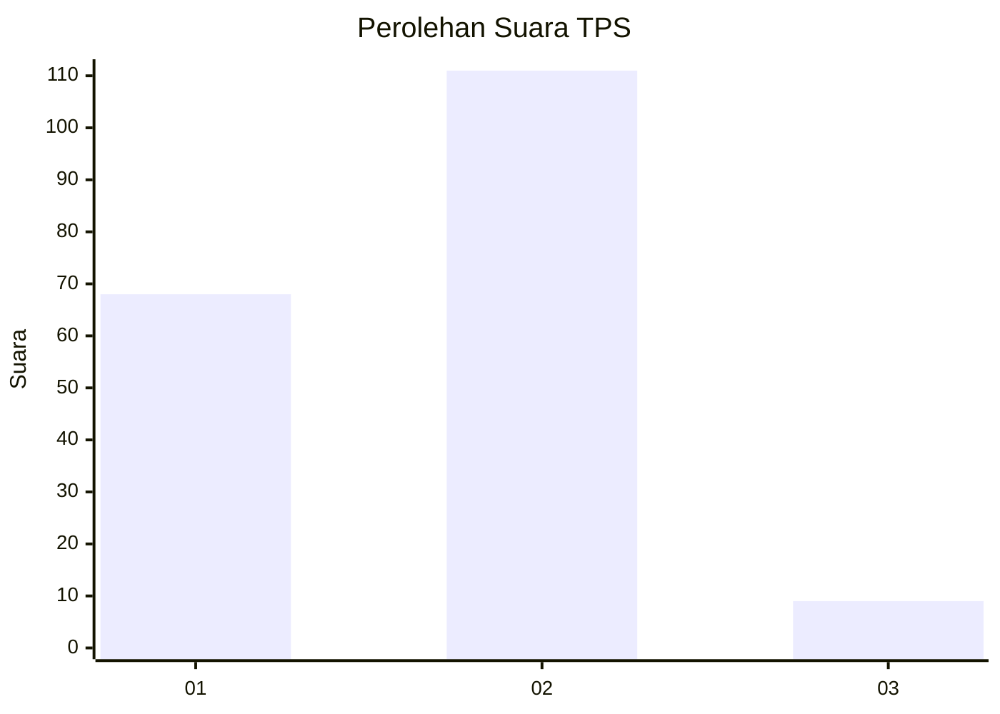
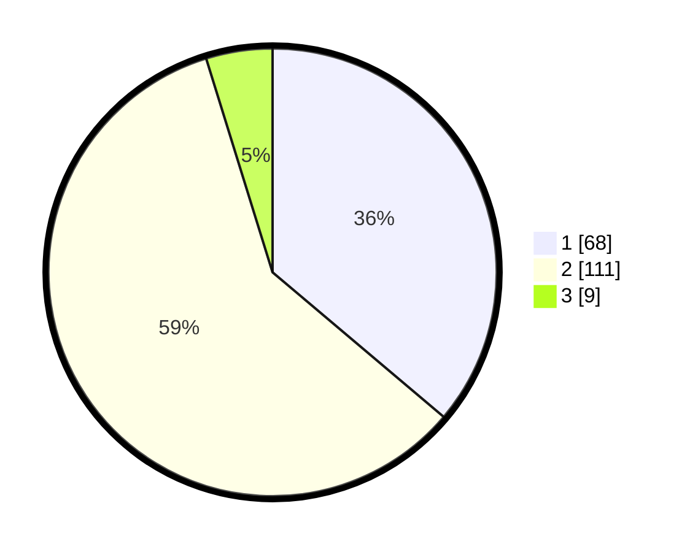

# Hasil

## Grafik

## Tabel

| No. | Nama Paslon    | Suara | Suara (raw) | Persentase |
|:--- |:-------------- | -----:| -----------:| ----------:|
| 1   | ANIES MUHAIMIN | 68    | [68][p-1]   | 36,17      |
| 2   | PRABOWO GIBRAN | 111   | [111][p-2]  | 59,04      |
| 3   | GANJAR MAHFUD  | 9     | [9][p-3]    | 4,79       |

[p-1]: https://github.com/gigit-pemilu/pemilu-2024-14-riau/blob/main/pilpres/hitung-suara/sub/14-riau/sub/08-siak/sub/14-pusako/sub/2007-perincit/sub/002-tps/sub/paslon-1.txt
[p-2]: https://github.com/gigit-pemilu/pemilu-2024-14-riau/blob/main/pilpres/hitung-suara/sub/14-riau/sub/08-siak/sub/14-pusako/sub/2007-perincit/sub/002-tps/sub/paslon-2.txt
[p-3]: https://github.com/gigit-pemilu/pemilu-2024-14-riau/blob/main/pilpres/hitung-suara/sub/14-riau/sub/08-siak/sub/14-pusako/sub/2007-perincit/sub/002-tps/sub/paslon-3.txt

## Foto C Plano

https://sirekap-obj-formc.kpu.go.id/8c9f/pemilu/ppwp/14/08/14/20/07/1408142007002-20240226-154530--e5e51017-277f-4091-8d8c-d0ce2d4474c1.jpg

https://sirekap-obj-formc.kpu.go.id/8c9f/pemilu/ppwp/14/08/14/20/07/1408142007002-20240226-154626--491ea34f-ab6a-4818-926f-8d517fa8c0ca.jpg

https://sirekap-obj-formc.kpu.go.id/8c9f/pemilu/ppwp/14/08/14/20/07/1408142007002-20240226-154709--6d5b0249-2bf7-4698-a3cd-9e10afa09762.jpg

## Metadata

| Key        | Value               |
| ---------- | ------------------- |
| Time Stamp | 2024-02-28 19:00:00 |

