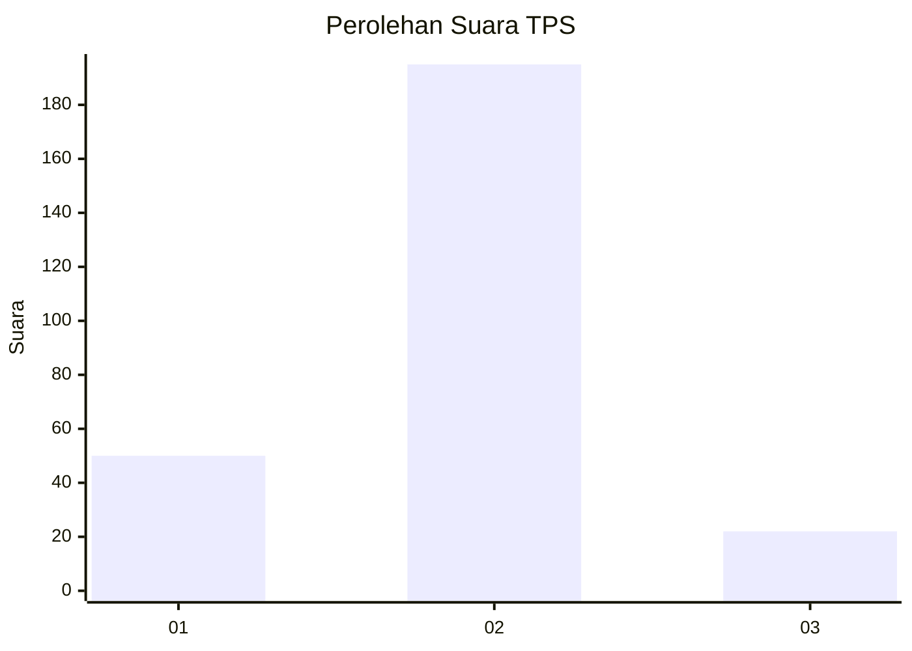
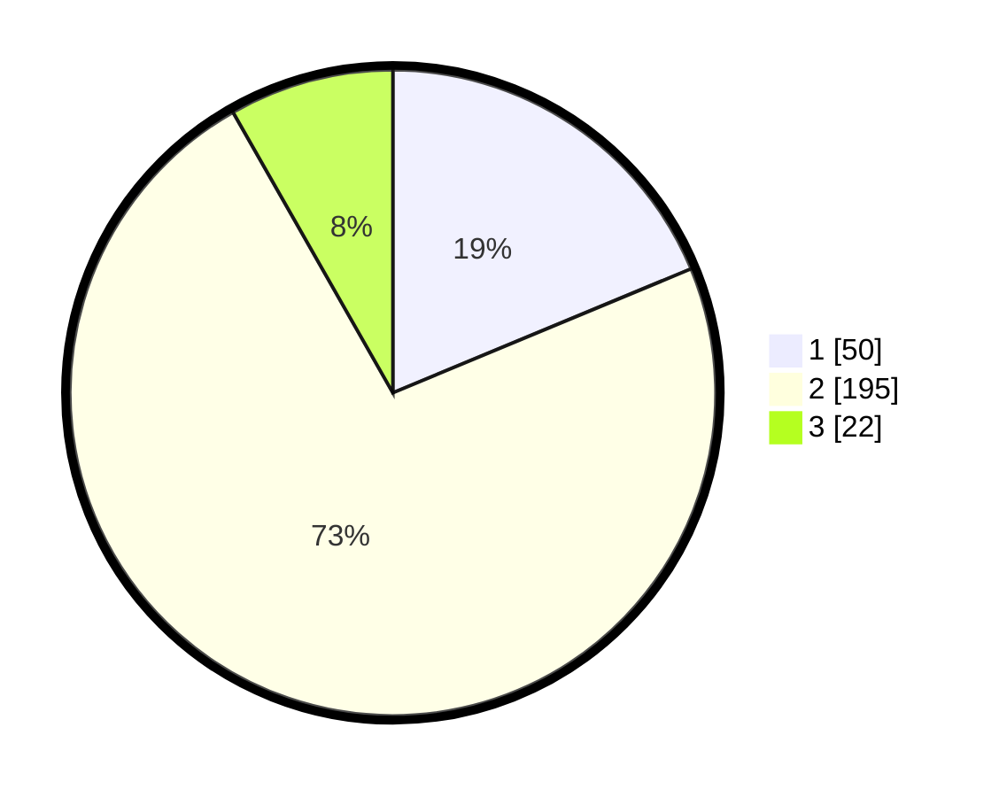

# Hasil

## Grafik

## Tabel

| No. | Nama Paslon    | Suara | Suara (raw) | Persentase |
|:--- |:-------------- | -----:| -----------:| ----------:|
| 1   | ANIES MUHAIMIN | 50    | [50][p-1]   | 18,73      |
| 2   | PRABOWO GIBRAN | 195   | [195][p-2]  | 73,03      |
| 3   | GANJAR MAHFUD  | 22    | [22][p-3]   | 8,24       |

[p-1]: https://github.com/gigit-pemilu/pemilu-2024-14-riau/blob/main/pilpres/hitung-suara/sub/14-riau/sub/09-kuantan-singingi/sub/01-kuantan-mudik/sub/2004-air-buluh/sub/001-tps/sub/paslon-1.txt
[p-2]: https://github.com/gigit-pemilu/pemilu-2024-14-riau/blob/main/pilpres/hitung-suara/sub/14-riau/sub/09-kuantan-singingi/sub/01-kuantan-mudik/sub/2004-air-buluh/sub/001-tps/sub/paslon-2.txt
[p-3]: https://github.com/gigit-pemilu/pemilu-2024-14-riau/blob/main/pilpres/hitung-suara/sub/14-riau/sub/09-kuantan-singingi/sub/01-kuantan-mudik/sub/2004-air-buluh/sub/001-tps/sub/paslon-3.txt

## Foto C Plano

https://sirekap-obj-formc.kpu.go.id/4e8b/pemilu/ppwp/14/09/01/20/04/1409012004001-20240217-193031--c6f8e2af-a5c9-43b0-80b4-e3f7e69f73f2.jpg

https://sirekap-obj-formc.kpu.go.id/4e8b/pemilu/ppwp/14/09/01/20/04/1409012004001-20240217-193226--a79be550-3218-4c27-96bf-05028583908b.jpg

https://sirekap-obj-formc.kpu.go.id/4e8b/pemilu/ppwp/14/09/01/20/04/1409012004001-20240217-194637--47bd8068-407a-484b-bdd1-e16c88fbe065.jpg

## Metadata

| Key        | Value               |
| ---------- | ------------------- |
| Time Stamp | 2024-02-19 06:16:00 |

## DATA PEMILIH TETAP

Jumlah pemilih dalam DPT: **299**.
 * L: **153**.
 * P: **146**.

## DATA PENGGUNA HAK PILIH

Jumlah pengguna hak pilih dalam DPT: **277**.
 * L: **142**.
 * P: **135**.

Jumlah pengguna hak pilih dalam DPTb: **6**.
 * L: **3**.
 * P: **3**.

Jumlah pengguna hak pilih dalam DPK: **6**.
 * L: **2**.
 * P: **4**.

Jumlah pengguna hak pilih: **289**.
 * L: **147**.
 * P: **142**.

## JUMLAH SUARA SAH DAN TIDAK SAH

JUMLAH SELURUH SUARA SAH: **287**.

JUMLAH SUARA TIDAK SAH: **2**.

JUMLAH SELURUH SUARA SAH DAN SUARA TIDAK SAH: **289**.

