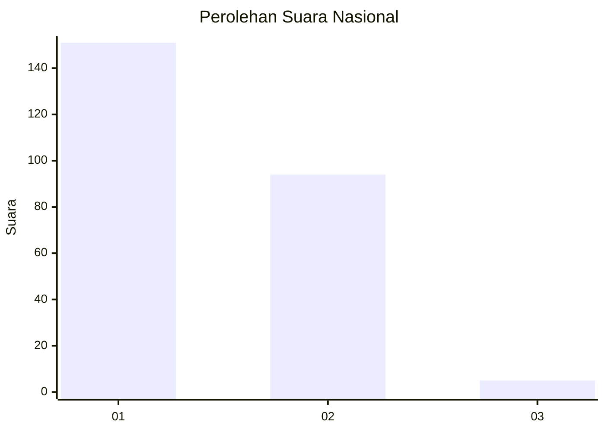
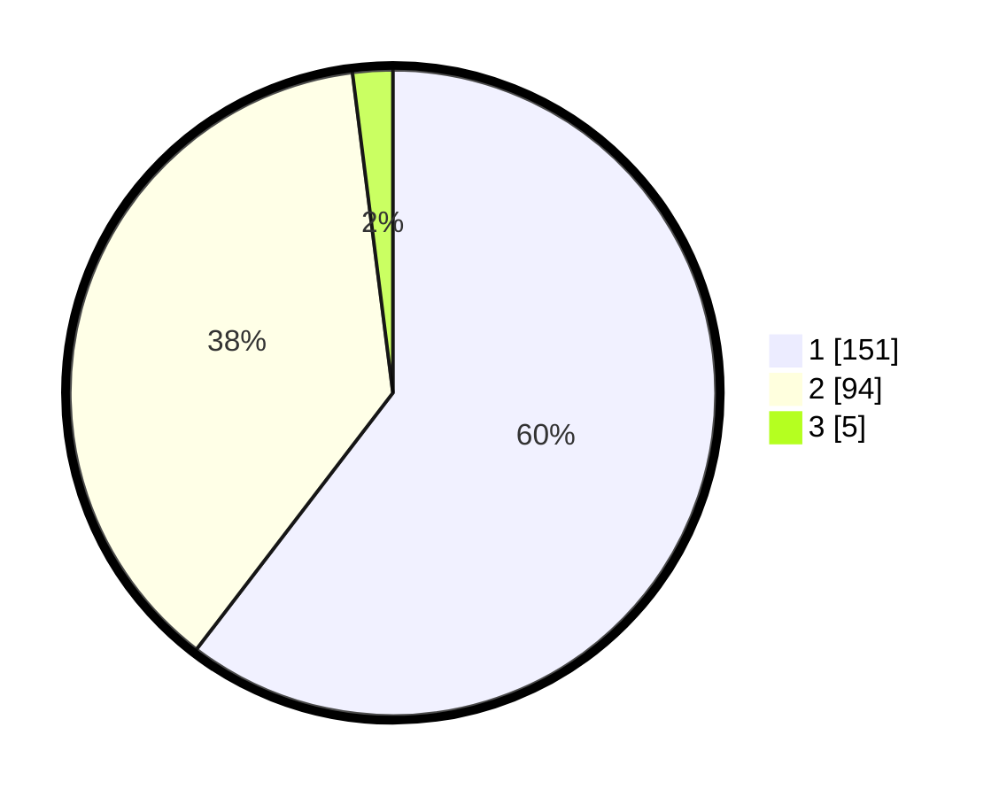

# Hasil

## Grafik

## Tabel

| No. | Nama Paslon    | Suara | Suara (raw) | Persentase |
|:--- |:-------------- | -----:| -----------:| ----------:|
| 1   | ANIES MUHAIMIN | 151   | [151][p-1]  | 60,40      |
| 2   | PRABOWO GIBRAN | 94    | [94][p-2]   | 37,60      |
| 3   | GANJAR MAHFUD  | 5     | [5][p-3]    | 2,00       |

[p-1]: https://github.com/gigit-pemilu/pemilu-2024/blob/main/pilpres/hitung-suara/sub/14-riau/sub/09-kuantan-singingi/sub/01-kuantan-mudik/sub/2027-sungaimanau/sub/002-tps/sub/paslon-1.txt
[p-2]: https://github.com/gigit-pemilu/pemilu-2024/blob/main/pilpres/hitung-suara/sub/14-riau/sub/09-kuantan-singingi/sub/01-kuantan-mudik/sub/2027-sungaimanau/sub/002-tps/sub/paslon-2.txt
[p-3]: https://github.com/gigit-pemilu/pemilu-2024/blob/main/pilpres/hitung-suara/sub/14-riau/sub/09-kuantan-singingi/sub/01-kuantan-mudik/sub/2027-sungaimanau/sub/002-tps/sub/paslon-3.txt

## Foto C Plano

https://sirekap-obj-formc.kpu.go.id/681e/pemilu/ppwp/14/09/01/20/27/1409012027002-20240214-203322--a85f406d-c293-404f-83f8-4a000ebafe65.jpg

https://sirekap-obj-formc.kpu.go.id/681e/pemilu/ppwp/14/09/01/20/27/1409012027002-20240215-175050--e98731d8-5b15-4b2d-9ee1-46d730628b9f.jpg

https://sirekap-obj-formc.kpu.go.id/681e/pemilu/ppwp/14/09/01/20/27/1409012027002-20240215-175448--fa53f40a-9268-4bf1-b850-34076311f3a8.jpg

## Metadata

| Key        | Value               |
| ---------- | ------------------- |
| Time Stamp | 2024-02-15 20:30:46 |

