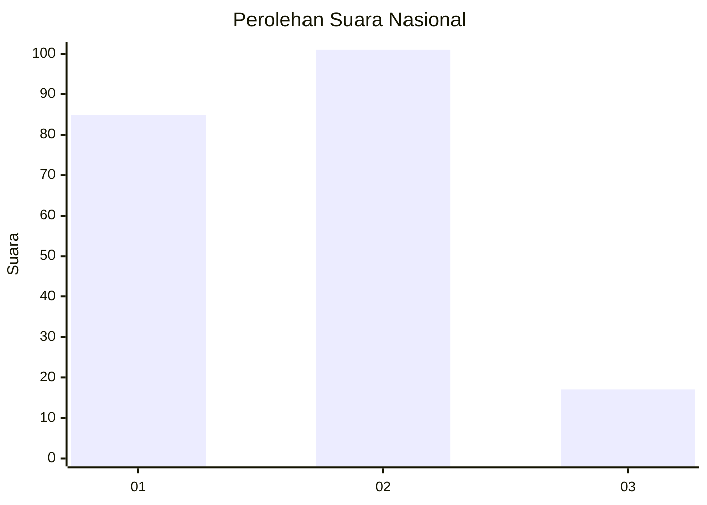
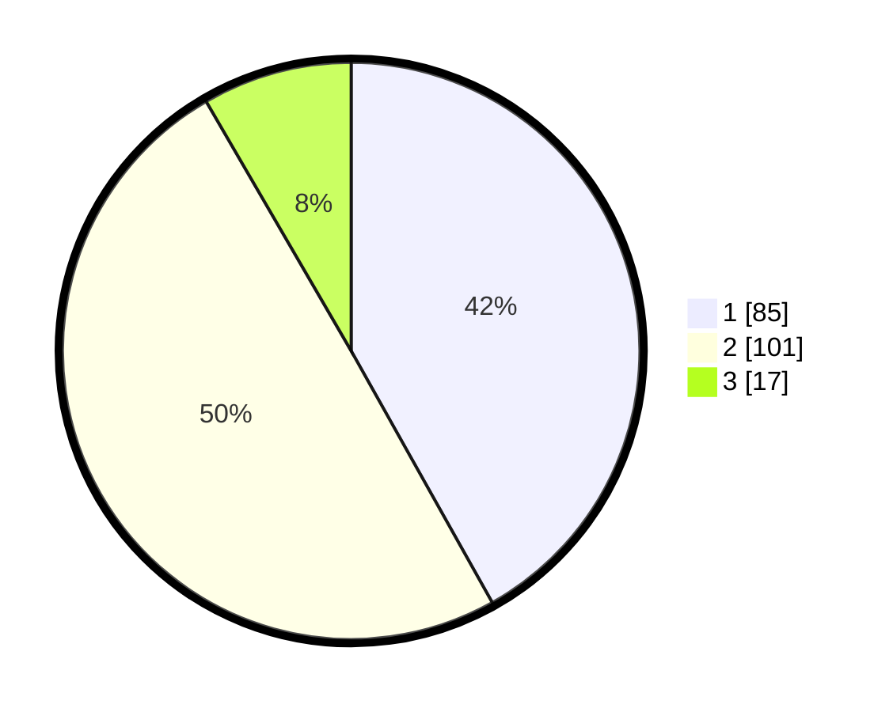

# Hasil

## Grafik

## Tabel

| No. | Nama Paslon    | Suara | Suara (raw) | Persentase |
|:--- |:-------------- | -----:| -----------:| ----------:|
| 1   | ANIES MUHAIMIN | 85    | [85][p-1]   | 41,87      |
| 2   | PRABOWO GIBRAN | 101   | [101][p-2]  | 49,75      |
| 3   | GANJAR MAHFUD  | 17    | [17][p-3]   | 8,37       |

[p-1]: https://github.com/gigit-pemilu/pemilu-2024/blob/main/pilpres/hitung-suara/sub/14-riau/sub/09-kuantan-singingi/sub/02-kuantan-tengah/sub/1016-pasar-teluk/sub/002-tps/sub/paslon-1.txt
[p-2]: https://github.com/gigit-pemilu/pemilu-2024/blob/main/pilpres/hitung-suara/sub/14-riau/sub/09-kuantan-singingi/sub/02-kuantan-tengah/sub/1016-pasar-teluk/sub/002-tps/sub/paslon-2.txt
[p-3]: https://github.com/gigit-pemilu/pemilu-2024/blob/main/pilpres/hitung-suara/sub/14-riau/sub/09-kuantan-singingi/sub/02-kuantan-tengah/sub/1016-pasar-teluk/sub/002-tps/sub/paslon-3.txt

## Foto C Plano

https://sirekap-obj-formc.kpu.go.id/f977/pemilu/ppwp/14/09/02/10/16/1409021016002-20240215-134647--002d0612-45a0-411b-a8aa-40f1f6edc348.jpg

https://sirekap-obj-formc.kpu.go.id/f977/pemilu/ppwp/14/09/02/10/16/1409021016002-20240215-134014--e686e853-a1a9-4842-98a9-bdff0aa1d152.jpg

https://sirekap-obj-formc.kpu.go.id/f977/pemilu/ppwp/14/09/02/10/16/1409021016002-20240215-134126--480f099b-2eca-41b6-843c-56dc98146502.jpg

## Metadata

| Key        | Value               |
| ---------- | ------------------- |
| Time Stamp | 2024-02-15 17:00:25 |

