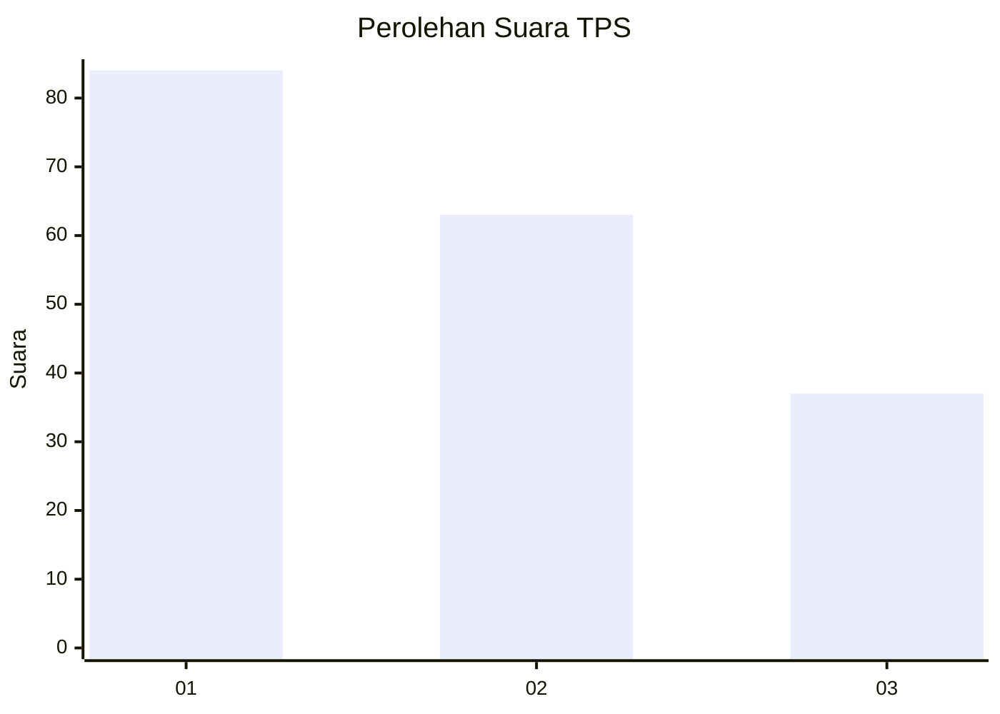
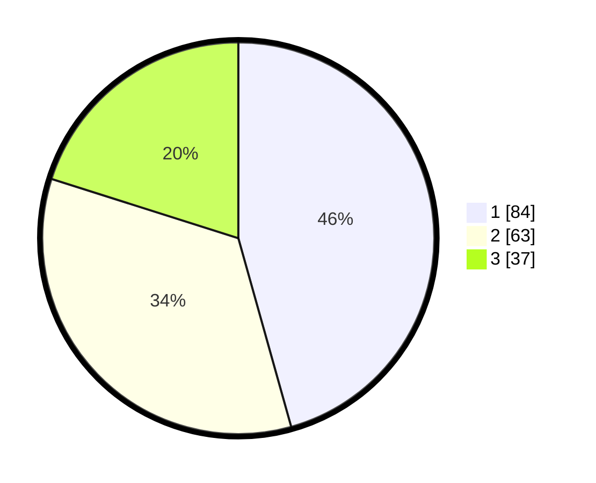

# Hasil

## Grafik

## Tabel

| No. | Nama Paslon    | Suara | Suara (raw) | Persentase |
|:--- |:-------------- | -----:| -----------:| ----------:|
| 1   | ANIES MUHAIMIN | 84    | [84][p-1]   | 45,65      |
| 2   | PRABOWO GIBRAN | 63    | [63][p-2]   | 34,24      |
| 3   | GANJAR MAHFUD  | 37    | [37][p-3]   | 20,11      |

[p-1]: https://github.com/gigit-pemilu/pemilu-2024-14-riau/blob/main/pilpres/hitung-suara/sub/14-riau/sub/09-kuantan-singingi/sub/02-kuantan-tengah/sub/1016-pasar-teluk/sub/003-tps/sub/paslon-1.txt
[p-2]: https://github.com/gigit-pemilu/pemilu-2024-14-riau/blob/main/pilpres/hitung-suara/sub/14-riau/sub/09-kuantan-singingi/sub/02-kuantan-tengah/sub/1016-pasar-teluk/sub/003-tps/sub/paslon-2.txt
[p-3]: https://github.com/gigit-pemilu/pemilu-2024-14-riau/blob/main/pilpres/hitung-suara/sub/14-riau/sub/09-kuantan-singingi/sub/02-kuantan-tengah/sub/1016-pasar-teluk/sub/003-tps/sub/paslon-3.txt

## Foto C Plano

https://sirekap-obj-formc.kpu.go.id/f754/pemilu/ppwp/14/09/02/10/16/1409021016003-20240215-110239--e6db9a0f-3d47-4cc6-8574-a15b9c1100a2.jpg

https://sirekap-obj-formc.kpu.go.id/f754/pemilu/ppwp/14/09/02/10/16/1409021016003-20240215-124619--3e259de9-58f4-41c8-93be-522920ed1af0.jpg

https://sirekap-obj-formc.kpu.go.id/f754/pemilu/ppwp/14/09/02/10/16/1409021016003-20240215-142603--d458111e-6763-46fa-8cb7-5ca6052f2025.jpg

## Metadata

| Key        | Value               |
| ---------- | ------------------- |
| Time Stamp | 2024-02-15 17:00:25 |

