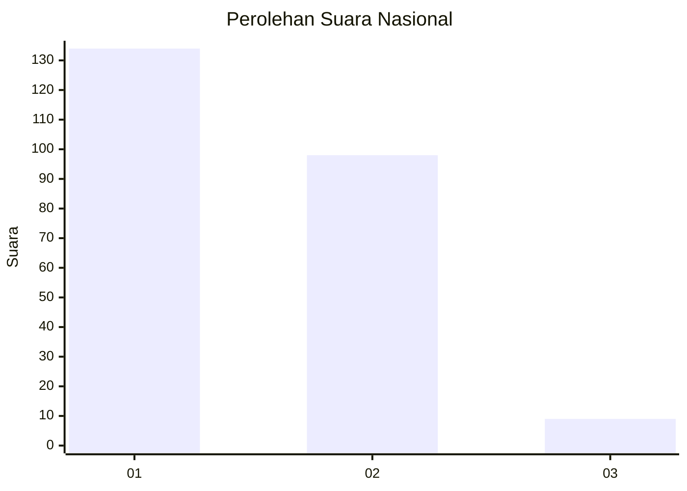
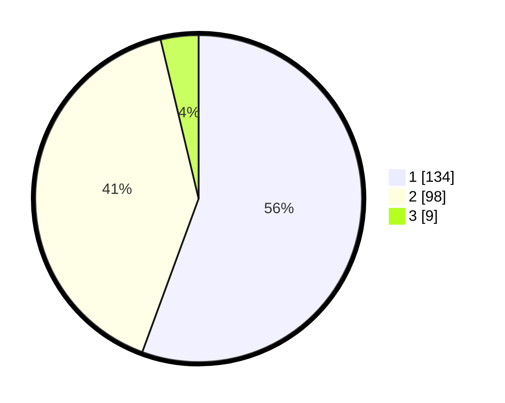

# Hasil

## Grafik

## Tabel

| No. | Nama Paslon    | Suara | Suara (raw) | Persentase |
|:--- |:-------------- | -----:| -----------:| ----------:|
| 1   | ANIES MUHAIMIN | 134   | [134][p-1]  | 55,60      |
| 2   | PRABOWO GIBRAN | 98    | [98][p-2]   | 40,66      |
| 3   | GANJAR MAHFUD  | 9     | [9][p-3]    | 3,73       |

[p-1]: https://github.com/gigit-pemilu/pemilu-2024/blob/main/pilpres/hitung-suara/sub/14-riau/sub/09-kuantan-singingi/sub/02-kuantan-tengah/sub/1018-simpang-tiga/sub/007-tps/sub/paslon-1.txt
[p-2]: https://github.com/gigit-pemilu/pemilu-2024/blob/main/pilpres/hitung-suara/sub/14-riau/sub/09-kuantan-singingi/sub/02-kuantan-tengah/sub/1018-simpang-tiga/sub/007-tps/sub/paslon-2.txt
[p-3]: https://github.com/gigit-pemilu/pemilu-2024/blob/main/pilpres/hitung-suara/sub/14-riau/sub/09-kuantan-singingi/sub/02-kuantan-tengah/sub/1018-simpang-tiga/sub/007-tps/sub/paslon-3.txt

## Foto C Plano

https://sirekap-obj-formc.kpu.go.id/c46a/pemilu/ppwp/14/09/02/10/18/1409021018007-20240216-092801--3dcb27c6-49e9-4817-afbe-051fd82d0ec2.jpg

https://sirekap-obj-formc.kpu.go.id/c46a/pemilu/ppwp/14/09/02/10/18/1409021018007-20240216-092814--280e7248-e2ef-4cdd-a641-e4b626c74741.jpg

https://sirekap-obj-formc.kpu.go.id/c46a/pemilu/ppwp/14/09/02/10/18/1409021018007-20240216-092823--629fde91-8a2d-45de-ba42-655ea3e3341f.jpg

## Metadata

| Key        | Value               |
| ---------- | ------------------- |
| Time Stamp | 2024-02-16 12:51:22 |

