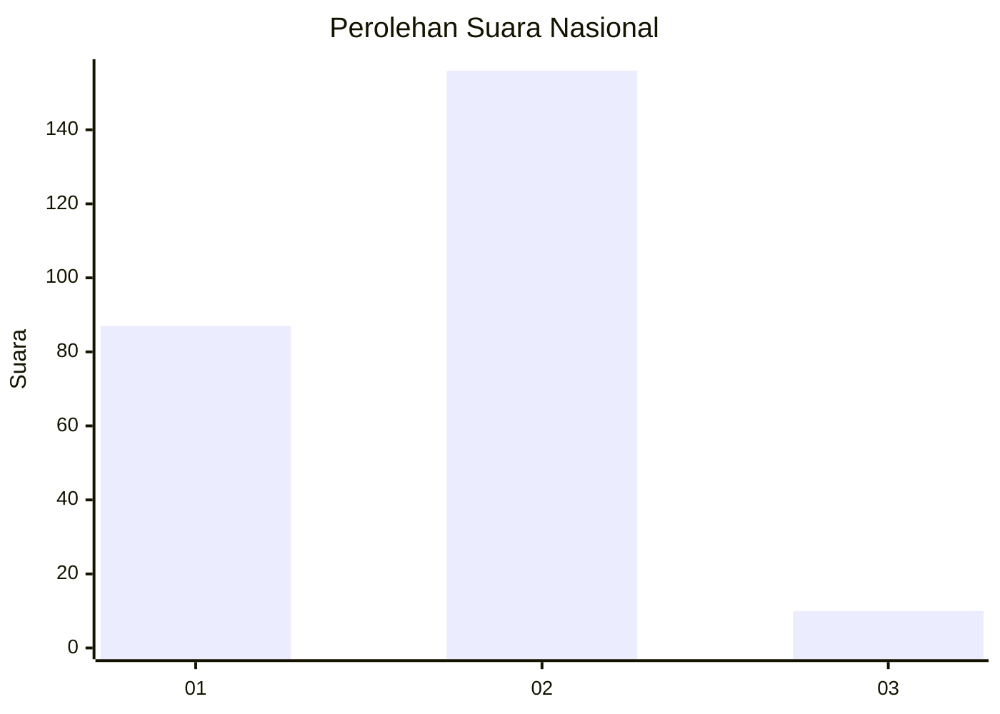
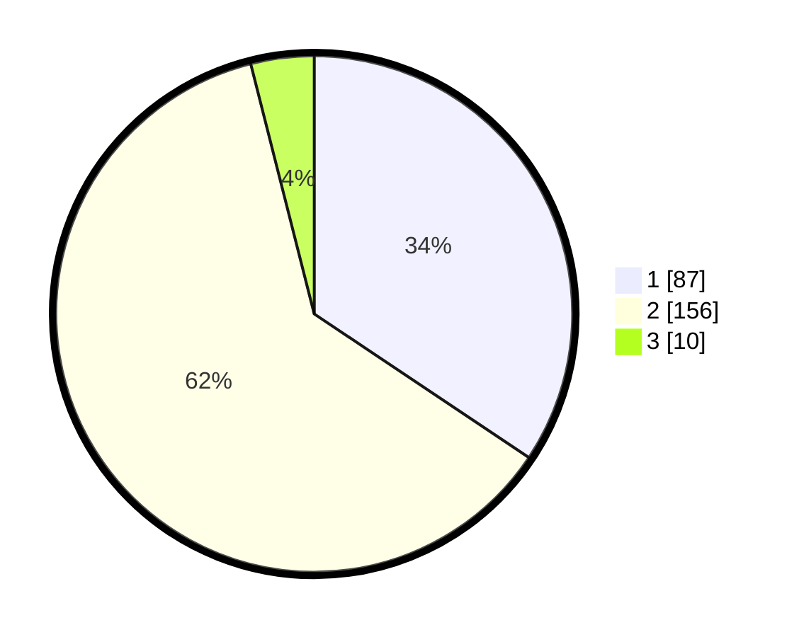

# Hasil

## Grafik

## Tabel

| No. | Nama Paslon    | Suara | Suara (raw) | Persentase |
|:--- |:-------------- | -----:| -----------:| ----------:|
| 1   | ANIES MUHAIMIN | 87    | [87][p-1]   | 34,39      |
| 2   | PRABOWO GIBRAN | 156   | [156][p-2]  | 61,66      |
| 3   | GANJAR MAHFUD  | 10    | [10][p-3]   | 3,95       |

[p-1]: https://github.com/gigit-pemilu/pemilu-2024/blob/main/pilpres/hitung-suara/sub/14-riau/sub/09-kuantan-singingi/sub/02-kuantan-tengah/sub/2027-titian-modang-kopah/sub/002-tps/sub/paslon-1.txt
[p-2]: https://github.com/gigit-pemilu/pemilu-2024/blob/main/pilpres/hitung-suara/sub/14-riau/sub/09-kuantan-singingi/sub/02-kuantan-tengah/sub/2027-titian-modang-kopah/sub/002-tps/sub/paslon-2.txt
[p-3]: https://github.com/gigit-pemilu/pemilu-2024/blob/main/pilpres/hitung-suara/sub/14-riau/sub/09-kuantan-singingi/sub/02-kuantan-tengah/sub/2027-titian-modang-kopah/sub/002-tps/sub/paslon-3.txt

## Foto C Plano

https://sirekap-obj-formc.kpu.go.id/7cab/pemilu/ppwp/14/09/02/20/27/1409022027002-20240214-211300--85b5f95f-2489-46db-b275-a7e1272b91d5.jpg

https://sirekap-obj-formc.kpu.go.id/7cab/pemilu/ppwp/14/09/02/20/27/1409022027002-20240214-212256--87129b20-8097-4c80-92e4-4d635bf31c3d.jpg

https://sirekap-obj-formc.kpu.go.id/7cab/pemilu/ppwp/14/09/02/20/27/1409022027002-20240214-212554--b7a4a016-fc83-4d0b-bf02-c0ddcc80baf8.jpg

## Metadata

| Key        | Value               |
| ---------- | ------------------- |
| Time Stamp | 2024-02-15 17:00:25 |

