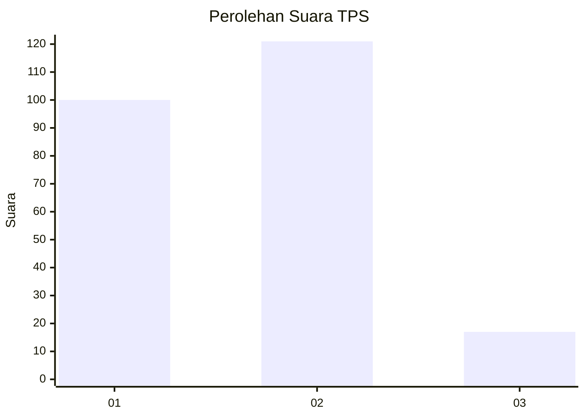
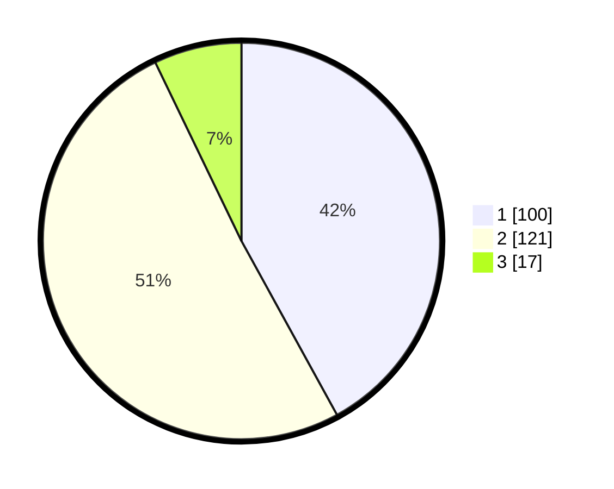

# Hasil

## Grafik

## Tabel

| No. | Nama Paslon    | Suara | Suara (raw) | Persentase |
|:--- |:-------------- | -----:| -----------:| ----------:|
| 1   | ANIES MUHAIMIN | 100   | [100][p-1]  | 42,02      |
| 2   | PRABOWO GIBRAN | 121   | [121][p-2]  | 50,84      |
| 3   | GANJAR MAHFUD  | 17    | [17][p-3]   | 7,14       |

[p-1]: https://github.com/gigit-pemilu/pemilu-2024-14-riau/blob/main/pilpres/hitung-suara/sub/14-riau/sub/09-kuantan-singingi/sub/03-singingi/sub/1003-muara-lembu/sub/001-tps/sub/paslon-1.txt
[p-2]: https://github.com/gigit-pemilu/pemilu-2024-14-riau/blob/main/pilpres/hitung-suara/sub/14-riau/sub/09-kuantan-singingi/sub/03-singingi/sub/1003-muara-lembu/sub/001-tps/sub/paslon-2.txt
[p-3]: https://github.com/gigit-pemilu/pemilu-2024-14-riau/blob/main/pilpres/hitung-suara/sub/14-riau/sub/09-kuantan-singingi/sub/03-singingi/sub/1003-muara-lembu/sub/001-tps/sub/paslon-3.txt

## Foto C Plano

https://sirekap-obj-formc.kpu.go.id/fe62/pemilu/ppwp/14/09/03/10/03/1409031003001-20240215-065845--ed93010e-1d35-49c9-9eea-5161179a9690.jpg

https://sirekap-obj-formc.kpu.go.id/fe62/pemilu/ppwp/14/09/03/10/03/1409031003001-20240215-065856--8b766a39-e628-4bd5-b464-f86193f21d18.jpg

https://sirekap-obj-formc.kpu.go.id/fe62/pemilu/ppwp/14/09/03/10/03/1409031003001-20240215-065915--b41cb052-000e-410a-8b16-5b6bfce59608.jpg

## Metadata

| Key        | Value               |
| ---------- | ------------------- |
| Time Stamp | 2024-02-15 15:30:25 |

