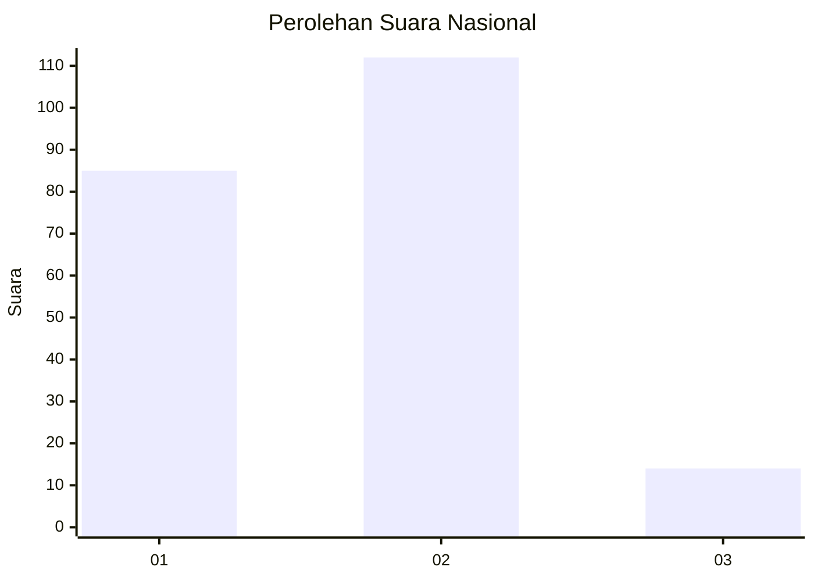

# Hasil

## Grafik

## Tabel

| No. | Nama Paslon    | Suara | Suara (raw) | Persentase |
|:--- |:-------------- | -----:| -----------:| ----------:|
| 1   | ANIES MUHAIMIN | 85    | [85][p-1]   | 40,28      |
| 2   | PRABOWO GIBRAN | 112   | [112][p-2]  | 53,08      |
| 3   | GANJAR MAHFUD  | 14    | [14][p-3]   | 6,64       |

[p-1]: https://github.com/gigit-pemilu/pemilu-2024/blob/main/pilpres/hitung-suara/sub/14-riau/sub/09-kuantan-singingi/sub/03-singingi/sub/1003-muara-lembu/sub/003-tps/sub/paslon-1.txt
[p-2]: https://github.com/gigit-pemilu/pemilu-2024/blob/main/pilpres/hitung-suara/sub/14-riau/sub/09-kuantan-singingi/sub/03-singingi/sub/1003-muara-lembu/sub/003-tps/sub/paslon-2.txt
[p-3]: https://github.com/gigit-pemilu/pemilu-2024/blob/main/pilpres/hitung-suara/sub/14-riau/sub/09-kuantan-singingi/sub/03-singingi/sub/1003-muara-lembu/sub/003-tps/sub/paslon-3.txt

## Foto C Plano

https://sirekap-obj-formc.kpu.go.id/a743/pemilu/ppwp/14/09/03/10/03/1409031003003-20240215-022440--0a11ad92-d55a-4ba7-8016-e02bd4d59315.jpg

https://sirekap-obj-formc.kpu.go.id/a743/pemilu/ppwp/14/09/03/10/03/1409031003003-20240215-022738--85c55f9d-02a8-49b1-aa9a-a5e376b98adb.jpg

https://sirekap-obj-formc.kpu.go.id/a743/pemilu/ppwp/14/09/03/10/03/1409031003003-20240215-022929--bb28b3bd-835e-40e8-843e-d0220d8ec362.jpg

## Metadata

| Key        | Value               |
| ---------- | ------------------- |
| Time Stamp | 2024-02-15 15:00:29 |

