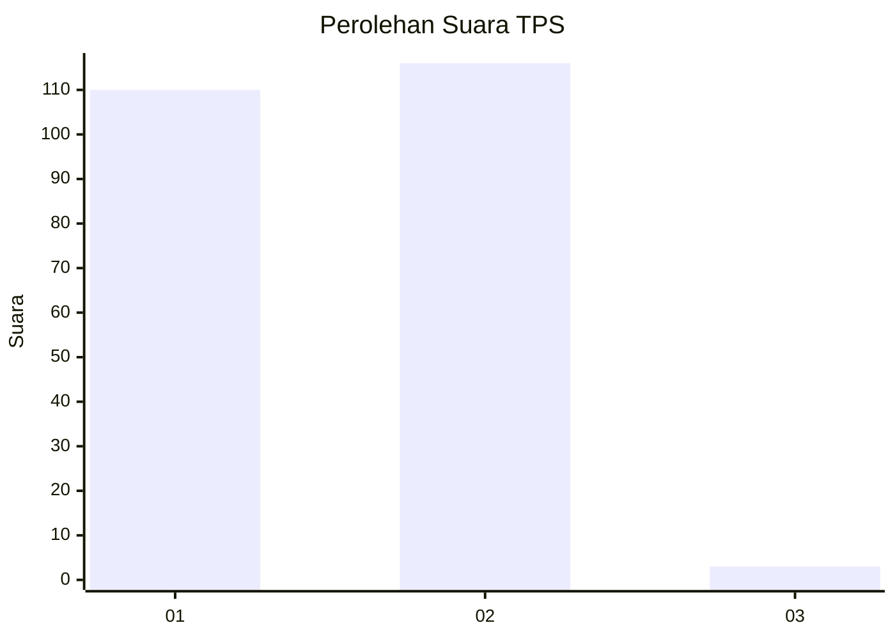
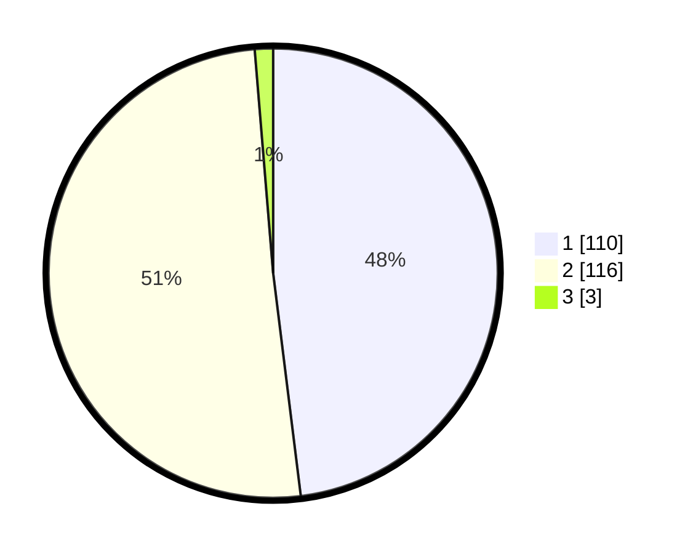

# Hasil

## Grafik

## Tabel

| No. | Nama Paslon    | Suara | Suara (raw) | Persentase |
|:--- |:-------------- | -----:| -----------:| ----------:|
| 1   | ANIES MUHAIMIN | 110   | [110][p-1]  | 48,03      |
| 2   | PRABOWO GIBRAN | 116   | [116][p-2]  | 50,66      |
| 3   | GANJAR MAHFUD  | 3     | [3][p-3]    | 1,31       |

[p-1]: https://github.com/gigit-pemilu/pemilu-2024-14-riau/blob/main/pilpres/hitung-suara/sub/14-riau/sub/09-kuantan-singingi/sub/03-singingi/sub/1003-muara-lembu/sub/011-tps/sub/paslon-1.txt
[p-2]: https://github.com/gigit-pemilu/pemilu-2024-14-riau/blob/main/pilpres/hitung-suara/sub/14-riau/sub/09-kuantan-singingi/sub/03-singingi/sub/1003-muara-lembu/sub/011-tps/sub/paslon-2.txt
[p-3]: https://github.com/gigit-pemilu/pemilu-2024-14-riau/blob/main/pilpres/hitung-suara/sub/14-riau/sub/09-kuantan-singingi/sub/03-singingi/sub/1003-muara-lembu/sub/011-tps/sub/paslon-3.txt

## Foto C Plano

https://sirekap-obj-formc.kpu.go.id/6edb/pemilu/ppwp/14/09/03/10/03/1409031003011-20240215-031734--10c7a6c2-0605-4868-b971-79491eded113.jpg

https://sirekap-obj-formc.kpu.go.id/6edb/pemilu/ppwp/14/09/03/10/03/1409031003011-20240215-031918--0a0a6194-c622-4326-907d-25ee7fdc56a1.jpg

https://sirekap-obj-formc.kpu.go.id/6edb/pemilu/ppwp/14/09/03/10/03/1409031003011-20240215-032051--60c4b1d3-17b9-4d3e-a5a8-58f3c62a6968.jpg

## Metadata

| Key        | Value               |
| ---------- | ------------------- |
| Time Stamp | 2024-02-16 21:01:00 |

