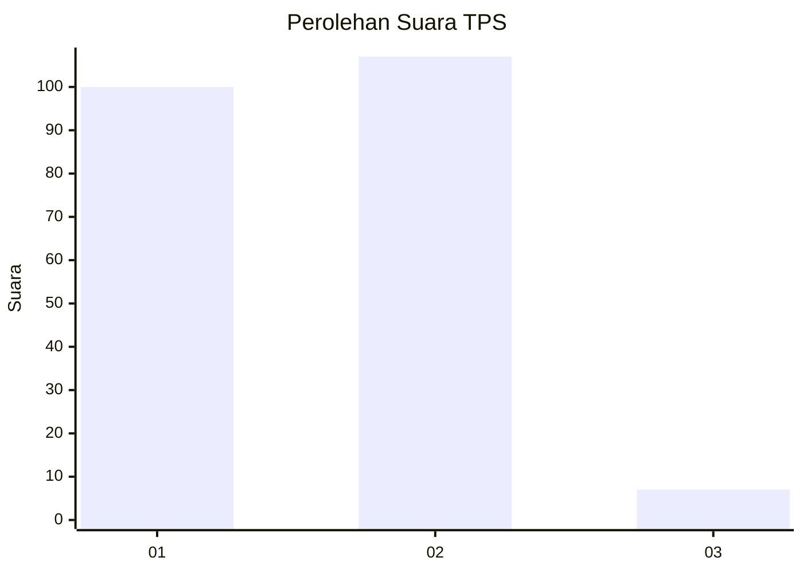
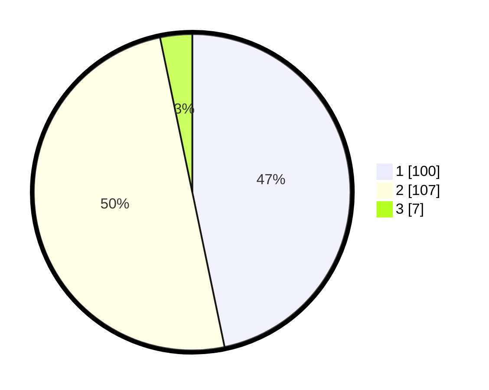

# Hasil

## Grafik

## Tabel

| No. | Nama Paslon    | Suara | Suara (raw) | Persentase |
|:--- |:-------------- | -----:| -----------:| ----------:|
| 1   | ANIES MUHAIMIN | 100   | [100][p-1]  | 46,73      |
| 2   | PRABOWO GIBRAN | 107   | [107][p-2]  | 50,00      |
| 3   | GANJAR MAHFUD  | 7     | [7][p-3]    | 3,27       |

[p-1]: https://github.com/gigit-pemilu/pemilu-2024-14-riau/blob/main/pilpres/hitung-suara/sub/14-riau/sub/09-kuantan-singingi/sub/04-kuantan-hilir/sub/1001-pasar-usang/sub/002-tps/sub/paslon-1.txt
[p-2]: https://github.com/gigit-pemilu/pemilu-2024-14-riau/blob/main/pilpres/hitung-suara/sub/14-riau/sub/09-kuantan-singingi/sub/04-kuantan-hilir/sub/1001-pasar-usang/sub/002-tps/sub/paslon-2.txt
[p-3]: https://github.com/gigit-pemilu/pemilu-2024-14-riau/blob/main/pilpres/hitung-suara/sub/14-riau/sub/09-kuantan-singingi/sub/04-kuantan-hilir/sub/1001-pasar-usang/sub/002-tps/sub/paslon-3.txt

## Foto C Plano

https://sirekap-obj-formc.kpu.go.id/d03f/pemilu/ppwp/14/09/04/10/01/1409041001002-20240214-194148--93957afd-c56a-4f1f-b0b8-ac80f41e678b.jpg

https://sirekap-obj-formc.kpu.go.id/d03f/pemilu/ppwp/14/09/04/10/01/1409041001002-20240214-194309--94519df9-13c1-4b85-bba2-2e69562261eb.jpg

https://sirekap-obj-formc.kpu.go.id/d03f/pemilu/ppwp/14/09/04/10/01/1409041001002-20240214-194432--b257ac6b-23e0-4698-bdd9-716d874509d9.jpg

## Metadata

| Key        | Value               |
| ---------- | ------------------- |
| Time Stamp | 2024-02-15 17:30:25 |

