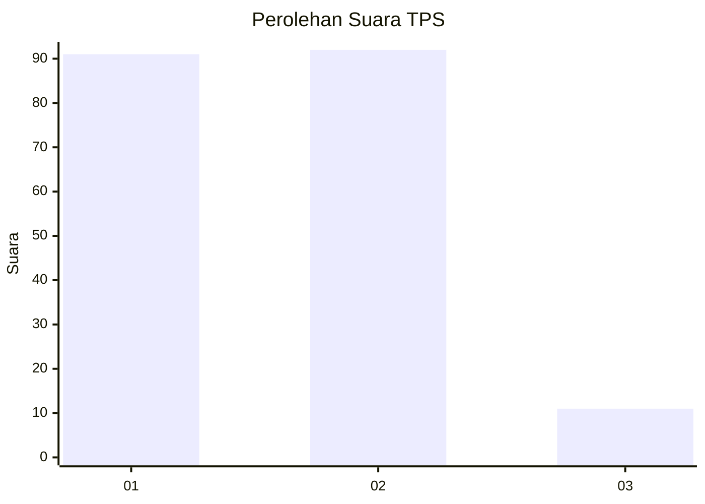
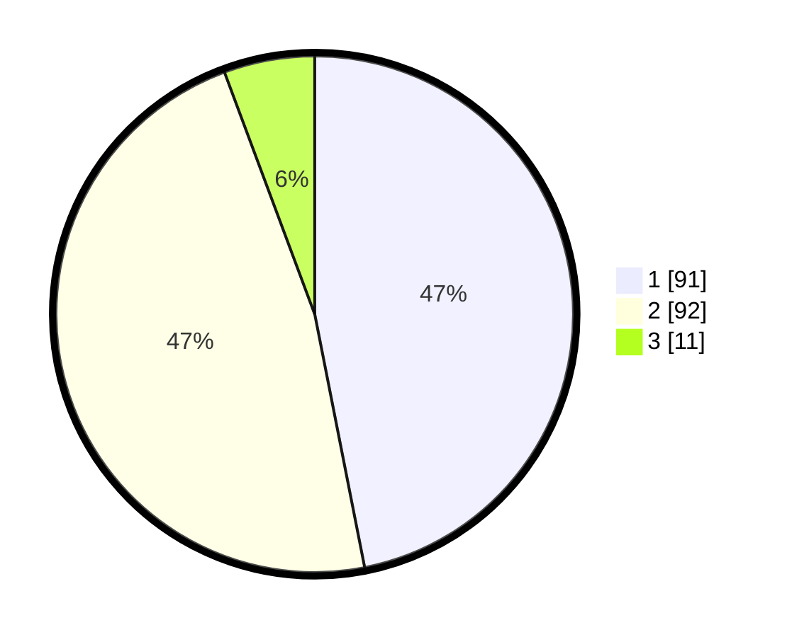

# Hasil

## Grafik

## Tabel

| No. | Nama Paslon    | Suara | Suara (raw) | Persentase |
|:--- |:-------------- | -----:| -----------:| ----------:|
| 1   | ANIES MUHAIMIN | 91    | [91][p-1]   | 46,91      |
| 2   | PRABOWO GIBRAN | 92    | [92][p-2]   | 47,42      |
| 3   | GANJAR MAHFUD  | 11    | [11][p-3]   | 5,67       |

[p-1]: https://github.com/gigit-pemilu/pemilu-2024-14-riau/blob/main/pilpres/hitung-suara/sub/14-riau/sub/09-kuantan-singingi/sub/04-kuantan-hilir/sub/2007-kampung-madura/sub/001-tps/sub/paslon-1.txt
[p-2]: https://github.com/gigit-pemilu/pemilu-2024-14-riau/blob/main/pilpres/hitung-suara/sub/14-riau/sub/09-kuantan-singingi/sub/04-kuantan-hilir/sub/2007-kampung-madura/sub/001-tps/sub/paslon-2.txt
[p-3]: https://github.com/gigit-pemilu/pemilu-2024-14-riau/blob/main/pilpres/hitung-suara/sub/14-riau/sub/09-kuantan-singingi/sub/04-kuantan-hilir/sub/2007-kampung-madura/sub/001-tps/sub/paslon-3.txt

## Foto C Plano

https://sirekap-obj-formc.kpu.go.id/c5d7/pemilu/ppwp/14/09/04/20/07/1409042007001-20240216-173245--05aed25c-bdd9-4a72-a997-630a26eb0971.jpg

https://sirekap-obj-formc.kpu.go.id/c5d7/pemilu/ppwp/14/09/04/20/07/1409042007001-20240215-090504--203b512e-a93e-41f3-80fe-14f2df5b67c7.jpg

https://sirekap-obj-formc.kpu.go.id/c5d7/pemilu/ppwp/14/09/04/20/07/1409042007001-20240215-090606--fbe3c7a3-c013-4152-9ea3-c16e2ec1b5a2.jpg

## Metadata

| Key        | Value               |
| ---------- | ------------------- |
| Time Stamp | 2024-02-16 21:01:00 |

