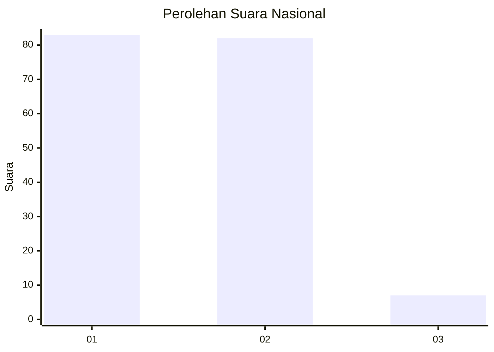
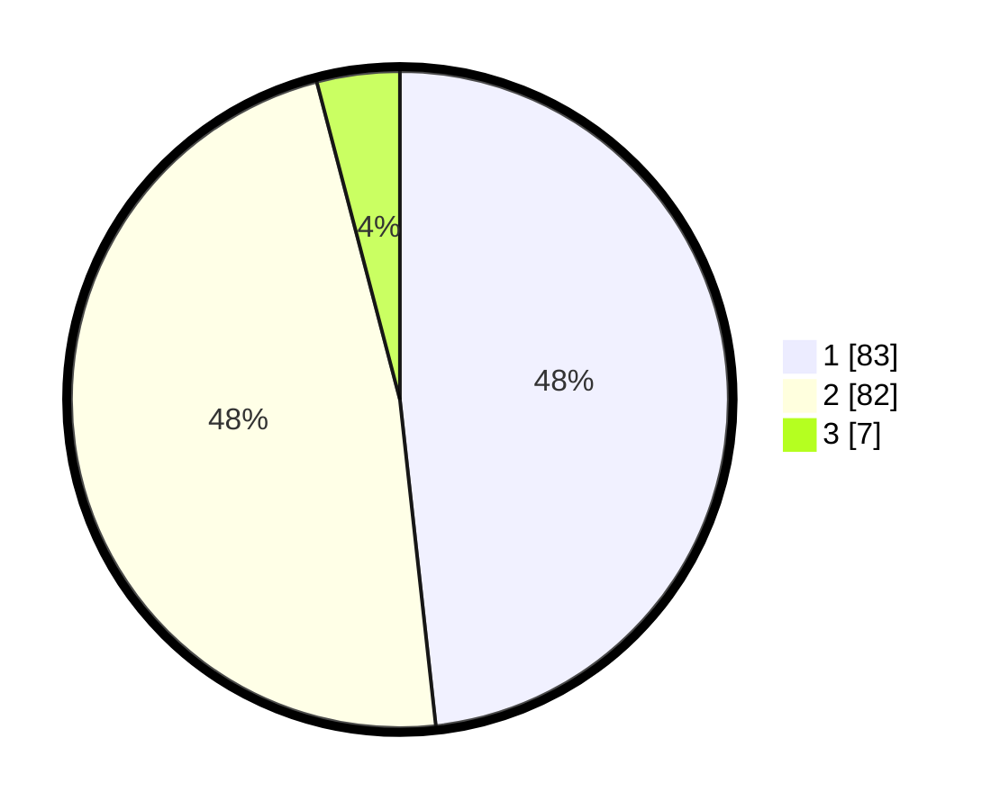

# Hasil

## Grafik

## Tabel

| No. | Nama Paslon    | Suara | Suara (raw) | Persentase |
|:--- |:-------------- | -----:| -----------:| ----------:|
| 1   | ANIES MUHAIMIN | 83    | [83][p-1]   | 48,26      |
| 2   | PRABOWO GIBRAN | 82    | [82][p-2]   | 47,67      |
| 3   | GANJAR MAHFUD  | 7     | [7][p-3]    | 4,07       |

[p-1]: https://github.com/gigit-pemilu/pemilu-2024/blob/main/pilpres/hitung-suara/sub/14-riau/sub/09-kuantan-singingi/sub/05-cerenti/sub/1001-pasar-cerenti/sub/001-tps/sub/paslon-1.txt
[p-2]: https://github.com/gigit-pemilu/pemilu-2024/blob/main/pilpres/hitung-suara/sub/14-riau/sub/09-kuantan-singingi/sub/05-cerenti/sub/1001-pasar-cerenti/sub/001-tps/sub/paslon-2.txt
[p-3]: https://github.com/gigit-pemilu/pemilu-2024/blob/main/pilpres/hitung-suara/sub/14-riau/sub/09-kuantan-singingi/sub/05-cerenti/sub/1001-pasar-cerenti/sub/001-tps/sub/paslon-3.txt

## Foto C Plano

https://sirekap-obj-formc.kpu.go.id/3aec/pemilu/ppwp/14/09/05/10/01/1409051001001-20240214-231250--606f0641-0597-4972-8263-85c50d6226b2.jpg

https://sirekap-obj-formc.kpu.go.id/3aec/pemilu/ppwp/14/09/05/10/01/1409051001001-20240214-231359--7861ce96-4618-4b2e-b53d-d878f7459ca1.jpg

https://sirekap-obj-formc.kpu.go.id/3aec/pemilu/ppwp/14/09/05/10/01/1409051001001-20240214-231514--08178edc-16b0-4c95-9bbe-eb5f7dcb152c.jpg

## Metadata

| Key        | Value               |
| ---------- | ------------------- |
| Time Stamp | 2024-02-15 12:00:28 |

