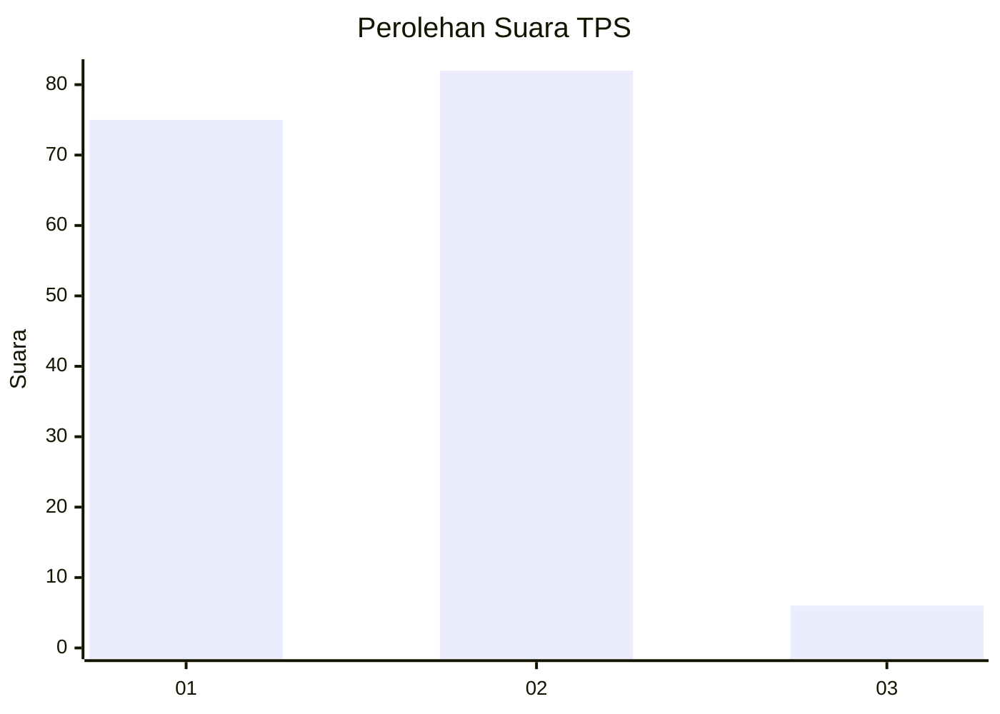
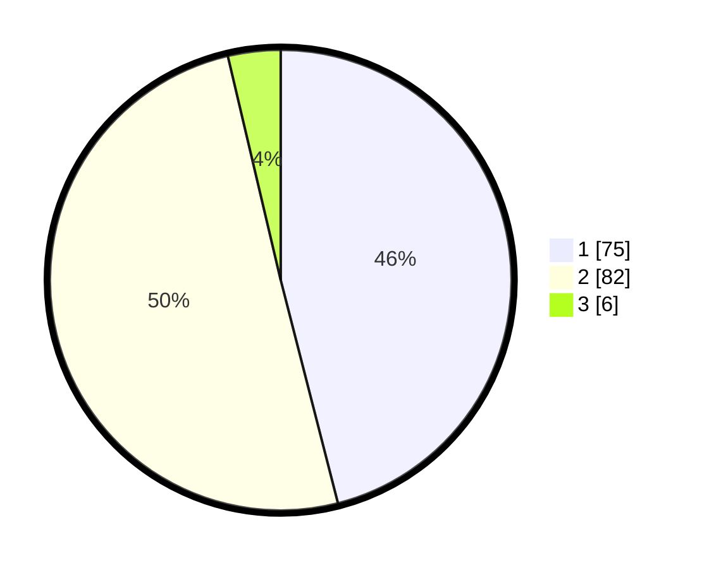

# Hasil

## Grafik

## Tabel

| No. | Nama Paslon    | Suara | Suara (raw) | Persentase |
|:--- |:-------------- | -----:| -----------:| ----------:|
| 1   | ANIES MUHAIMIN | 75    | [75][p-1]   | 46,01      |
| 2   | PRABOWO GIBRAN | 82    | [82][p-2]   | 50,31      |
| 3   | GANJAR MAHFUD  | 6     | [6][p-3]    | 3,68       |

[p-1]: https://github.com/gigit-pemilu/pemilu-2024-14-riau/blob/main/pilpres/hitung-suara/sub/14-riau/sub/09-kuantan-singingi/sub/05-cerenti/sub/1001-pasar-cerenti/sub/002-tps/sub/paslon-1.txt
[p-2]: https://github.com/gigit-pemilu/pemilu-2024-14-riau/blob/main/pilpres/hitung-suara/sub/14-riau/sub/09-kuantan-singingi/sub/05-cerenti/sub/1001-pasar-cerenti/sub/002-tps/sub/paslon-2.txt
[p-3]: https://github.com/gigit-pemilu/pemilu-2024-14-riau/blob/main/pilpres/hitung-suara/sub/14-riau/sub/09-kuantan-singingi/sub/05-cerenti/sub/1001-pasar-cerenti/sub/002-tps/sub/paslon-3.txt

## Foto C Plano

https://sirekap-obj-formc.kpu.go.id/823b/pemilu/ppwp/14/09/05/10/01/1409051001002-20240214-235240--2ea827da-4d46-48f9-8975-b7b9f529ab9d.jpg

https://sirekap-obj-formc.kpu.go.id/823b/pemilu/ppwp/14/09/05/10/01/1409051001002-20240214-235435--5a77e1df-16a8-4dad-bb71-761060e8192b.jpg

https://sirekap-obj-formc.kpu.go.id/823b/pemilu/ppwp/14/09/05/10/01/1409051001002-20240214-235723--5f0fba90-81fd-4596-8ecf-23b3b9386279.jpg

## Metadata

| Key        | Value               |
| ---------- | ------------------- |
| Time Stamp | 2024-02-15 16:00:26 |

