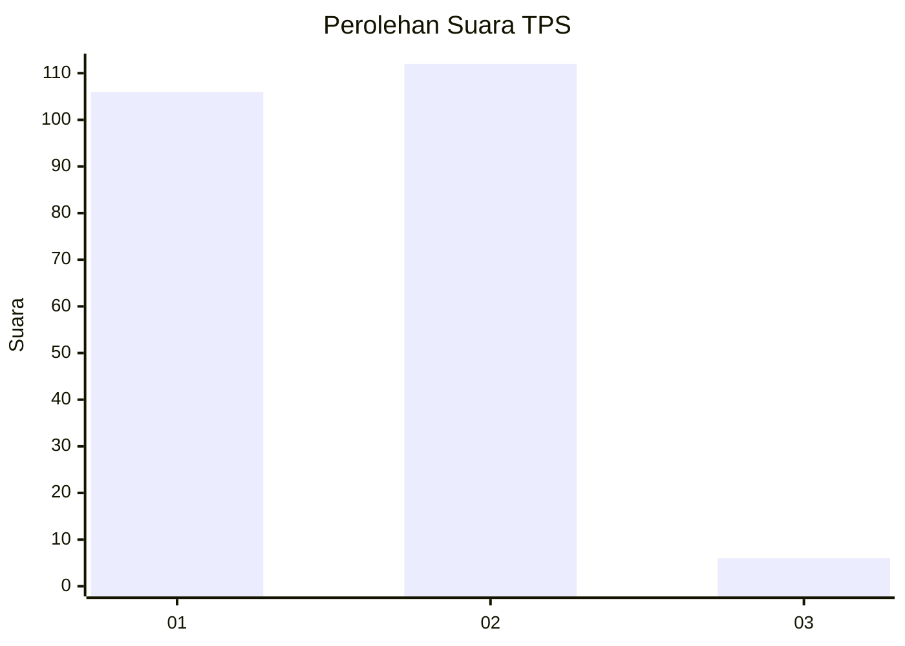
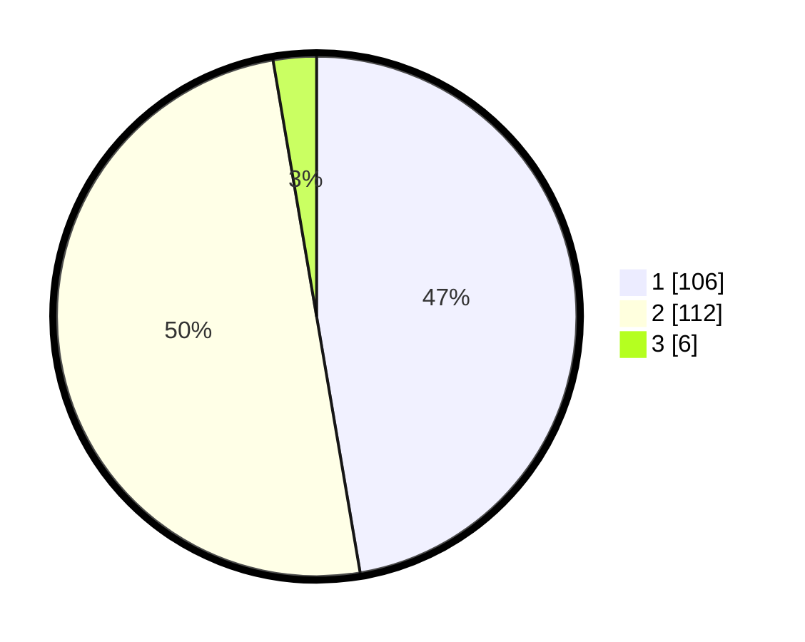

# Hasil

## Grafik

## Tabel

| No. | Nama Paslon    | Suara | Suara (raw) | Persentase |
|:--- |:-------------- | -----:| -----------:| ----------:|
| 1   | ANIES MUHAIMIN | 106   | [106][p-1]  | 47,32      |
| 2   | PRABOWO GIBRAN | 112   | [112][p-2]  | 50,00      |
| 3   | GANJAR MAHFUD  | 6     | [6][p-3]    | 2,68       |

[p-1]: https://github.com/gigit-pemilu/pemilu-2024-14-riau/blob/main/pilpres/hitung-suara/sub/14-riau/sub/09-kuantan-singingi/sub/06-benai/sub/1001-benai/sub/001-tps/sub/paslon-1.txt
[p-2]: https://github.com/gigit-pemilu/pemilu-2024-14-riau/blob/main/pilpres/hitung-suara/sub/14-riau/sub/09-kuantan-singingi/sub/06-benai/sub/1001-benai/sub/001-tps/sub/paslon-2.txt
[p-3]: https://github.com/gigit-pemilu/pemilu-2024-14-riau/blob/main/pilpres/hitung-suara/sub/14-riau/sub/09-kuantan-singingi/sub/06-benai/sub/1001-benai/sub/001-tps/sub/paslon-3.txt

## Foto C Plano

https://sirekap-obj-formc.kpu.go.id/de8d/pemilu/ppwp/14/09/06/10/01/1409061001001-20240214-224450--2281b84d-26a1-4181-910f-473b83cf987e.jpg

https://sirekap-obj-formc.kpu.go.id/de8d/pemilu/ppwp/14/09/06/10/01/1409061001001-20240214-224557--6c837986-1865-4754-863e-66ff423aa802.jpg

https://sirekap-obj-formc.kpu.go.id/de8d/pemilu/ppwp/14/09/06/10/01/1409061001001-20240214-224640--cfad8421-c4ea-48b3-96fe-37488cdeb084.jpg

## Metadata

| Key        | Value               |
| ---------- | ------------------- |
| Time Stamp | 2024-02-15 12:00:28 |

