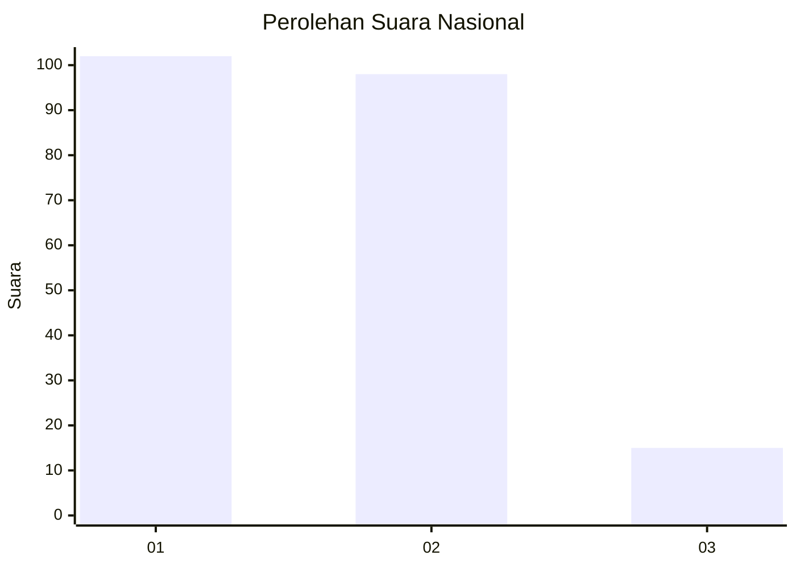
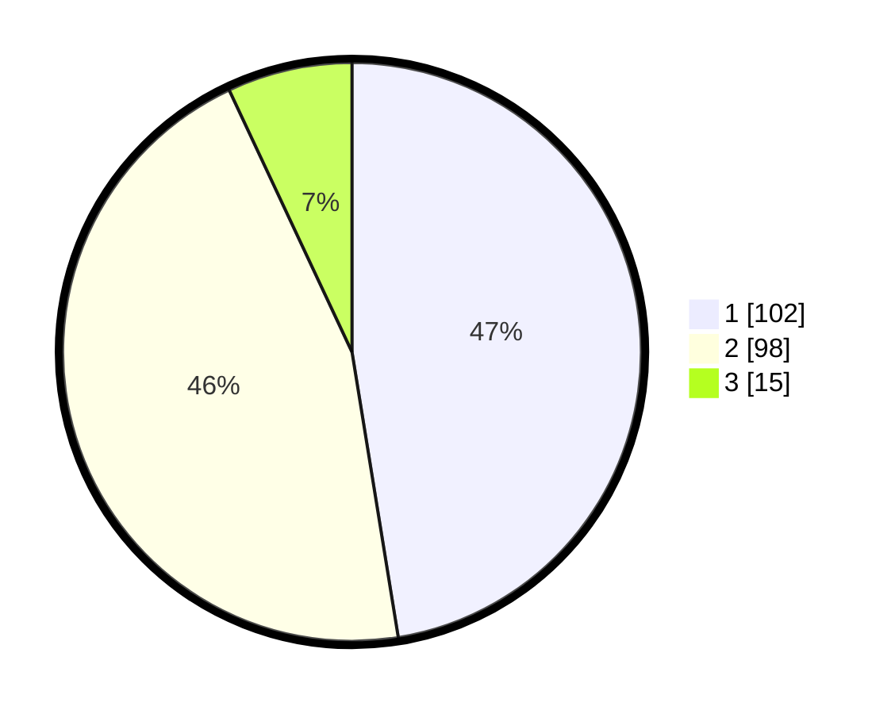

# Hasil

## Grafik

## Tabel

| No. | Nama Paslon    | Suara | Suara (raw) | Persentase |
|:--- |:-------------- | -----:| -----------:| ----------:|
| 1   | ANIES MUHAIMIN | 102   | [102][p-1]  | 47,44      |
| 2   | PRABOWO GIBRAN | 98    | [98][p-2]   | 45,58      |
| 3   | GANJAR MAHFUD  | 15    | [15][p-3]   | 6,98       |

[p-1]: https://github.com/gigit-pemilu/pemilu-2024/blob/main/pilpres/hitung-suara/sub/14-riau/sub/09-kuantan-singingi/sub/06-benai/sub/1001-benai/sub/002-tps/sub/paslon-1.txt
[p-2]: https://github.com/gigit-pemilu/pemilu-2024/blob/main/pilpres/hitung-suara/sub/14-riau/sub/09-kuantan-singingi/sub/06-benai/sub/1001-benai/sub/002-tps/sub/paslon-2.txt
[p-3]: https://github.com/gigit-pemilu/pemilu-2024/blob/main/pilpres/hitung-suara/sub/14-riau/sub/09-kuantan-singingi/sub/06-benai/sub/1001-benai/sub/002-tps/sub/paslon-3.txt

## Foto C Plano

https://sirekap-obj-formc.kpu.go.id/9e95/pemilu/ppwp/14/09/06/10/01/1409061001002-20240214-193243--edfb70f8-9dec-4410-847a-6080e6a44c1c.jpg

https://sirekap-obj-formc.kpu.go.id/9e95/pemilu/ppwp/14/09/06/10/01/1409061001002-20240214-211900--a4d15100-4a3a-486d-9d57-8b5a60e446e8.jpg

https://sirekap-obj-formc.kpu.go.id/9e95/pemilu/ppwp/14/09/06/10/01/1409061001002-20240214-212101--84e4eacb-cc86-434e-8f0d-90f5dc2c8612.jpg

## Metadata

| Key        | Value               |
| ---------- | ------------------- |
| Time Stamp | 2024-02-15 00:41:44 |

