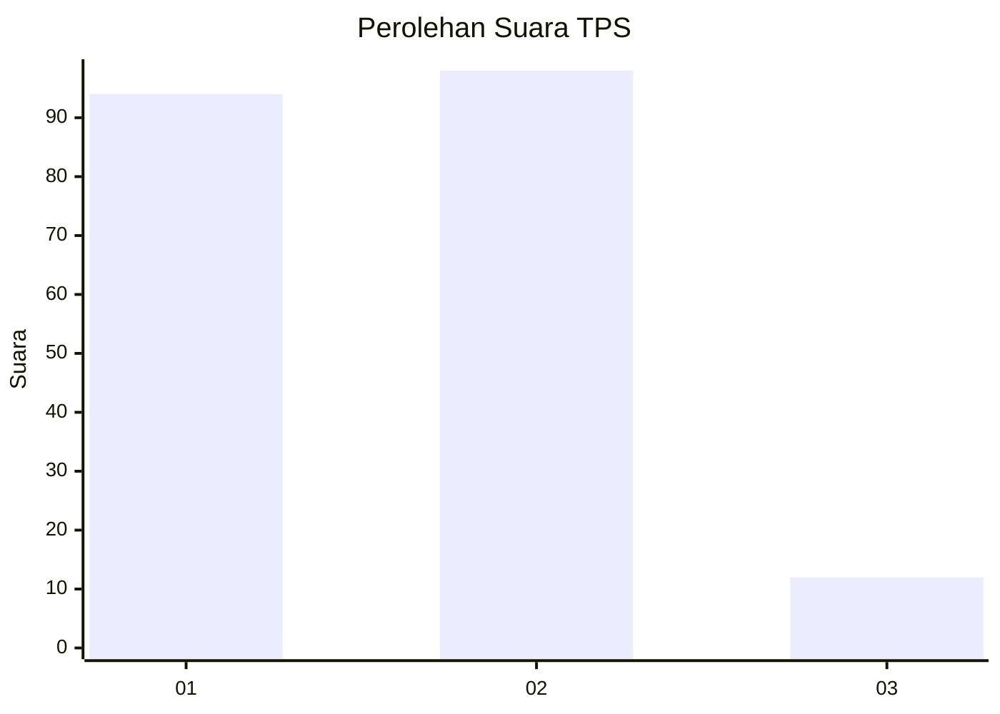
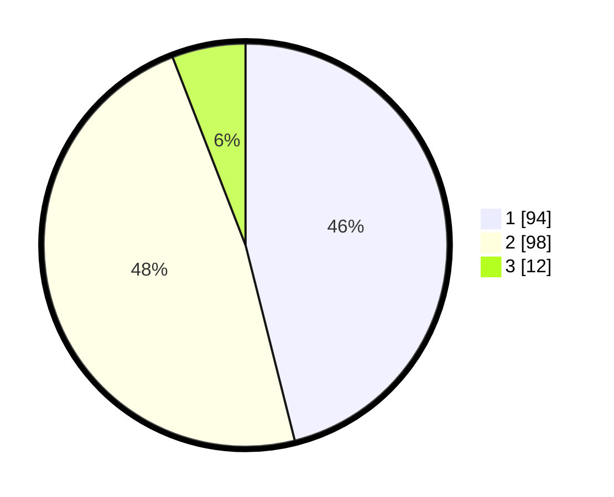

# Hasil

## Grafik

## Tabel

| No. | Nama Paslon    | Suara | Suara (raw) | Persentase |
|:--- |:-------------- | -----:| -----------:| ----------:|
| 1   | ANIES MUHAIMIN | 94    | [94][p-1]   | 46,08      |
| 2   | PRABOWO GIBRAN | 98    | [98][p-2]   | 48,04      |
| 3   | GANJAR MAHFUD  | 12    | [12][p-3]   | 5,88       |

[p-1]: https://github.com/gigit-pemilu/pemilu-2024-14-riau/blob/main/pilpres/hitung-suara/sub/14-riau/sub/09-kuantan-singingi/sub/06-benai/sub/1001-benai/sub/003-tps/sub/paslon-1.txt
[p-2]: https://github.com/gigit-pemilu/pemilu-2024-14-riau/blob/main/pilpres/hitung-suara/sub/14-riau/sub/09-kuantan-singingi/sub/06-benai/sub/1001-benai/sub/003-tps/sub/paslon-2.txt
[p-3]: https://github.com/gigit-pemilu/pemilu-2024-14-riau/blob/main/pilpres/hitung-suara/sub/14-riau/sub/09-kuantan-singingi/sub/06-benai/sub/1001-benai/sub/003-tps/sub/paslon-3.txt

## Foto C Plano

https://sirekap-obj-formc.kpu.go.id/b771/pemilu/ppwp/14/09/06/10/01/1409061001003-20240215-033314--ae3a5492-fc02-4556-aff0-456c30274ea1.jpg

https://sirekap-obj-formc.kpu.go.id/b771/pemilu/ppwp/14/09/06/10/01/1409061001003-20240215-033408--9a4912b4-f13b-4083-8107-4441775f704b.jpg

https://sirekap-obj-formc.kpu.go.id/b771/pemilu/ppwp/14/09/06/10/01/1409061001003-20240215-033606--3b154cf0-3397-4a95-9267-6c1fb4118635.jpg

## Metadata

| Key        | Value               |
| ---------- | ------------------- |
| Time Stamp | 2024-02-15 12:00:28 |

