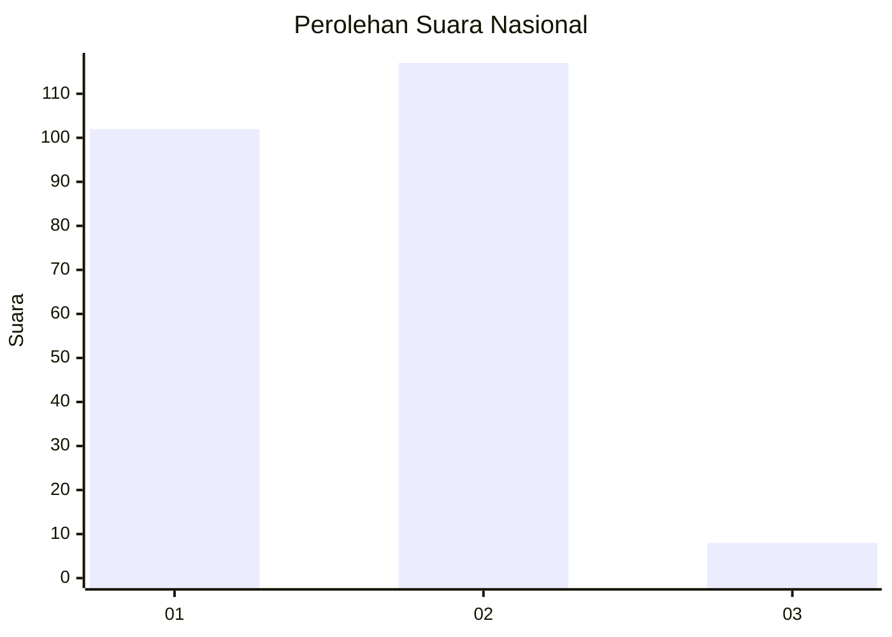
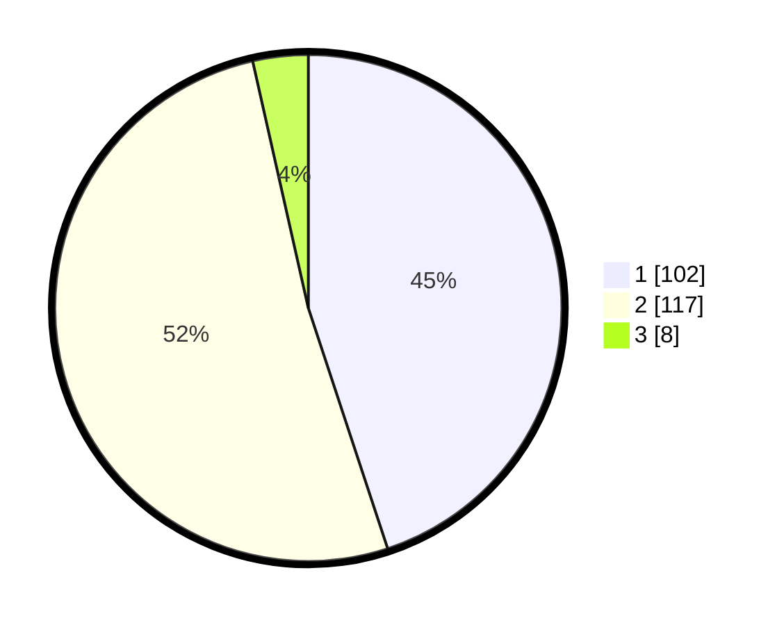

# Hasil

## Grafik

## Tabel

| No. | Nama Paslon    | Suara | Suara (raw) | Persentase |
|:--- |:-------------- | -----:| -----------:| ----------:|
| 1   | ANIES MUHAIMIN | 102   | [102][p-1]  | 44,93      |
| 2   | PRABOWO GIBRAN | 117   | [117][p-2]  | 51,54      |
| 3   | GANJAR MAHFUD  | 8     | [8][p-3]    | 3,52       |

[p-1]: https://github.com/gigit-pemilu/pemilu-2024/blob/main/pilpres/hitung-suara/sub/14-riau/sub/09-kuantan-singingi/sub/06-benai/sub/2005-gunungkesiangan/sub/001-tps/sub/paslon-1.txt
[p-2]: https://github.com/gigit-pemilu/pemilu-2024/blob/main/pilpres/hitung-suara/sub/14-riau/sub/09-kuantan-singingi/sub/06-benai/sub/2005-gunungkesiangan/sub/001-tps/sub/paslon-2.txt
[p-3]: https://github.com/gigit-pemilu/pemilu-2024/blob/main/pilpres/hitung-suara/sub/14-riau/sub/09-kuantan-singingi/sub/06-benai/sub/2005-gunungkesiangan/sub/001-tps/sub/paslon-3.txt

## Foto C Plano

https://sirekap-obj-formc.kpu.go.id/ae43/pemilu/ppwp/14/09/06/20/05/1409062005001-20240216-115601--35a9deac-dfbc-4b4e-8e8d-3305f1326d02.jpg

https://sirekap-obj-formc.kpu.go.id/ae43/pemilu/ppwp/14/09/06/20/05/1409062005001-20240215-031226--c2ed6e94-262b-40ab-a8f0-62339037bc0f.jpg

https://sirekap-obj-formc.kpu.go.id/ae43/pemilu/ppwp/14/09/06/20/05/1409062005001-20240215-031335--38f3ccfe-df37-4377-a063-821b324e177e.jpg

## Metadata

| Key        | Value               |
| ---------- | ------------------- |
| Time Stamp | 2024-02-16 12:51:22 |

